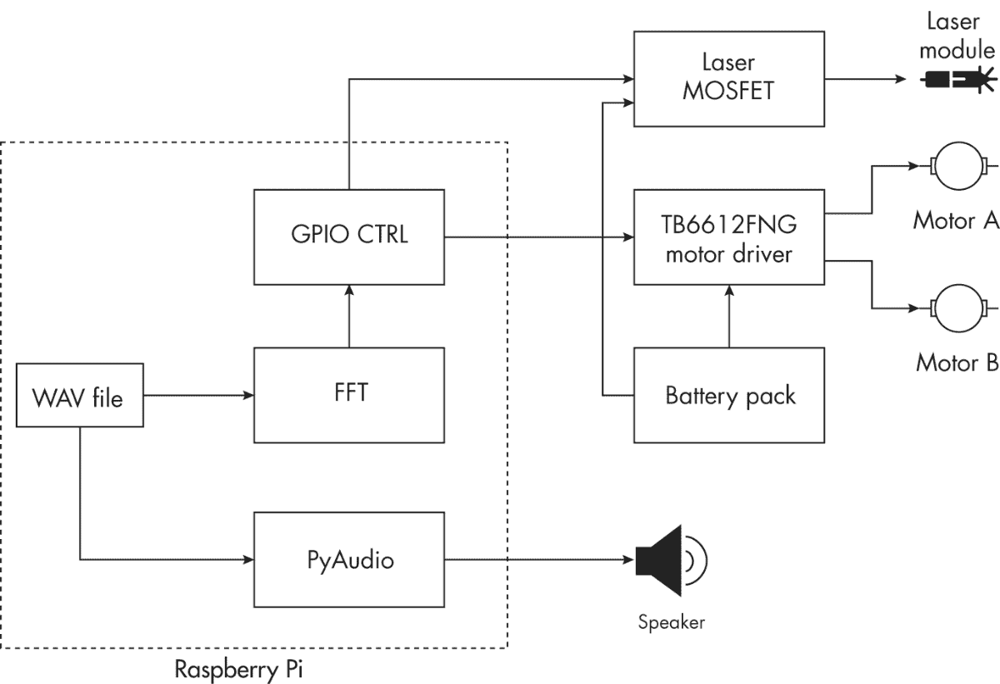
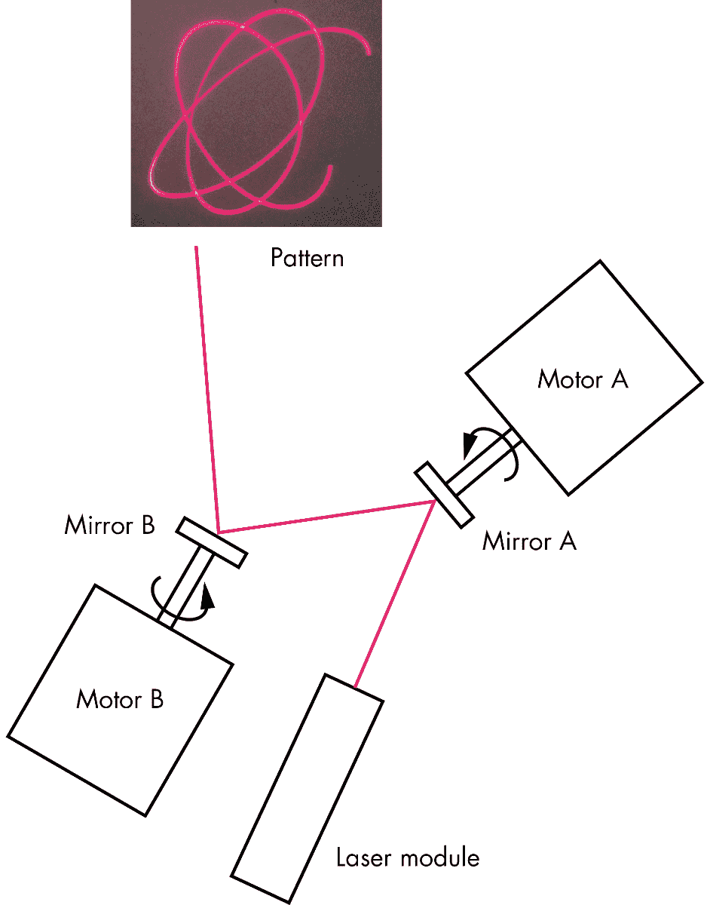
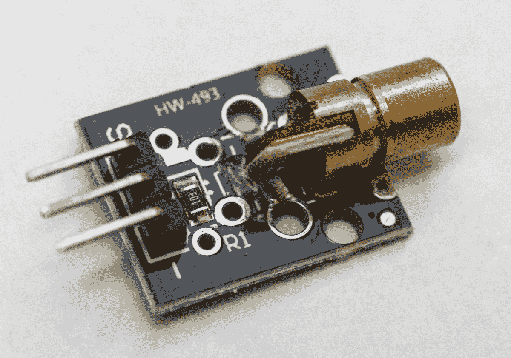
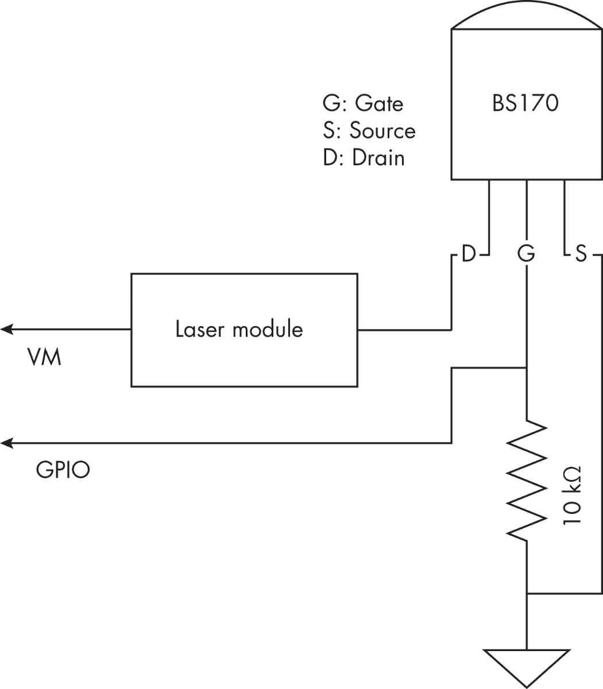
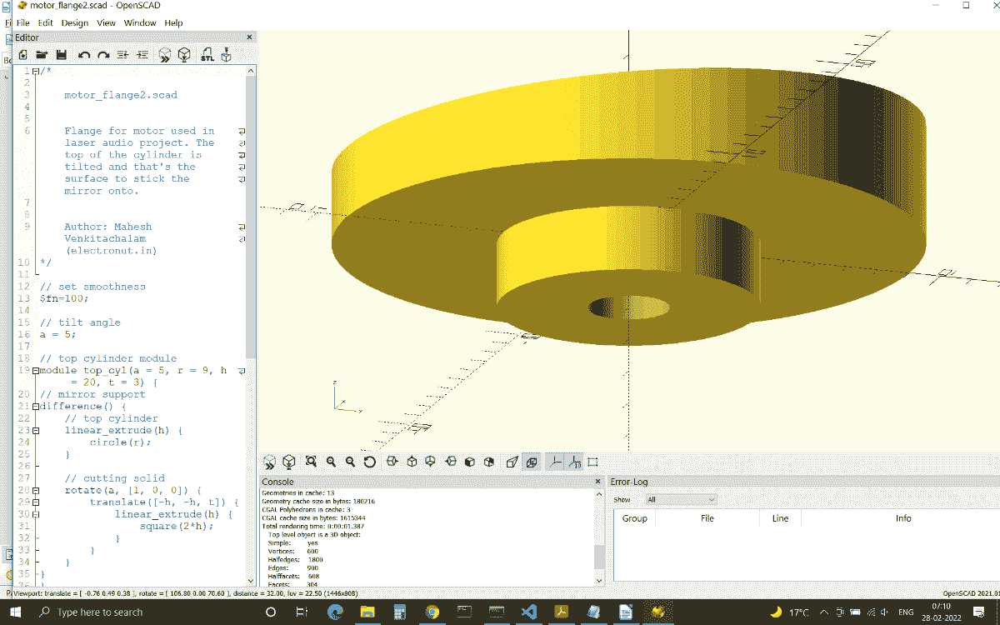
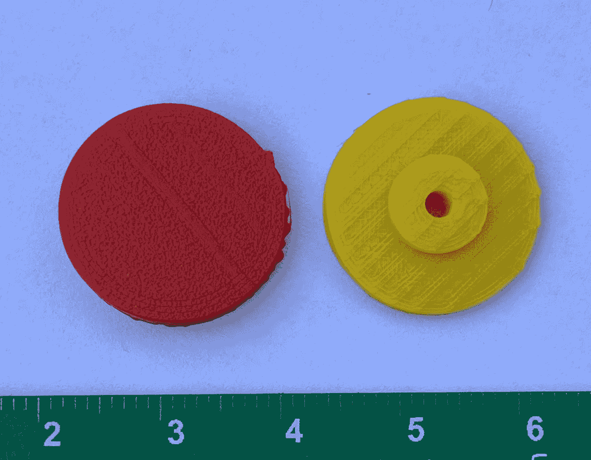
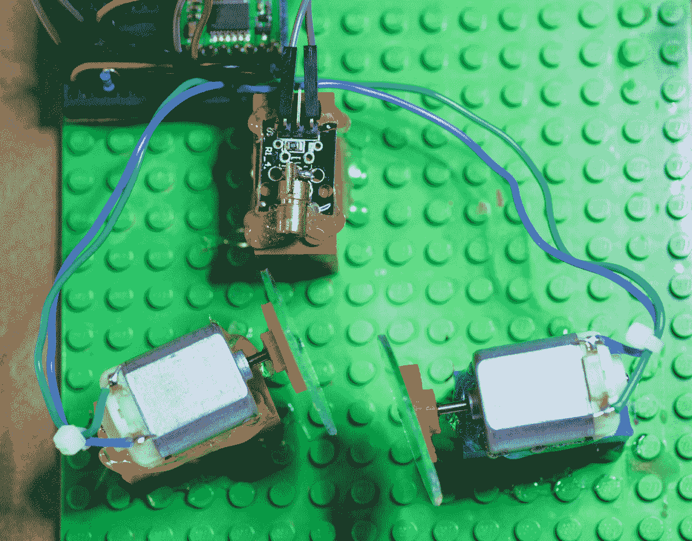
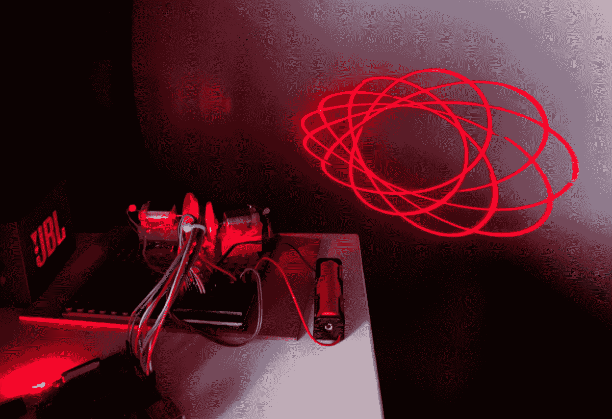
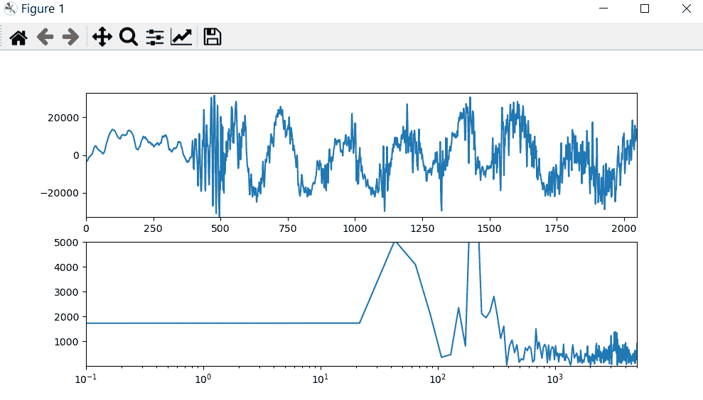

## 第十三章：# 使用树莓派显示激光音频


在第十二章中，你使用了一个微型控制器 Pico 来生成音乐音调。在本章中，你将使用一个更强大的嵌入式系统——树莓派，根据音频信号生成有趣的激光图案。

上一章节的 Pico 配备了一个 RP2040 微控制器，拥有双核 ARM Cortex-M0 处理器，运行速度可达 133 MHz，具有 264KB 的随机存取内存（RAM）和 2MB 的非易失性存储空间，存储在外部闪存芯片中。相比之下，树莓派 3B+配备了一个更强大的 ARM Cortex-A53 处理器，运行速度为 1.4 GHz，具有 1GB 的 RAM，并根据使用的 SD 卡提供几 GB 的存储空间。虽然这与标准的桌面或笔记本电脑相比仍显得微不足道，但树莓派仍然能够运行基于 Linux 的操作系统和完整的 Python 环境，而不像 Pico 那样受限。

在本章中，你将使用树莓派上的 Python 读取 WAV 格式的音频文件，基于实时音频数据进行计算，并使用这些数据来调整激光显示设备中两个电机的旋转速度和方向。你将把镜子安装在电机上，反射来自便宜激光模块的光束，生成类似 Spirograph 的图案，这些图案会根据音频发生变化。你还将同时将音频流传输到扬声器，这样你就可以在观看激光灯光秀的同时听到 WAV 文件的播放。

本项目将进一步拓展你对 Python 的理解，帮助你学习如何使用树莓派。以下是我们将要涉及的一些主题：

+   • 使用激光和两个旋转镜子生成有趣的图案

+   • 使用快速傅里叶变换（FFT）从信号中获取频率信息

+   • 使用`numpy`计算 FFT

+   • 从 WAV 文件中读取音频

+   • 使用`pyaudio`输出音频数据

+   • 使用树莓派驱动电机

+   • 使用金属氧化物半导体场效应晶体管（MOSFET）开关激光模块的开/关

## 工作原理

你将使用树莓派处理音频数据并控制硬件。图 13-1 显示了你将在本项目中创建的框图。



图 13-1：激光音频项目的框图

树莓派将以两种方式使用 WAV 文件。它将通过`pyaudio`将文件播放通过附加的扬声器，同时使用一种名为*快速傅里叶变换（FFT）*的数学技术实时分析音频数据。树莓派将利用 FFT 数据通过其通用输入/输出（GPIO）引脚驱动电动机和激光，但为了保护树莓派不受损坏，你不会直接将其连接到这些外部组件。相反，你将通过电动机驱动板和 MOSFET 间接连接它。在开始之前，让我们更详细地考虑一下这些项目方面的工作原理。

### 用激光生成图案

为了在本项目中生成激光图案，你将使用一个激光模块和两个附着在两个小型直流电动机轴上的镜子，如图 13-2 所示。可以把激光看作是一个强烈的光束，即使投射到很远的地方，它也会始终聚焦在一个微小的点上。这种聚焦之所以能实现，是因为激光束的波长是有序的，波的传播方向一致，且它们相位相同。如果你将激光照射到一个平面镜（图 13-2 中的镜子 A）的表面，反射出来的点将保持固定，即使电动机在旋转。由于激光的反射面垂直于电动机的旋转轴，所以即使镜子在旋转，反射的激光点看起来就像是镜子根本没有旋转。

现在，假设镜子相对于电动机轴以一定角度附着，如图 13-2 右侧所示（镜子 B）。随着轴的旋转，投影点将描绘出一个椭圆形，如果电动机旋转得足够快，观察者将看到该移动点呈现为一个连续的形状。


图 13-2：平面镜（镜子 A）反射一个点。倾斜镜子（镜子 B）的反射随着电动机的旋转形成一个圆圈。

如果两个镜子都倾斜，并且你将它们排列，使得从镜子 A 反射的点投射到镜子 B 上呢？现在，当电动机 A 和 B 旋转时，反射点产生的图案将是电动机 A 和 B 两种旋转运动的组合，产生有趣的图案，如图 13-3 所示。



图 13-3：通过两个旋转的倾斜镜子反射激光光线，会产生有趣且复杂的图案。

产生的精确图案将取决于两个电动机的旋转速度和方向，但它们将类似于你在第二章中探讨的由 Spirograph 生成的假极线。

#### 电动机控制

你将使用树莓派通过一种叫做*脉宽调制（**PWM**）*的技术来控制电机的速度和方向。这是一种通过快速开关的数字脉冲来为设备（如电机）供电的方式，使得设备“看到”一个持续的电压。发送到设备的信号有固定的频率，但数字脉冲开启的时间比例（即*占空比*）是可变的。占空比以百分比表示。举例来说，图 13-4 显示了三个频率相同但占空比不同的信号——分别是 25%、50%和 75%。


图 13-4：具有不同占空比的 PWM 信号

占空比百分比越高，每个信号周期中脉冲打开的时间就越长。接收到信号的电机会将这些较长的脉冲感知为更高的持续电压。通过调节占空比，你可以为这个项目中的电机提供不同的功率，从而导致电机速度的变化和激光模式的变化。

注意：PWM 在电机控制之外还有许多应用。例如，它还可以用于控制可调光 LED 的亮度。

电机工作时电压较高，但树莓派只能承受有限的电流，超过这个电流就会被损坏。你将使用一个 TB6612FNG 电机驱动模块板，类似于图 13-5 中显示的那种，作为树莓派与电机之间的中介，确保树莓派的安全。市面上有许多这种模块的变种，你可以选择其中任何一种，只要小心正确接线即可。


图 13-5：TB6612FNG 电机驱动模块的印刷电路板（PCB）

模块板的底部应该有引脚信息。查看 TB6612FNG 芯片的数据手册也是一个好主意，你可以从互联网上下载。引脚名称中的*A*和*B*表示两个电机。IN 引脚控制电机的方向，01 和 02 引脚为电机提供电源，而 PWM 引脚则使用脉宽调制来控制电机的速度。通过向这些引脚写入数据，你可以控制每个电机的旋转方向和速度，这正是这个项目所需要的。我们不会详细讲解这个模块的工作原理，但如果你感兴趣，可以从学习*H 桥*开始，这是一种常见的电路设计，利用 MOSFET 控制电机。

注意：你可以用任何你熟悉的电机控制电路来替换这个模块，只要你相应地修改代码即可。

#### 激光模块

对于激光，你将使用一个价格低廉的激光模块板，类似于图 13-6 中展示的那种。



图 13-6：激光模块

市面上有不同版本的激光模块。你需要一个工作在 5 伏（V）的 650 纳米（nm）红色激光模块。（650 nm 指的是激光的波长。）在使用该板进行项目之前，确保你了解它的极性和连接方式。使用 5 V 电源单独测试它。

#### MOSFET

要使用树莓派打开和关闭激光模块，你将使用*N-channel MOSFET*，你可以把它看作是一个电控开关。你可以使用几乎任何 N-channel MOSFET 来完成这个项目，但 BS170 既便宜又容易获取。图 13-7 显示了 MOSFET 的引脚编号，以及如何将其连接到激光模块和树莓派。



图 13-7：BS170 MOSFET 连接图

10 kΩ 电阻将 MOSFET 的门引脚“拉”到地面，这样当树莓派 GPIO 引脚处于浮空状态时（例如，在 GPIO 清理后），它不会被触发。当你向 GPIO 发送 HIGH 信号时，MOSFET 开关会打开，实际上将激光模块连接到 VM 和 GND，从而为其供电。

为什么需要一个 MOSFET？不能直接将激光模块连接到树莓派的 GPIO 引脚吗？这个主意并不好，因为 MOSFET 能承受的电流远大于树莓派。使用 MOSFET 可以将树莓派与负载电流激增的情况隔离开来。宁愿烧坏你便宜的 MOSFET，也不要烧坏你相对昂贵的树莓派！一般来说，每当你想用树莓派控制外部设备时，记得使用 MOSFET 是一个好主意。

### 使用快速傅里叶变换分析音频

因为这个项目的最终目标是根据音频输入控制电机速度，你需要能够实时分析音频。回想一下第四章，声学乐器发出的音调是多种频率或泛音的混合。事实上，任何声音都可以通过*傅里叶变换*分解成它的组成频率。当傅里叶变换应用于数字信号时，结果被称为*离散傅里叶变换（**DFT）*，因为数字信号是由许多离散样本组成的。在这个项目中，你将使用 Python 实现一个*快速傅里叶变换（FFT）*算法来计算 DFT。（在本章中，我将使用*FFT* 来指代算法和结果。）

图 13-8 展示了 FFT 的一个简单例子。图中的顶部框展示了一个由两个正弦波组成的信号波形。这个图是*时域图*，因为它展示了信号的振幅如何随时间变化。图中的底部框展示了该信号的 FFT。FFT 是*频域图*，它显示了在某一时刻信号中存在哪些频率。


图 13-8：包含多个频率的音频信号（顶部）及其对应的 FFT（底部）

顶部框中的波形可以通过以下方程表示，该方程将两个正弦波相加：

*y*(*t*) = 4sin(2π10*t*) + 2.5sin(2π30*t*)

注意表达式中第一个波的 4 和 10——4 是波的振幅，10 是频率（单位赫兹）。而第二个波的振幅为 2.5，频率为 30 赫兹。观察图中底部框的 FFT，你会看到它有两个峰值，分别在 10 赫兹和 30 赫兹。FFT 揭示了信号的组成频率。FFT 还识别了每个频率的相对振幅；第一个峰的强度大约是第二个峰的两倍。

现在我们来看一个更现实的例子。图 13-9 展示了顶部框中的复杂音频信号和底部框中的对应 FFT。注意，FFT 包含了更多的峰值，并且它们的强度各不相同，表明信号包含了更多的频率。


图 13-9：FFT 算法获取一个振幅信号（顶部），并计算其组成的频率（底部）

为了计算 FFT，你需要一组采样数据。选择采样数量有些任意，但样本太少不会给你信号频率内容的清晰图像，而且可能还会导致更高的计算负担，因为你需要每秒计算更多的 FFT。另一方面，样本数量过大则会平滑信号的变化，因此你将无法得到信号的“实时”频率响应。对于本项目，2,048 个样本是可行的。在 44,100 赫兹的采样率下，2,048 个样本代表约 0.046 秒的音频。

你将使用`numpy`来计算 FFT，将音频数据分解为其组成的频率，然后利用这些信息来控制电机。首先，你将把频率范围（单位为赫兹）分为三个频段：[0, 100]、[100, 1000]和[1000, 2500]。你将为每个频段计算一个平均振幅值，每个值将以不同的方式影响电机和最终的激光图案，具体如下：

+   • 低频率的平均振幅变化会影响第一个电机的速度。

+   • 中频的平均振幅变化会影响第二个电机的速度。

+   • 当高频率超过某个阈值时，第一个电机将改变方向。

根据这些规则，激光图案会响应音频信号发生变化。

## 要求

在这个项目中，你将使用以下 Python 模块：

+   • `RPi.GPIO` 用于设置 PWM 和控制引脚的输出

+   • `time` 用于操作之间的暂停

+   • `wave` 用于读取 WAV 文件

+   • `pyaudio` 用于处理和流式传输音频数据

+   • `numpy` 用于 FFT 计算

+   • `argparse` 用于处理命令行参数

你还需要以下物品来构建该项目：

+   • 一个 Raspberry Pi 3B+ 或更新版本

+   • 一个 5 V 适配器，用于为 Raspberry Pi 供电

+   • 一个带 AUX（线路输入）接口的有源扬声器（现在大多数蓝牙扬声器都有 AUX 输入）

+   • 一个 TB6612FNG 电机扩展板

+   • 一个激光模块扩展板

+   • 一个 10 kΩ 电阻

+   • 一个 BS170 N-channel MOSFET 或等效元件

+   • 两个 9 V 额定的小型玩具用直流电机

+   • 两个小镜子，直径大约为 1 英寸或更小

+   • 一个 3.7 V 18650 2000 mAh（3C）锂离子电池和电池座（或者使用四节 AA 电池和电池座）

+   • 两个 3D 打印的零件，用于将镜子固定在电机轴上（可选）

+   • 一个大约 8 英寸 × 6 英寸的矩形底座，用于安装硬件

+   • 一些 LEGO 积木，用于将电机和激光模块抬起，以便镜子可以自由旋转

+   • 一把热熔胶枪

+   • 超级胶水用于将镜子固定到电机轴上

+   • 一把焊接铁

+   • 一个面包板

+   • 用于连接的电线（双头公针单股连接线效果很好）

### 设置 Raspberry Pi

要设置你的 Raspberry Pi，请参见 附录 B。按照附录中的说明操作，确保已经安装了本项目所需的 `numpy` 和 `pyaudio` Python 包。你将通过安全外壳（SSH）在 Raspberry Pi 上编写代码。你可以通过 SSH 将 Microsoft Visual Studio Code 设置为远程连接 Pi，操作可以在你的笔记本电脑或台式机上进行。这一点在 附录 B 中也有说明。

### 构建激光显示

在连接所有硬件之前，你应该准备电机和激光模块用于激光显示。首先要做的是将镜子安装到电机上。每个镜子必须相对于电机轴稍微倾斜。可以使用热熔胶来完成这项工作。将镜子放在平坦的表面上，镜面朝下，在中心滴上一滴热熔胶。小心地将电机轴浸入胶水中，确保其相对于镜子垂直线有一个轻微的角度，直到胶水凝固。

更好的方法是使用带有倾斜面的电机法兰，您可以轻松地将镜子粘贴到其上。但是，您在哪里能找到这样的部件呢？您可以使用 3D 打印自己制作！图 13-10(a)展示了我使用名为 OpenSCAD 的免费开源程序创建的 3D 设计。您可以从本书的 GitHub 仓库下载该设计。图 13-10(b)展示了 3D 打印的部件。激光首先照射到的镜子将使用倾斜较小的法兰（5 度），而第二面镜子将使用倾斜较大的法兰（10 度）。



(a)



(b)

图 13-10：OpenSCAD 模型（a）和 3D 打印法兰（b）

如果您有 3D 打印机，可以自己打印法兰，或者从 3D 打印服务商那里打印。（无论哪种方式，都不会很贵。）一旦得到这些部件，使用强力胶将法兰固定到电机轴上，再将镜子粘贴到法兰上。图 13-11 展示了完全组装好的部件。


图 13-11：将镜子以轻微的角度固定到每个电机轴上。

要测试装配效果，用手旋转镜子，同时将激光模块对准它。您应该会发现，激光点的反射在平面表面上呈椭圆形移动。对第二面镜子也做相同的操作。由于相对于电机轴的角度较大，它应该会形成一个更宽的椭圆。

#### 镜子对准

接下来，将激光模块与镜子对准，使激光从镜子 A 反射到镜子 B，如图 13-12 所示。确保从镜子 A 反射出来的激光光束在镜子 A 的整个旋转范围内都保持在镜子 B 的圆周内。（这将需要一些反复试验。）为了测试这一排列，手动旋转镜子 A。同时，确保将镜子 B 放置好，使得其表面反射的光束在两个镜子旋转的整个范围内都会落到一个平面表面（如墙壁）上。



图 13-12：激光与镜子的对准

注意：在调整对准时，您需要保持激光指示器开启。您可以通过运行以下项目代码来实现：`python laser_audio.py --test_laser`。这个命令只是开启控制激光模块的 MOSFET，稍后我们会在本章中讨论这个问题。

一旦你对镜子的放置感到满意，用热熔胶将激光模块和附加镜子的两个电机固定在三个相同的积木上（乐高积木非常适用！），将其抬高，以便电机能够自由旋转。接着，将这些积木放在安装板上，当你对它们的排列感到满意时，用铅笔勾画出它们的位置，然后将积木用热熔胶粘在板上。或者，使用乐高底板，并将乐高积木直接附加到底板上。

#### 电机供电

如果你的电机没有附带连接端子上的电线（大多数没有），请在两个端子上焊接电线，确保留下足够的电线（例如 6 英寸），以便将电机连接到电机驱动板。电机可以由 3.7V 锂电池或 4 节 AA 电池包供电。

### 连接硬件

现在开始连接硬件。你需要将树莓派、电机驱动板、MOSFET、激光模块板和电机连接起来。树莓派拥有一系列 GPIO 引脚，可以连接到其他硬件。为了了解引脚布局，我强烈建议你访问网站[`pinout.xyz`](https://pinout.xyz/)。它提供了一个方便的视觉参考，并解释了各种引脚的功能。

注意：有几种不同的惯例用于引用树莓派上的引脚编号。对于这个项目，我们将使用*BCM 引脚编号*惯例。

表 13-1 列出了你需要连接的各个接口。

表 13-1：硬件接线连接

| 从 | 到 |
| --- | --- |
| 树莓派 GPIO 12 | TB6612FNG PWMA |
| 树莓派 GPIO 13 | TB6612FNG PWMB |
| 树莓派 GPIO 7 | TB6612FNG AIN1 |
| 树莓派 GPIO 8 | TB6612FNG AIN2 |
| 树莓派 GPIO 5 | TB6612FNG BIN1 |
| 树莓派 GPIO 6 | TB6612FNG BIN2 |
| 树莓派 GPIO 22 | TB6612FNG STBY |
| 树莓派 GND | TB6612FNG GND |
| 树莓派 3V3 | TB6612FNG VCC |
| 树莓派 GPIO 25 | BS170 栅极（也连接到 GND 通过 10 kΩ电阻） |
| 树莓派 GND | BS170 源极 |
| 激光模块 GND | BS170 漏极 |
| 激光模块 VCC | 电池包 VCC（+） |
| 电池包 GND（−） | TB6612FNG GND |
| 电池包 VCC（+） | TB6612FNG VM |
| 电机#1 连接器#1（极性无关） | TB6612FNG A01 |
| 电机#1 连接器#2（极性无关） | TB6612FNG A02 |
| 电机#2 连接器#1（极性无关） | TB6612FNG B01 |
| 电机#2 连接器#2（极性无关） | TB6612FNG B02 |
| 树莓派 3.5 毫米音频接口 | 带电扬声器的 AUX 输入 |

图 13-13 显示了所有的接线。


图 13-13：完全接线的激光显示器

现在让我们来看一下代码。

## 代码

这个项目的代码在文件*laser_audio.py*中。你将从一些基本的设置开始。然后，你将定义用于操作和测试电机与激光的函数，并定义一个用于处理 WAV 文件中音频数据并根据这些数据控制电机的函数。最后，你会将所有内容整合起来，并通过`main()`函数接收命令行选项。要查看完整程序，请跳到“完整代码”章节，第 305 页。你也可以在[`github.com/mkvenkit/pp2e/tree/main/laser_audio`](https://github.com/mkvenkit/pp2e/tree/main/laser_audio)下载代码。

### 设置

首先导入所需的模块：

```py
import RPi.GPIO as GPIO
import time
import argparse
import pyaudio
import wave
import numpy as np

```

`RPi.GPIO`模块让你能够使用树莓派的引脚。你将使用`time`模块来在代码中添加延迟，并且使用`argparse`来为程序添加命令行参数。`pyaudio`和`wave`模块将帮助你从 WAV 文件中读取数据并输出音频流。最后，你将使用`numpy`来计算音频数据的 FFT。

接下来，你初始化一些全局变量：

```py
# define pin numbers
# uses TB6612FNG motor driver pin naming
PWMA = 12
PWMB = 13
AIN1 = 7
AIN2 = 8
BIN1 = 5
BIN2 = 6
STBY = 22
LASER = 25

```

这段代码存储了项目中所有使用的树莓派引脚的编号。`PWMA`、`PWMB`、`AIN1`、`AIN2`、`BIN1`、`BIN2`和`STBY`是连接到 TB6612FNG 电机驱动器的引脚。`LASER`引脚将连接到 MOSFET 的门极，用来控制激光模块的开关。请注意，你在这里使用的是 BCM 引脚编号约定。

继续定义更多的全局变量：

```py
# global PWM objects
pwm_a = None
pwm_b = None
# size of audio data read in
CHUNK = 2048
# FFT size
N = CHUNK

```

在这里，你初始化了`pwm_a`和`pwm_b`变量，它们将代表`PWM`对象，用于控制电机。由于在代码中此时创建实际的`PWM`对象还为时过早，所以你将它们设置为`None`。你还设置了`CHUNK`，即每次从 WAV 文件中读取的音频数据样本数量，以及`N`，即用于计算 FFT 的样本数量。

你通过初始化 GPIO 引脚来完成设置。这是使用引脚所必须的。为此，你定义了一个`init_pins()`函数：

```py
def init_pins():
    """set up pins"""
  ❶ global pwm_a, pwm_b
    # use BCM pin numbering
  ❷ GPIO.setmode(GPIO.BCM)
    # put pins into a list
    pins = [PWMA, PWMB, AIN1, AIN2, BIN1, BIN2, STBY, LASER]
    # set up pins as outputs
  ❸ GPIO.setup(pins, GPIO.OUT)
    # set PWM
    pwm_a = GPIO.PWM(PWMA, 100)
    pwm_b = GPIO.PWM(PWMB, 100)

```

首先，你声明`pwm_a`和`pwm_b`是全局变量❶，因为你将在这个函数内部设置它们。接着，你将引脚模式设置为 BCM 编号约定❷。然后，你将之前设置的引脚变量放入一个`pins`列表中，这样你可以通过一次调用将它们全部声明为输出引脚❸。最后，你创建两个`PWM`对象，并将它们分配给全局变量`pwm_a`和`pwm_b`。参数`100`是信号的频率，单位为赫兹，用于驱动每个电机。你将通过调整这些信号的占空比来控制电机的速度，使用脉宽调制。

### 控制硬件

你需要一些辅助函数来控制激光模块和电机。首先让我们看看切换激光模块的函数：

```py
def laser_on(on):
    # pin 25 controls laser ctrl mosfet
    GPIO.output(LASER, on)

```

这个函数接受一个参数`on`，它是一个布尔值`True/False`。你将该参数传递给`GPIO.output()`方法，以便设置`LASER`引脚为开（`True`）或关（`False`）。这将触发 MOSFET 开关，控制激光模块的开关。

接下来，定义一个函数`start_motors()`，在项目开始时启动电机：

```py
def start_motors():
    """start both motors"""
    # enable driver chip
  ❶ GPIO.output(STBY, GPIO.HIGH)
    # set motor direction for channel A
  ❷ GPIO.output(AIN1, GPIO.HIGH)
  ❸ GPIO.output(AIN2, GPIO.LOW)
    # set motor direction for channel B
    GPIO.output(BIN1, GPIO.HIGH)
    GPIO.output(BIN2, GPIO.LOW)
    # set PWM for channel A
    duty_cycle = 10
  ❹ pwm_a.start(duty_cycle)
    # set PWM for channel B
    pwm_b.start(duty_cycle)

```

首先，你将`STBY`（待机）引脚设置为`HIGH` ❶，这样实际上就打开了电机驱动器。然后，你将`AIN1`和`AIN2`引脚分别设置为`HIGH` ❷和`LOW` ❸。这将使电机 A 朝一个方向旋转。（如果交换这两个引脚的`HIGH/LOW`值，电机会朝相反方向旋转。）你对电机 B 执行相同的操作。最后，你使用`PWM`对象来设置电机的速度 ❹。你将占空比（与电机速度相关）设置为 10%，一个相对较低的值，因为这只是初始化调用。

你还需要一个函数，在项目结束时停止电机旋转。下面是定义：

```py
def stop_motors():
    """stop both motors"""
    # stop PWM
  ❶ pwm_a.stop()
  ❷ pwm_b.stop()
    # brake A
    GPIO.output(AIN1, GPIO.HIGH)
    GPIO.output(AIN2, GPIO.HIGH)
    # brake B
    GPIO.output(BIN1, GPIO.HIGH)
    GPIO.output(BIN2, GPIO.HIGH)
    # disable driver chip
  ❸ GPIO.output(STBY, GPIO.LOW)

```

为了停止电机旋转，你首先停止发送到`PWMA` ❶和`PWMB` ❷引脚的 PWM 信号。然后，你将`AIN1`、`AIN2`、`BIN1`和`BIN2`引脚都设置为`HIGH`，这会起到“刹车”的作用，迫使每个电机停下来。最后，你通过将`STBY`引脚设置为`LOW` ❸来禁用电机驱动器。待机模式可以在电机不需要运转时节省电力。

你还需要一个辅助函数，用于设置两个电机的速度和方向。你将使用此函数，根据实时音频分析来调整电机。

```py
def set_motor_speed_dir(dca, dcb, dira, dirb):
    """set speed and direction of motors"""
    # set duty cycle
  ❶ pwm_a.ChangeDutyCycle(dca)
    pwm_b.ChangeDutyCycle(dcb)
    # set direction A
  ❷ if dira:
        GPIO.output(AIN1, GPIO.HIGH)
        GPIO.output(AIN2, GPIO.LOW)
  ❸ else:
        GPIO.output(AIN1, GPIO.LOW)
        GPIO.output(AIN2, GPIO.HIGH)
    if dirb:
        GPIO.output(BIN1, GPIO.HIGH)
        GPIO.output(BIN2, GPIO.LOW)
    else:
        GPIO.output(BIN1, GPIO.LOW)
        GPIO.output(BIN2, GPIO.HIGH)

```

`set_motor_speed_dir()`函数接受四个参数：`dca`和`dcb`确定每个电机的占空比，而`dira`和`dirb`是布尔值，决定电机的旋转方向。你使用`ChangeDutyCycle()`方法来更新电机的占空比（速度），将传入函数的值 ❶。然后，你调整电机的旋转方向。如果`dira`为`True` ❷，你将`AIN1`和`AIN2`引脚设置为`HIGH`和`LOW`，使电机 A 朝一个方向旋转。但是，如果`dira`为`False` ❸，你会将引脚设置为相反方向，使电机朝另一个方向旋转。你对电机 B 也执行相同的操作，使用`dirb`参数。

### 处理音频

该项目的核心是`process_audio()`函数，它从 WAV 文件读取音频数据，通过`pyaudio`输出音频流，计算 FFT 来分析音频数据，并利用结果来控制电机。我们将分部分来看这个函数。

```py
def process_audio(filename):
    print("opening {}...".format(filename))
    # open WAV file
  ❶ wf = wave.open(filename, 'rb')
    # print audio details
  ❷ print("SW = {}, NCh = {}, SR = {}".format(wf.getsampwidth(),
        wf.getnchannels(), wf.getframerate()))
    # check for supported format
  ❸ if wf.getsampwidth() != 2 or wf.getnchannels() != 1:
        print("Only single channel 16 bit WAV files are supported!")
        wf.close()
        return
    # create PyAudio object
  ❹ p = pyaudio.PyAudio()
    # open an output stream
  ❺ stream = p.open(format=p.get_format_from_width(wf.getsampwidth()),
                    channels=wf.getnchannels(),
                    rate=wf.getframerate(),
                    output=True)
    # read first frame

```

你从使用 `wave` 模块打开传递给 `process_audio()` 函数的音频文件开始❶。`wave.open()` 函数返回一个 `Wave_read` 对象，你将用它来读取 WAV 文件中的数据。你打印出关于读取到的 WAV 文件的一些信息❷：`SW` 是样本宽度（单位为字节），`NCh` 是音频的声道数，`SR` 是采样率。为了简化项目，你只支持单声道、16 位的 WAV 文件作为输入。你检查这些规格❸，如果输入不符合要求，就从函数中返回。

接下来，你创建一个 `PyAudio` 对象，用来将数据从 WAV 文件流式传输到输出❹。然后你打开一个 `pyaudio` 输出流（如 `output=True` 参数所示），并将其配置为与 WAV 文件具有相同的样本宽度、声道数和采样率❺。对于树莓派，默认的音频输出是板上的 3.5 毫米音频插孔。只要你的扬声器插入该插孔，你就能听到音频输出。

这是函数的下一部分：

```py
  ❶ data = wf.readframes(CHUNK)
  ❷ buf = np.frombuffer(data, dtype=np.int16)
    # store sample rate
  ❸ SR = wf.getframerate()
    # start motors
    start_motors()
    # laser on
    laser_on(True)

```

这里你从 WAV 文件中读取 `CHUNK` 个样本到变量 `data` 中❶。记住，你已将 `CHUNK` 设置为 `2048`，每个样本是 2 字节宽，因此你将读取 2,048 个 16 位值。由于函数主循环的结构，你一次只读取一个数据块，稍后你会看到具体实现。

`readframes()` 方法返回一个 `bytes` 对象，但你使用 `numpy` 库的 `frombuffer()` 函数将 `bytes` 对象转换为一个名为 `buf` 的 16 位整数的 `numpy` 数组❷。你将采样率（`wave` 模块称之为 *帧率*）存储在变量 `SR` 中❸；稍后你会用到它。然后你调用 `start_motors()` 和 `laser_on()` 函数，这两个函数我们之前已经讨论过，用来启动电动机和激光模块。

接下来，你进入函数的主循环，该循环输出音频并执行 FFT。循环一次处理一个音频数据块，这就是为什么在前面的代码中你只读取一个数据块的原因。注意，循环是在一个 `try` 块中进行的。稍后，你会写一个 `except` 块来处理在循环执行过程中出现的任何问题。

```py
    # read audio data from WAV file
    try:
        # loop till there is no data to be read
      ❶ while len(data) > 0:
            # write stream to output
          ❷ stream.write(data)
            # ensure enough samples for FFT
          ❸ if len(buf) == N:
              ❹ buf = np.frombuffer(data, dtype=np.int16)
                # do FFT
              ❺ fft = np.fft.rfft(buf)
              ❻ fft = np.abs(fft) * 2.0/N
                # calc levels
                # get average of 3 frequency bands
                # 0-100 Hz, 100-1000 Hz, and 1000-2500 Hz
              ❼ levels = [np.sum(fft[0:100])/100,
                            np.sum(fft[100:1000])/900,
                            np.sum(fft[1000:2500])/1500]

```

主循环会一直重复，直到 `data` 为空❶，这意味着你已经读取到 WAV 文件的末尾。在循环中，你将当前的数据块写入 `pyaudio` 输出流❷。这将使你在处理 WAV 文件的同时，能够听到它的声音，同时驱动电动机。然后你检查当前数据块是否有 `N` 个样本用于计算 FFT❸（你在代码开始时将 `N` 设置为 `2048`，与数据块大小相同）。这个检查是必要的，因为最后一个读取的数据块可能没有足够的样本来进行 FFT。在这种情况下，你会跳过 FFT 的计算和电动机的更新，因为音频文件基本上已经结束了。

接下来，你将音频数据加载到一个`numpy`的 16 位整数数组中❹。在这种格式下，计算 FFT 非常简单：你只需要使用`numpy.fft`模块中的`rfft()`方法❺。这个方法接受由*实数*（如音频数据）组成的信号，并计算 FFT，结果通常是一个*复数*的集合。然而，你希望继续使用实数，所以你使用`abs()`方法获取这些复数的幅度，它们是实数❻。`2.0/N`是一个归一化因子，用于将 FFT 值映射到预期的范围。

继续循环，你从 FFT 中提取相关信息来控制电机。为了分析音频信号，你将频率范围分为三个频段：0 到 100 Hz（低音）、100 到 1,000 Hz（中音）和 1,000 到 2,500 Hz（高音）。你特别关注低音和中音频段，它们大致对应于歌曲中的节奏和人声部分。你使用`numpy.``sum()`方法计算每个频段中频率的平均幅度值，并将结果除以该频段中的频率数量❼。你将这三个平均值存储在 Python 列表中。

注意，在`while`循环中你正在做两件不同的事：将音频发送到输出并计算相同音频的 FFT。你能做到这一点并保持音频输出的连续性，因为`numpy`的 FFT 计算速度足够快——它会在当前音频数据播放完之前就计算完成。尝试一个实验：在 FFT 之后加入延时，看看音频输出会发生什么！

现在，你需要将 FFT 的平均幅度转换为电机的速度和方向，仍然在之前列出的`while`循环中进行。速度需要是百分比，而方向则是`True/False`值。

```py
                # speed1
              ❶ dca = int(5*levels[0])  percent 60
                # speed2
              ❷ dcb = int(100 + levels[1])  percent 60
                # dir
                dira = False
                dirb = True
              ❸ if levels[2] > 0.1:
                    dira = True
                # set motor direction and speed
              ❹ set_motor_speed_dir(dca, dcb, dira, dirb)

```

首先，你取最低频段的值，将其乘以`5`，转换为整数，然后使用取模运算符（`percent`）确保该值位于[0, 60]范围内❶。这个值控制电机 A 的速度。然后，你将中频段的值加上`100`，再使用取模运算符将其放置在[0, 60]范围内❷。这个值控制电机 B 的速度。

注意：一开始不要让电机转速过快，这就是为什么这段代码将电机的速度限制在 60% 的原因。一旦你确认显示屏正常工作，就可以尝试提高在❶和❷处的速度阈值。

默认情况下，你将`dira`设置为`False`以使电机 A 朝一个方向旋转，但如果来自最高频段的值超过`0.1`的阈值，则切换到另一个方向❸。与此同时，通过将`dirb`设置为`True`，你保持电机 B 的方向不变。最后，你调用`set_motor_speed_dir()`函数以按照你计算的速度和方向运行电机❹。

注意：没有特别优雅的规则来转换 FFT 信息以获取电机速度和方向。FFT 值随音频信号不断变化，因此您提出的任何方法都将根据音乐改变激光图案。我通过试验得出了这里描述的方法；我在播放各种类型的音乐时查看了 FFT 值，并选择了产生多种漂亮图案的计算方法。我鼓励您尝试使用这些计算并创建您自己的转换。在这里没有错误的答案，只要您的方法将电机速度设置在 [0, 100] 范围内（或更低以避免高速度），并设置方向为 `True` 或 `False`。

这里是 `process_audio()` 函数的剩余部分：

```py
            # read next
          ❶ data = wf.readframes(CHUNK)
  ❷ except BaseException as err:
        print("Unexpected {}, type={}".format(err, type(err)))
  ❸ finally:
            print("Finally: Pyaudio clean up...")
            stream.stop_stream()
            stream.close()
            # stop motors
            stop_motors()

```

首先，通过读取下一个要处理的音频数据块来结束 `while` 循环 ❶。请记住，`while` 循环位于 `try` 块内。`except` 块 ❷ 捕获循环期间可能出现的任何异常。例如，在程序运行时按下 CTRL-C 将引发异常并停止循环，读取数据时发生任何错误也会停止循环。最后，在 `finally` 块 ❸ 中进行一些清理工作，无论是否抛出异常都会执行。在此块中，您停止 `pyaudio` 输出流并关闭它，并调用 `stop_motors()` 函数停止电机旋转。

### 测试电机

出于测试目的，手动设置电机的速度和方向并查看生成的激光图案非常有用。这是一个 `test_motors()` 函数，可以实现这一点：

```py
def test_motors():
    """test motors by manually setting speed and direction"""
    # turn laser on
  ❶ laser_on(True)
    # start motors
  ❷ start_motors()
    # read user input
    try:
        while True:
          ❸ print("Enter dca dcb dira dirb (eg. 50 100 1 0):")
            # read input
            str_in = input()
            # parse values
          ❹ vals = [int(val) for val in str_in.split()]
            # sanity check
            if len(vals) == 4:
              ❺ set_motor_speed_dir(vals[0], vals[1], vals[2], vals[3])
            else:
                print("Input error!")
    except:
        print("Exiting motor test!")
  ❻ finally:
        # stop motors
        stop_motors()
        # turn laser off
        laser_on(False)

```

您首先打开激光 ❶ 并启动电机 ❷。然后，您进入一个循环以从用户获取信息。该循环提示用户输入四个整数值 ❸：`dca` 和 `dcb` 是电机的占空比（速度）（从 0 到 100），`dira` 和 `dirb` 是电机方向（0 或 1）。等待输入，然后解析它，使用 `split()` 根据空格分割输入字符串，并使用列表推导将每个子字符串转换为整数 ❹。经过一些检查以确保确实得到了四个输入数字后，使用提供的值运行电机 ❺。

这个函数运行在一个循环中，所以您可以尝试输入各种速度和方向值来查看结果。由于 `while` 循环位于 `try` 块内，按下 CTRL-C 将引发异常，并在您准备好时退出测试。然后，在 `finally` 块 ❻ 中，您停止电机并关闭激光。

### 整合一切

通常，`main()` 函数接受命令行参数并启动项目。首先让我们看看命令行参数：

```py
def main():
    """main calling function"""
    # set up args parser
  ❶ parser = argparse.ArgumentParser(description="A laser audio display.")
    # add arguments
    parser.add_argument('--test_laser', action='store_true', required=False)
    parser.add_argument('--test_motors', action='store_true', required=False)
    parser.add_argument('--wav_file', dest='wav_file', required=False)
    args = `parser`.`parse_args`()

```

在这里，您遵循了创建`ArgumentParser`对象以解析程序命令行参数的常见模式 ❶。程序将支持三种不同的命令行参数。`--test_laser`选项仅打开激光，当您在组装电机和激光器时非常有用。`--test_motors`选项用于测试电机，`--wav_file`选项让您指定要读取的激光音频显示的 WAV 文件。

下面是`main()`函数的其余部分：

```py
    # initialize pins
  ❶ init_pins()
    # main loop
    try:
      ❷ if args.test_laser:
            print("laser on...")
            laser_on(True)
            try:
                # wait in a loop
                while True:
                    time.sleep(0.1)
            except:
                # turn laser off
                laser_on(False)
      ❸ elif args.test_motors:
            print("testing motors...")
            test_motors()
      ❹ elif args.wav_file:
            print("starting laser audio display...")
            process_audio(args.wav_file)
    except (Exception) as e:
        print("Exception: {}".format(e))
        print("Exiting.")
    # turn laser off
  ❺ laser_on(False)
    # call at the end
  ❻ GPIO.cleanup()
    print("Done.")

```

您调用之前定义的`init_pins()`函数来初始化 Raspberry Pi 的 GPIO 引脚 ❶。接下来，您会处理命令行参数。如果用户输入了`--test_laser`参数，则`args.test_laser`会被设置为`True`。通过打开激光并等待用户按 CTRL-C 终止循环来处理这个情况 ❷。类似地，通过调用`test_motors()`来处理`--test_motors`选项 ❸。要启动激光音频显示，用户需要使用`--wav_file`命令行参数。在这种情况下 ❹，您调用`process_audio()`函数。同样，所有这些都嵌套在`try`块中，这样当用户按 CTRL-C 时，您可以在三种模式中的任何一种中跳出循环。最后，您关闭激光 ❺，并在退出程序前进行 GPIO 清理 ❻。

## 运行激光显示

要测试该项目，请组装硬件，确保电池组已连接，并将所有设备摆放到位，使激光投射到平面表面（如墙壁）上。然后，使用 SSH 登录到您的 Raspberry Pi，按照附录 B 中的讨论，通过终端运行程序。我建议首先通过以测试模式运行程序来测试激光显示部分。

警告：该项目包含高速旋转的镜面。运行程序前，请佩戴适当的眼部保护装备，或用透明盒子覆盖设备，以避免受伤。

这是测试模式的示例运行：

```py
$ `python laser_audio.py --test_motors`
testing motors...
Enter dca dcb dira dirb (eg. 50 100 1 0):
`30 40 0 1`
Enter dca dcb dira dirb (eg. 50 100 1 0):
`40 30 1 0`

```

您可以使用此测试通过不同的速度和方向组合来运行两个电机。当您更改值时，应该能看到不同的激光图案投射到墙上。要停止程序和电机，请按 CTRL-C。注意，如果您输入大于 80 的占空比（速度）值，电机会旋转得非常快，请小心！

如果测试成功，您就可以开始进行正式的展示了。将您最喜欢的音乐 WAV 文件复制到 Raspberry Pi 中。请记住，为了保持简单，程序只接受 16 位格式的单声道 WAV 文件。您可以使用免费的 Audacity 软件将任何音频文件转换为这种格式。（项目的 GitHub 仓库中也有一个示例文件。）当音频文件准备好后，按如下方式运行程序，在`--wave_file`选项后替换为您想要的文件名：

```py
`python3 laser_audio.py --wav_file bensound-allthat-16.wav`

```

你应该能看到激光显示产生许多有趣的图案，并随着音乐的变化而变化，如图 13-14 所示。



图 13-14：激光显示的完整接线和投影到墙上的图案

尝试使用不同的 WAV 文件，或者使用不同的计算方法将 FFT 信息转换为电机设置，看看可视化效果如何变化。

## 总结

在本章中，你通过构建一个相当复杂的项目提高了你的 Python 和硬件技能。你学会了如何使用 Python、Raspberry Pi 和电机驱动器控制电机。你使用`numpy`计算音频数据的 FFT，并使用`pyaudio`实时流式传输音频输出。你甚至学会了如何使用 MOSFET 控制激光！

## 实验！

这里有一些修改这个项目的方法：

1.  1. 程序使用了一种任意方案将 FFT 值转换为电机速度和方向数据。尝试更改这个方案。例如，尝试不同的频带和改变电机方向的标准。

1.  2. 在这个项目中，你将从音频信号中收集的频率信息转换为电机速度和方向设置。尝试让电机根据音乐的整体“脉冲”或音量来移动。为此，你可以计算信号幅度的*均方根（RMS）*值。这个计算类似于 FFT 计算。读取一块音频数据并将其放入`numpy`数组`x`后，你可以按如下方式计算 RMS 值：

    ```py
    rms = np.sqrt(np.mean(x**2))

    ```

    此外，请记住，你项目中的幅度是以 16 位有符号整数表示的，最大值为 32,768（这是一个有用的归一化参考值）。使用这个 RMS 幅度值与 FFT 一起生成更多变化的激光图案。

1.  3. 你现在知道，频率内容，因此音频数据的 FFT，会随着音频的同步变化。你能否创建一个实时可视化，如图 13-15 所示，同时展示音频数据和 FFT，并在音频通过扬声器播放时实时显示？这应该在你的计算机上运行，而不是在 Raspberry Pi 上。

    

    图 13-15：实时 FFT 可视化

    以下是解决这个问题的一些提示：

    +   ◦ 使用`matplotlib`进行绘图。

    +   ◦ 使用 Python 的`multiprocessing`包，以便你的音乐流式输出和绘图可以同时进行。

    +   ◦ 使用`numpy.fft.``rfftfreq()`方法获取对应 FFT 值的频率，便于绘图。

    （这个实验的解决代码可以在书本的 GitHub 仓库中找到，但先自己试试看！）

## 完整代码

这是该项目的完整 Python 代码：

```py
"""
laser_audio.py
Creates a laser display that changes in time to music.
Uses Python on a Raspberry Pi.
Author: Mahesh Venkitachalam
"""
import RPi.GPIO as GPIO
import time
import argparse
import pyaudio
import wave
import numpy as np
# define pin numbers
# uses TB6612FNG motor driver pin naming
PWMA = 12
PWMB = 13
AIN1 = 7
AIN2 = 8
BIN1 = 5
BIN2 = 6
STBY = 22
LASER = 25
# global PWM objects
pwm_a = None
pwm_b = None
# size of audio data read in
CHUNK = 2048
# FFT size
N = CHUNK
def init_pins():
    """set up pins"""
    global pwm_a, pwm_b
    # use BCM pin numbering
    GPIO.setmode(GPIO.BCM)
    # put pins into a list
    pins = [PWMA, PWMB, AIN1, AIN2, BIN1, BIN2, STBY, LASER]
    # set up pins as outputs
    GPIO.setup(pins, GPIO.OUT)
    # set PWM
    pwm_a = GPIO.PWM(PWMA, 100)
    pwm_b = GPIO.PWM(PWMB, 100)
def laser_on(on):
    """turn laser MOSFET on/off"""
    # pin 25 controls laser ctrl mosfet
    GPIO.output(LASER, on)
def test_motors():
    """test motors by manually setting speed and direction"""
    # turn laser on
    laser_on(True)
    # start motors
    start_motors()
    # read user input
    try:
        while True:
            print("Enter dca dcb dira dirb (eg. 50 100 1 0):")
            # read input
            str_in = input()
            # parse values
            vals = [int(val) for val in str_in.split()]
            # sanity check
            if len(vals) == 4:
                set_motor_speed_dir(vals[0], vals[1], vals[2], vals[3])
            else:
                print("Input error!")
    except:
        print("Exiting motor test!")
    finally:
        # stop motors
        stop_motors()
        # turn laser off
        laser_on(False)
def start_motors():
    """start both motors"""
    # enable driver chip
    GPIO.output(STBY, GPIO.HIGH)
    # set motor direction for channel A
    GPIO.output(AIN1, GPIO.HIGH)
    GPIO.output(AIN2, GPIO.LOW)
    # set motor direction for channel B
    GPIO.output(BIN1, GPIO.HIGH)
    GPIO.output(BIN2, GPIO.LOW)
    # set PWM for channel A
    duty_cycle = 0
    pwm_a.start(duty_cycle)
    # set PWM for channel B
    pwm_b.start(duty_cycle)
def stop_motors():
    """stop both motors"""
    # stop PWM
    pwm_a.stop()
    pwm_b.stop()
    # brake A
    GPIO.output(AIN1, GPIO.HIGH)
    GPIO.output(AIN2, GPIO.HIGH)
    # brake B
    GPIO.output(BIN1, GPIO.HIGH)
    GPIO.output(BIN2, GPIO.HIGH)
    # disable driver chip
    GPIO.output(STBY, GPIO.LOW)
def set_motor_speed_dir(dca, dcb, dira, dirb):
    """set speed and direction of motors"""
    # set duty cycle
    pwm_a.ChangeDutyCycle(dca)
    pwm_b.ChangeDutyCycle(dcb)
    # set direction A
    if dira:
        GPIO.output(AIN1, GPIO.HIGH)
        GPIO.output(AIN2, GPIO.LOW)
    else:
        GPIO.output(AIN1, GPIO.LOW)
        GPIO.output(AIN2, GPIO.HIGH)
    if dirb:
        GPIO.output(BIN1, GPIO.HIGH)
        GPIO.output(BIN2, GPIO.LOW)
    else:
        GPIO.output(BIN1, GPIO.LOW)
        GPIO.output(BIN2, GPIO.HIGH)
def process_audio(filename):
    """reads WAV file, does FFT and controls motors"""
    print("opening {}...".format(filename))
    # open WAV file
    wf = wave.open(filename, 'rb')
    # print audio details
    print("SW = {}, NCh = {}, SR = {}".format(wf.getsampwidth(),
        wf.getnchannels(), wf.getframerate()))
    # check for supported format
    if wf.getsampwidth() != 2 or wf.getnchannels() != 1:
        print("Only single channel 16 bit WAV files are supported!")
        wf.close()
        return
    # create PyAudio object
    p = pyaudio.PyAudio()
    # open an output stream
    stream = p.open(format=p.get_format_from_width(wf.getsampwidth()),
                    channels=wf.getnchannels(),
                    rate=wf.getframerate(),
                    output=True)
    # read first frame
    data = wf.readframes(CHUNK)
    buf = np.frombuffer(data, dtype=np.int16)
    # store sample rate
    SR = wf.getframerate()
    # start motors
    start_motors()
    # laser on
    laser_on(True)
    # read audio data from WAV file
    try:
        # loop till there is no data to be read
        while len(data) > 0:
            # write stream to output
            stream.write(data)
            # ensure enough samples for FFT
            if len(buf) == N:
                buf = np.frombuffer(data, dtype=np.int16)
                # do FFT
                fft = np.fft.rfft(buf)
                fft = np.abs(fft) * 2.0/N
                # calc levels
                # get average of 3 frequency bands
                # 0-100 Hz, 100-1000 Hz, and 1000-2500 Hz
                levels = [np.sum(fft[0:100])/100,
                            np.sum(fft[100:1000])/900,
                            np.sum(fft[1000:2500])/1500]
                # speed1
                dca = int(5*levels[0])  percent 60
                # speed2
                dcb = int(100 + levels[1])  percent 60
                # dir
                dira = False
                dirb = True
                if levels[2] > 0.1:
                    dira = True
                # set motor direction and speed
                set_motor_speed_dir(dca, dcb, dira, dirb)
            # read next
            data = wf.readframes(CHUNK)
    except BaseException as err:
        print("Unexpected {}, type={}".format(err, type(err)))
    finally:
            print("Finally: Pyaudio clean up...")
            stream.stop_stream()
            stream.close()
            # stop motors
            stop_motors()
            # close WAV file
            wf.close()
def main():
    """main calling function"""
    # set up args parser
    parser = argparse.ArgumentParser(description="A laser audio display.")
    # add arguments
    parser.add_argument('--test_laser', action='store_true', required=False)
    parser.add_argument('--test_motors', action='store_true', required=False)
    parser.add_argument('--wav_file', dest='wav_file', required=False)
    args = parser.parse_args()
    # initialize pins
    init_pins()
    # main loop
    try:
        if args.test_laser:
            print("laser on...")
            laser_on(True)
            try:
                # wait in a loop
                while True:
                    time.sleep(1)
            except:
                # turn laser off
                laser_on(False)
        elif args.test_motors:
            print("testing motors...")
            test_motors()
        elif args.wav_file:
            print("starting laser audio display...")
            process_audio(args.wav_file)
    except (Exception) as e:
        print("Exception: {}".format(e))
        print("Exiting.")
    # turn laser off
    laser_on(False)
    # call at the end
    GPIO.cleanup()
    print("Done.")
# call main
if __name__ == '__main__':
    main()

```
