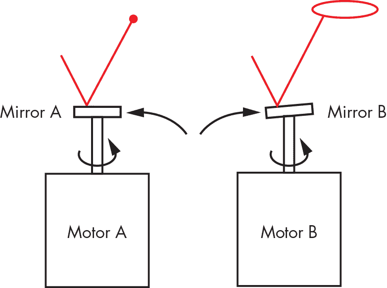
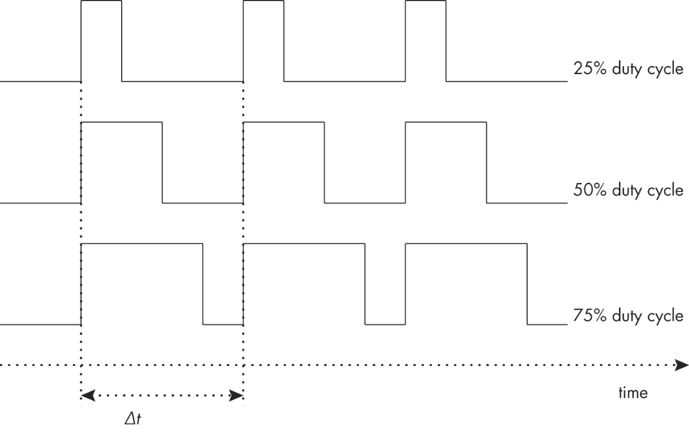
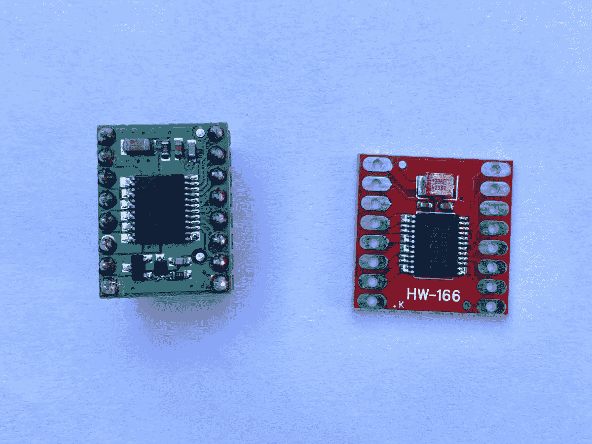
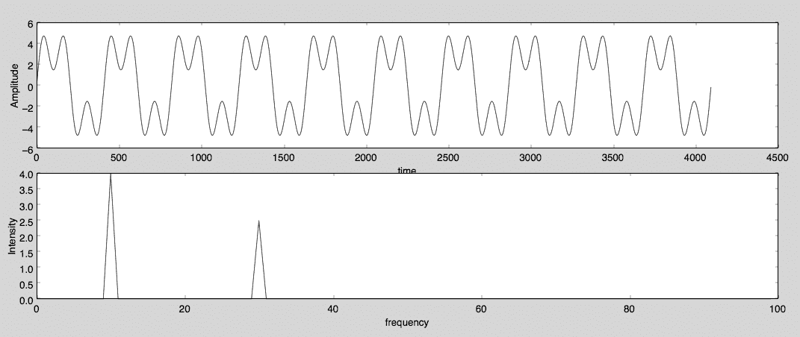
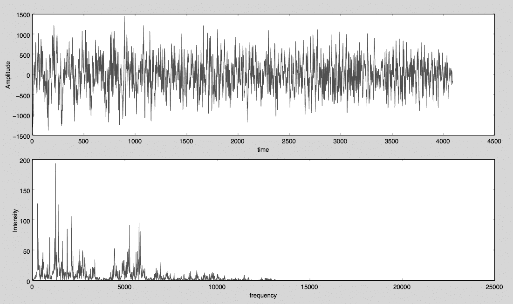
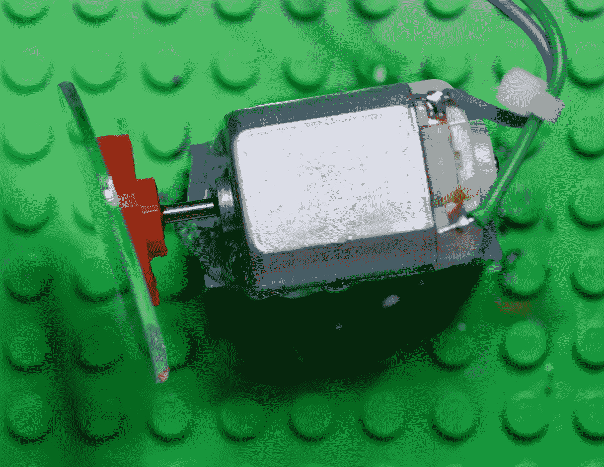
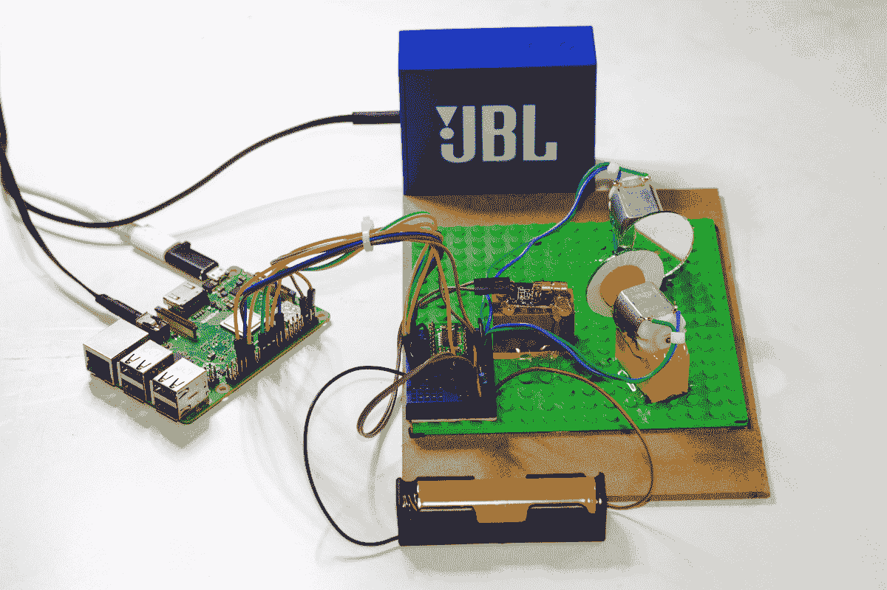

# 13

# 使用树莓派的激光音频显示

在第十二章中，你使用了一个微型微控制器 Pico 来生成音乐音调。在本章中，你将使用功能更强大的嵌入式系统——树莓派，根据音频信号产生有趣的激光图案。

上一章中的 Pico 使用了 RP2040 微控制器，配有双 ARM Cortex-M0 处理器，运行速度最高可达 133 MHz，具有 264KB 的随机存取内存（RAM）和 2MB 的外部闪存非易失存储。相比之下，树莓派 3B+配备了更强大的 ARM Cortex-A53 处理器，主频为 1.4 GHz，具有 1GB 的 RAM 和根据所使用的 SD 卡存储几 GB 的存储空间。尽管与标准的桌面或笔记本计算机相比仍显不足，但树莓派依然能够运行基于 Linux 的操作系统和完整的 Python，与 Pico 不同。

在本章中，你将使用树莓派上的 Python 来读取 WAV 格式的音频文件，基于实时音频数据进行计算，并利用这些数据调整激光显示装置中两个电机的旋转速度和方向。你将把镜子安装到电机上，通过一个廉价的激光模块反射激光束，产生类似螺旋图的图案，这些图案会根据音频的变化而变化。你还会同时将音频流传输到扬声器，让你在观看激光光秀时能听到 WAV 文件的播放。

本项目将进一步扩展你对 Python 的理解，因为你将学习如何使用树莓派。以下是我们将要覆盖的一些主题：

+   • 使用激光和两个旋转镜子生成有趣的图案

+   • 使用快速傅里叶变换（FFT）获取信号的频率信息

+   • 使用`numpy`计算 FFT

+   • 从 WAV 文件读取音频

+   • 使用`pyaudio`输出音频数据

+   • 使用树莓派驱动电机

+   • 使用金属氧化物半导体场效应晶体管（MOSFET）切换激光模块的开/关

## 工作原理

你将使用树莓派处理音频数据并控制硬件。图 13-1 显示了你在这个项目中将创建的框图。

图 13-1：激光音频项目的框图

树莓派将通过两种方式使用 WAV 文件。它将通过连接的扬声器通过`pyaudio`播放该文件，同时使用一种叫做*快速傅里叶变换（FFT）*的数学技术实时分析音频数据。树莓派将使用 FFT 的数据来驱动电机和激光，通过其通用输入输出（GPIO）引脚，但为了保护树莓派不受损害，你不会直接将其连接到这些外部组件上。相反，你将通过电机驱动板和 MOSFET 间接连接它。在你开始之前，让我们更详细地了解一下这些项目方面是如何运作的。

### 用激光生成图案

要在这个项目中生成激光图案，你将使用一个激光模块和两个附着在两个小直流电机轴上的镜子，如图 13-2 所示。可以把激光看作是一束强烈的光束，即使在大距离上投射，它依然能够保持聚焦在一个微小的点上。这种聚焦得以实现，因为激光束是有序的，其波只沿一个方向传播，并且彼此相位一致。如果你将激光照射到平面镜的表面上（如图 13-2 中的镜子 A），即使电机旋转，反射出来的点也将保持固定。因为激光的反射平面是垂直于电机旋转轴的，就好像镜子根本没有旋转一样。

现在，假设镜子相对于电机轴的角度是固定的，如图 13-2 右侧所示（镜子 B）。随着轴的旋转，投射出的点将描绘出一个椭圆，如果电机旋转得足够快，观察者将会看到一个连续的图形。

图 13-2：平面镜（镜子 A）反射出一个点。倾斜镜（镜子 B）的反射在电机旋转时形成一个圆形。

如果两个镜子都倾斜，并且你将它们排列成让从镜子 A 反射出来的点投射到镜子 B 上呢？现在，当 A 和 B 电机旋转时，反射点所形成的图案将是 A 和 B 电机两个旋转运动的结合，产生有趣的图案，如图 13-3 所示。

图 13-3：激光光线从两个旋转的倾斜镜子反射，产生有趣而复杂的图案。

产生的具体图案将取决于两个电机的旋转速度和方向，但它们将类似于你在第二章中探索的由 Spirograph 生成的假圆线图案。

#### 电机控制

你将使用树莓派通过一种叫做 *脉宽调制（PWM）* 的技术来控制电动机的速度和方向。这是一种通过发送快速开关的数字脉冲来为设备（如电动机）供电的方式，使得设备“看到”一个持续的电压。发送给设备的信号有固定的频率，但数字脉冲“开”状态的时间比例，即 *占空比*，是可以变化的。占空比以百分比表示。为了说明，图 13-4 显示了三个频率相同但占空比不同的信号——分别为 25%、50% 和 75%。

图 13-4：具有不同占空比的 PWM 信号

占空比百分比越高，每个信号周期中脉冲的“开”时间就越长。接收信号的电动机会将这些更长的脉冲视为更高的持续电压。通过调整占空比，你可以为电动机提供不同的功率水平，从而实现电动机转速和激光模式的变化。

注意：PWM 除了在电动机控制中有应用外，还可以用于其他领域，例如控制可调光 LED 的亮度。

电动机工作在相对较高的电压下，但树莓派只能处理一定量的电流，超过此限度会损坏。你将使用一个 TB6612FNG 电动机驱动拆解板，类似于图 13-5 中所示的板子，作为树莓派与电动机之间的中介，保护树莓派的安全。此板有许多不同的版本，你可以选择任何一个，只要确保正确连接。

图 13-5：TB6612FNG 电动机驱动拆解 PCB（印刷电路板）

拆解板的底部应有引脚信息。查看 TB6612FNG 芯片的数据手册也是一个好主意，你可以从互联网下载。引脚名称中的 *A* 和 *B* 表示两个电动机。IN 引脚控制电动机的方向，01 和 02 引脚为电动机提供电源，PWM 引脚使用脉宽调制控制电动机的转速。通过写入这些引脚，你可以控制每个电动机的旋转方向和速度，这正是你在这个项目中需要的功能。我们不会深入讲解该板的工作原理，但如果你感兴趣，可以先了解一下 *H 桥*，这是一种常用的电路设计，利用 MOSFET 控制电动机。

注意：你可以用任何你熟悉的电动机控制电路替代这个拆解部分，只要你适当修改代码即可。

#### 激光模块

对于激光器，你将使用一个廉价的激光模块拆解 PCB，类似于图 13-6 中所示的模块。

图 13-6：激光模块

有不同型号的激光模块可供选择。你需要一个具有 650 纳米（nm）红色激光、并且在 5 伏（V）下工作的激光模块。（650 nm 指的是激光的波长。）在使用这个模块进行项目之前，一定要了解这个电路板的极性和连接方式。使用 5 V 电源单独测试它。

#### MOSFET

要通过树莓派打开和关闭激光模块，你需要使用*N 型 MOSFET*，它可以被视为一个电控开关。几乎任何 N 型 MOSFET 都可以用于这个项目，但 BS170 便宜且容易获得。图 13-7 显示了 MOSFET 的引脚编号，以及如何将其连接到激光模块和树莓派。

图 13-7：BS170 MOSFET 连接

10 kΩ电阻“拉”MOSFET 的栅极引脚到地，从而避免在树莓派 GPIO 引脚处于浮动状态时（例如，在 GPIO 清理后）触发 MOSFET。当你向 GPIO 发送 HIGH 信号时，MOSFET 开关打开，激光模块连接到 VM 和 GND，并通电启动。

为什么需要 MOSFET？难道不能直接将激光模块连接到树莓派的 GPIO 引脚吗？那样做并不好，因为 MOSFET 能承受比树莓派更大的电流。使用 MOSFET 可以将树莓派与负载电流峰值的情况隔离开来。宁愿烧坏便宜的 MOSFET，也不想烧坏相对较贵的树莓派！通常来说，每当你想通过树莓派控制外部设备时，记住 MOSFET 技巧是一个好主意。

### 使用快速傅里叶变换分析音频

由于本项目的最终目标是根据音频输入控制电机速度，你需要能够实时分析音频。回忆一下第四章，来自声学乐器的音调是几种频率或泛音的混合。事实上，任何声音都可以使用*傅里叶变换*分解为其组成的频率。当傅里叶变换应用于数字信号时，结果被称为*离散傅里叶变换（**DFT）*，因为数字信号是由许多离散的采样点组成的。在这个项目中，你将使用 Python 实现*快速傅里叶变换（FFT）*算法来计算 DFT。（在本章中，我将使用*FFT*来同时指代算法和结果。）

图 13-8 展示了一个简单的 FFT 示例。图中的上框展示了一个结合了两个正弦波的信号波形。这个图是*时域图*，因为它展示了信号的幅度如何随时间变化。图中的下框展示了与该信号对应的 FFT。FFT 是在*频域图*中，它展示了信号在某一时刻包含的频率。

图 13-8：一个包含多个频率的音频信号（上图）及其对应的 FFT（下图）

上框中的波形可以通过以下方程表示，它将两个正弦波相加：

*y*(*t*) = 4sin(2π10*t*) + 2.5sin(2π30*t*)

请注意第一个波形表达式中的 4 和 10—4 是波的幅度，10 是频率（以赫兹为单位）。与此同时，第二个波形的幅度为 2.5，频率为 30 赫兹。查看下框中的 FFT 图，你会看到它有两个峰，分别位于 10 赫兹和 30 赫兹。FFT 揭示了信号的组成频率。FFT 还标识了每个频率的相对幅度；第一个峰的强度大约是第二个峰的两倍。

现在让我们看一个更实际的例子。图 13-9 展示了一个复杂的音频信号，上框中是该信号，下框是对应的 FFT。请注意，FFT 包含了更多的峰值，并且强度各不相同，表明该信号包含了更多的频率。

图 13-9：FFT 算法接受一个幅度信号（上图），并计算其组成频率（下图）。

要计算 FFT，你需要一组样本。样本数量的选择有些随意，但样本量太小无法有效展示信号的频率内容，而且可能意味着更高的计算负担，因为你每秒需要计算更多的 FFT。另一方面，样本量过大会平均掉信号中的变化，因此你无法得到信号的“实时”频率响应。对于本项目，2,048 的样本量是可行的。在 44,100 赫兹的采样率下，2,048 个样本大约代表 0.046 秒的音频。

你将使用`numpy`计算 FFT，将音频数据拆分成其组成频率，然后利用这些信息来控制电机。首先，你将把频率范围（以赫兹为单位）分成三个频段：[0, 100]，[100, 1000]，和[1000, 2500]。你将计算每个频段的平均幅度水平，每个值将以不同的方式影响电机和激光模式，具体如下：

+   • 低频的平均幅度变化将影响第一个电机的速度。

+   • 中频的平均幅度变化将影响第二个电机的速度。

+   • 当高频信号超过某个阈值时，第一个电机会改变方向。

按照这些规则，激光图案将根据音频信号发生变化。

## 需求

在这个项目中，你将使用以下 Python 模块：

+   • `RPi.GPIO`用于设置 PWM 并控制引脚输出

+   • `time`用于操作之间的暂停

+   • `wave`用于读取 WAV 文件

+   • `pyaudio`用于处理和流式传输音频数据

+   • `numpy`用于 FFT 计算

+   • `argparse`用于处理命令行参数

你还需要以下物品来构建这个项目：

+   • 一块树莓派 3B+或更新版本

+   • 一个 5V 适配器为树莓派供电

+   • 一个带 AUX（线路输入）接口的有源扬声器（现在大多数蓝牙扬声器都配有 AUX 接口）

+   • 一个 TB6612FNG 电机扩展板

+   • 一个激光模块扩展板

+   • 一个 10 kΩ电阻

+   • 一个 BS170 N-channel MOSFET 或同等产品

+   • 两个 9V 额定的小型直流电机，如玩具中使用的电机

+   • 两面小镜子，直径大约为 1 英寸或更小

+   • 一个 3.7V 18650 2000mAh（3C）锂电池及电池座（或者使用四个 AA 电池和电池座）

+   • 两个 3D 打印部件，用于将镜子固定在电机轴上（可选）

+   • 一个大约 8 英寸×6 英寸的矩形底座，用于安装硬件

+   • 一些乐高积木，用来将电机和激光模块抬离底座，以便镜子可以自由旋转

+   • 一个热熔胶枪

+   • 强力胶水，用于将镜子固定在电机轴上

+   • 一个电烙铁

+   • 一块面包板

+   • 用于连接的电线（双头带公头引脚的单芯连接线效果很好）

### 设置树莓派

要设置你的树莓派，请参见附录 B。按照附录中的说明操作，并确保你已安装本项目所需的`numpy`和`pyaudio`Python 包。你将在树莓派上通过安全外壳（SSH）编写代码。你可以设置 Microsoft Visual Studio Code，以便通过 SSH 从你的笔记本或台式机远程操作树莓派。这些内容在附录 B 中也有解释。

### 构建激光显示

在连接所有硬件之前，你应该准备好电机和激光模块用于激光显示。首要任务是将镜子安装到电机上。每个镜子必须相对于电机轴稍微有一个角度。可以使用热胶来实现这一点。将镜子倒放在平面上，并在中心滴上一滴热胶。小心地将电机轴浸入胶水中，保持电机轴相对于镜子有一个微小的倾斜角度，直到胶水硬化。

更好的方法是使用一个带有倾斜面的小型电机法兰盘，方便将镜面固定在其上。但这种部件在哪里能找到呢？你可以使用 3D 打印技术自行制作！图 13-10(a)展示了我使用免费开源程序 OpenSCAD 创建的 3D 设计。你可以从本书的 GitHub 仓库下载该设计。图 13-10(b)展示了 3D 打印的零件。激光首先照射的镜面将使用倾斜较小的法兰盘（5 度），第二面镜子将使用倾斜较大的法兰盘（10 度）。

(a)

(b)

图 13-10：OpenSCAD 模型（a）和 3D 打印的法兰盘（b）

如果你有 3D 打印机，可以自行打印法兰盘，或者通过 3D 打印服务进行打印。（无论哪种方式，成本都不高。）当你得到这些零件后，使用超级胶水将法兰盘固定在电机轴上，再将镜面固定在法兰盘上。图 13-11 展示了完全组装好的零件。

图 13-11：将镜面以轻微的角度连接到每个电机轴上。

测试组装时，使用手转动镜面，同时将激光模块照射在镜面上。你应该能看到激光点在平面表面上形成椭圆形的反射轨迹。对第二面镜子做同样的测试。由于与电机轴的角度较大，它会形成一个更宽的椭圆。

#### 调整镜面

接下来，将激光模块与镜子对准，使得激光从镜面 A 反射到镜面 B，如图 13-12 所示。确保镜面 A 反射出来的激光光束在镜面 A 旋转的整个范围内，始终保持在镜面 B 的圆周内。（这需要通过多次试验。）要测试这个设置，手动旋转镜面 A。同时，确保将镜面 B 调整到适当位置，使得其表面反射出来的光线能够照射到一个平面表面（比如墙面），并覆盖两个镜子旋转的整个范围。

图 13-12：激光与镜面的对准

注意：在调整对准时，你需要保持激光指示器开启。你可以通过以下方式运行项目代码来实现：`python laser_audio.py --test_laser`。此命令仅仅是开启控制激光模块的 MOSFET，稍后在本章中我们会详细讨论。

一旦你对镜子的放置感到满意，用热熔胶将激光模块和两个带镜子的电机固定到三个相同的模块（LEGO 模块效果很好！），以将它们抬高，使电机能够自由旋转。接下来，将这些模块放在安装板上，当你对它们的布局满意时，用铅笔描摹出它们的位置。然后用热熔胶将模块固定到板上。或者你也可以使用 LEGO 底板，只需将 LEGO 模块固定在底板上即可。

#### 电机供电

如果你的电机没有带接线（大多数电机都没有），请将线缆焊接到电机的两个端子上，并确保留下足够的线（大约 6 英寸），这样你就可以将电机连接到电机驱动板。电机可以通过 3.7V 锂电池或 4 节 AA 电池供电。

### 连接硬件

现在开始连接硬件。你需要连接树莓派、电机驱动板、MOSFET、激光模块板和电机。树莓派有一组 GPIO 引脚，用于连接其他硬件。为了了解引脚布局，我强烈推荐你访问网站 [`pinout.xyz`](https://pinout.xyz/)。它为你提供了一个方便的视觉参考，并解释了各种引脚的功能。

注意：树莓派上有几种不同的引脚编号约定。在这个项目中，我们将使用*BCM 引脚编号*约定。

表 13-1 列出了你需要连接的各个部分。

表 13-1：硬件接线连接

| 从 | 到 |
| --- | --- |
| 树莓派 GPIO 12 | TB6612FNG PWMA |
| 树莓派 GPIO 13 | TB6612FNG PWMB |
| 树莓派 GPIO 7 | TB6612FNG AIN1 |
| 树莓派 GPIO 8 | TB6612FNG AIN2 |
| 树莓派 GPIO 5 | TB6612FNG BIN1 |
| 树莓派 GPIO 6 | TB6612FNG BIN2 |
| 树莓派 GPIO 22 | TB6612FNG STBY |
| 树莓派 GND | TB6612FNG GND |
| 树莓派 3V3 | TB6612FNG VCC |
| 树莓派 GPIO 25 | BS170 GATE（也通过 10kΩ电阻连接到 GND） |
| 树莓派 GND | BS170 SOURCE |
| 激光模块 GND | BS170 DRAIN |
| 激光模块 VCC | 电池组 VCC (+) |
| 电池组 GND (−) | TB6612FNG GND |
| 电池组 VCC (+) | TB6612FNG VM |
| 电机 #1 连接器 #1（极性无关） | TB6612FNG A01 |
| 电机 #1 连接器 #2（极性无关） | TB6612FNG A02 |
| 电机 #2 连接器 #1（极性无关） | TB6612FNG B01 |
| 电机 #2 连接器 #2（极性无关） | TB6612FNG B02 |
| 树莓派 3.5 mm 音频插孔 | 有源扬声器的 AUX 输入 |

图 13-13 显示了所有的接线情况。

图 13-13：完全接线的激光显示器

现在让我们看看代码。

## 代码

这个项目的代码位于文件*laser_audio.py*中。你将从一些基本的设置开始。接着，你将定义函数来操作和测试电机与激光，并定义一个函数来处理 WAV 文件中的音频数据，根据这些数据控制电机。最终你将把所有内容结合起来，并通过`main()`函数接受命令行选项。若要查看完整的程序，请跳至“完整代码”（第 305 页）。你也可以在[`github.com/mkvenkit/pp2e/tree/main/laser_audio`](https://github.com/mkvenkit/pp2e/tree/main/laser_audio)下载代码。

### 设置

首先导入所需的模块：

import RPi.GPIO as GPIO

import time

import argparse

import pyaudio

import wave

import numpy as np

`RPi.GPIO`模块让你使用树莓派的引脚。你将使用`time`模块在代码中加入延迟，并使用`argparse`来为程序添加命令行参数。`pyaudio`和`wave`模块将帮助你读取 WAV 文件中的数据并输出音频流。最后，你将使用`numpy`来计算音频数据的 FFT。

接下来，初始化一些全局变量：

# 定义引脚号

# 使用 TB6612FNG 电机驱动器引脚命名

PWMA = 12

PWMB = 13

AIN1 = 7

AIN2 = 8

BIN1 = 5

BIN2 = 6

STBY = 22

LASER = 25

这段代码存储了项目中使用的所有树莓派引脚的引脚号。`PWMA`、`PWMB`、`AIN1`、`AIN2`、`BIN1`、`BIN2`和`STBY`是连接到 TB6612FNG 电机驱动器的引脚。`LASER`引脚将连接到 MOSFET 的门极，用于控制激光模块的开关。注意，这里使用的是 BCM 引脚编号方式。

继续定义更多全局变量：

# global PWM 对象

pwm_a = None

pwm_b = None

# 读取的音频数据大小

CHUNK = 2048

# FFT 大小

N = CHUNK

在这里你初始化了变量`pwm_a`和`pwm_b`，它们将表示`PWM`对象，你将用它们来控制电机。由于在代码中太早创建实际的`PWM`对象，所以在此将它们设置为`None`。你还设置了`CHUNK`，它是你从 WAV 文件中一次读取的音频数据样本数，以及`N`，它是你用于计算 FFT 的样本数。

通过初始化 GPIO 引脚来完成设置。这是使用引脚所必需的。为此，定义一个`init_pins()`函数：

def init_pins():

"""设置引脚"""

❶ global pwm_a, pwm_b

# 使用 BCM 引脚编号方式

❷ GPIO.setmode(GPIO.BCM)

# 将引脚放入列表

pins = [PWMA, PWMB, AIN1, AIN2, BIN1, BIN2, STBY, LASER]

# 设置引脚为输出

❸ GPIO.setup(pins, GPIO.OUT)

# 设置 PWM

pwm_a = GPIO.PWM(PWMA, 100)

pwm_b = GPIO.PWM(PWMB, 100)

首先，你声明`pwm_a`和`pwm_b`是全局变量 ❶，因为你将在这个函数内部设置它们。然后，你将引脚模式设置为 BCM 编号规范 ❷。接下来，你将之前设置的引脚变量放入`pins`列表中，这样你就可以通过一次调用将它们都声明为输出引脚 ❸。最后，你创建两个`PWM`对象，并将它们分配给全局的`pwm_a`和`pwm_b`变量。参数`100`是驱动每个电机的信号频率（单位是赫兹）。你将通过调整这些信号的占空比来控制电机的速度，使用的是脉宽调制技术。

### 控制硬件

你需要一些辅助函数来控制激光模块和电机。我们先来看一下切换激光模块的函数：

def laser_on(on):

# 引脚 25 控制激光控制 MOSFET

GPIO.output(LASER, on)

这个函数接受一个参数`on`，它是一个布尔值`True/False`。你将该参数传递给`GPIO.output()`方法，以设置`LASER`引脚为开（`True`）或关（`False`）。这将触发 MOSFET 来控制激光模块的开关。

接下来，定义一个函数`start_motors()`来在项目开始时启动电机：

def start_motors():

"""启动两个电机"""

# 启用驱动芯片

❶ GPIO.output(STBY, GPIO.HIGH)

# 设置 A 通道的电机方向

❷ GPIO.output(AIN1, GPIO.HIGH)

❸ GPIO.output(AIN2, GPIO.LOW)

# 设置 B 通道电机方向

GPIO.output(BIN1, GPIO.HIGH)

GPIO.output(BIN2, GPIO.LOW)

# 设置 A 通道的 PWM

duty_cycle = 10

❹ pwm_a.start(duty_cycle)

# 设置 B 通道的 PWM

pwm_b.start(duty_cycle)

首先，你将`STBY`（待机）引脚设置为`HIGH` ❶，这实际上会打开电机驱动器。然后，你将`AIN1`和`AIN2`引脚分别设置为`HIGH` ❷和`LOW` ❸。这将使电机 A 朝一个方向旋转。（交换这两个引脚的`HIGH/LOW`值会导致电机朝相反方向旋转。）对电机 B 做同样的操作。最后，你使用`PWM`对象来设置电机的速度 ❹。你将占空比（与电机速度相关）设置为 10%，这是一个相对较低的值，因为这只是一个初始化调用。

你还需要一个函数来在项目结束时停止电机旋转。以下是该函数的定义：

def stop_motors():

"""停止两个电机"""

# 停止 PWM

❶ pwm_a.stop()

❷ pwm_b.stop()

# 刹车 A

GPIO.output(AIN1, GPIO.HIGH)

GPIO.output(AIN2, GPIO.HIGH)

# 刹车 B

GPIO.output(BIN1, GPIO.HIGH)

GPIO.output(BIN2, GPIO.HIGH)

# 禁用驱动芯片

❸ GPIO.output(STBY, GPIO.LOW)

为了停止电机旋转，你首先停止传送到`PWMA` ❶和`PWMB` ❷引脚的 PWM 信号。然后，你将`AIN1`、`AIN2`、`BIN1`和`BIN2`引脚全部设置为`HIGH`，这样就能“刹车”每个电机直到停止。最后，你通过将`STBY`引脚设置为`LOW` ❸来禁用电机驱动器。待机模式可以在电机不需要运转时节省电力。

你需要一个辅助函数来设置两个电机的速度和方向。你将使用这个函数根据实时音频分析调整电机。

def set_motor_speed_dir(dca, dcb, dira, dirb):

"""设置电机的速度和方向"""

# 设置占空比

❶ pwm_a.ChangeDutyCycle(dca)

pwm_b.ChangeDutyCycle(dcb)

# 设置方向 A

❷ if dira:

GPIO.output(AIN1, GPIO.HIGH)

GPIO.output(AIN2, GPIO.LOW)

❸ else:

GPIO.output(AIN1, GPIO.LOW)

GPIO.output(AIN2, GPIO.HIGH)

if dirb:

GPIO.output(BIN1, GPIO.HIGH)

GPIO.output(BIN2, GPIO.LOW)

else:

GPIO.output(BIN1, GPIO.LOW)

GPIO.output(BIN2, GPIO.HIGH)

`set_motor_speed_dir()` 函数有四个参数：`dca` 和 `dcb` 决定了每个电机的占空比，而 `dira` 和 `dirb` 是布尔值，设置电机的旋转方向。你使用 `ChangeDutyCycle()` 方法来更新电机的占空比（速度）到传入函数的值 ❶。然后你处理电机的方向。如果 `dira` 为 `True` ❷，你将引脚 `AIN1` 和 `AIN2` 分别设置为 `HIGH` 和 `LOW`，这样电机 A 就会朝一个方向旋转。然而，如果 `dira` 为 `False` ❸，你会反向设置引脚，使电机朝另一个方向旋转。对于电机 B，你使用 `dirb` 参数进行相同的设置。

### 处理音频

这个项目的核心是 `process_audio()` 函数，它从 WAV 文件中读取音频数据，使用 `pyaudio` 输出音频流，通过计算 FFT 分析音频数据，并利用分析结果控制电机。我们将分段查看该函数。

def process_audio(filename):

print("正在打开 {}...".format(filename))

# 打开 WAV 文件

❶ wf = wave.open(filename, 'rb')

# 打印音频详情

❷ print("SW = {}, NCh = {}, SR = {}".format(wf.getsampwidth(),

wf.getnchannels(), wf.getframerate()))

# 检查支持的格式

❸ if wf.getsampwidth() != 2 or wf.getnchannels() != 1:

print("仅支持单通道 16 位 WAV 文件！")

wf.close()

return

# 创建 PyAudio 对象

❹ p = pyaudio.PyAudio()

# 打开输出流

❺ stream = p.open(format=p.get_format_from_width(wf.getsampwidth()),

channels=wf.getnchannels(),

rate=wf.getframerate(),

output=True)

# 读取第一帧

你从使用 `wave` 模块打开传递给 `process_audio()` 函数的音频文件开始 ❶。`wave.open()` 函数返回一个 `Wave_read` 对象，你将使用它从 WAV 文件中读取数据。你会打印出一些读取的 WAV 文件信息 ❷：`SW` 是采样宽度（以字节为单位），`NCh` 是音频中的通道数，`SR` 是采样率。为了保持项目简单，你只支持单通道、16 位的 WAV 文件作为输入。你会检查这些规格 ❸，如果输入不匹配，你会从函数中返回。

接下来，你创建一个`PyAudio`对象，用于从 WAV 文件流式传输数据到输出 ❹。然后你打开一个`pyaudio`输出流（通过`output=True`参数指示），并将其配置为与 WAV 文件具有相同的采样宽度、通道数和采样率 ❺。对于树莓派，默认的音频输出是板上的 3.5 毫米音频插孔。只要你的扬声器插入这个插孔，你就能听到声音输出。

以下是函数的下一部分：

❶ data = wf.readframes(CHUNK)

❷ buf = np.frombuffer(data, dtype=np.int16)

# 存储采样率

❸ SR = wf.getframerate()

# 启动电机

启动电机()

# 激光开

激光开(True)

这里，你从 WAV 文件中读取`CHUNK`个样本到变量`data`中 ❶。记住，你已经将`CHUNK`设置为`2048`，每个样本占 2 个字节，所以你将读取共 2048 个 16 位值。由于函数的主循环结构，你一次只读取一个数据块，正如你在接下来的代码中看到的那样。

`readframes()`方法返回一个`bytes`对象，但你使用`numpy`库的`frombuffer()`函数将这个`bytes`对象转换为一个名为`buf`的 16 位整数的`numpy`数组 ❷。你将采样率（`wave`模块称之为*帧率*）存储在变量`SR`中 ❸；稍后你将需要它。然后，你调用之前讨论过的`start_motors()`和`laser_on()`函数来启动电机和激光模块。

接下来，你进入函数的主循环，循环输出音频并执行 FFT。该循环一次处理一个音频数据块，这就是为什么在前面的代码中你只读取一个数据块的原因。请注意，循环发生在一个`try`块内。稍后，你将写一个`except`块来处理执行过程中可能出现的任何问题。

# 从 WAV 文件读取音频数据

尝试:

# 循环直到没有数据可读取

❶ while len(data) > 0:

# 将数据写入输出流

❷ stream.write(data)

# 确保有足够的样本进行 FFT

❸ if len(buf) == N:

❹ buf = np.frombuffer(data, dtype=np.int16)

# 执行 FFT

❺ fft = np.fft.rfft(buf)

❻ fft = np.abs(fft) * 2.0/N

# 计算音量

# 获取 3 个频段的平均值

# 0-100 Hz, 100-1000 Hz, 和 1000-2500 Hz

❼ levels = [np.sum(fft[0:100])/100,

np.sum(fft[100:1000])/900,

np.sum(fft[1000:2500])/1500]

主循环会一直重复，直到`data`为空 ❶，这意味着你已经处理到 WAV 文件的末尾。在循环中，你将当前的数据块写入`pyaudio`输出流 ❷。这样，你在驱动电机的同时也可以听到正在处理的 WAV 文件。接着，你检查当前数据块中是否有`N`个样本来计算 FFT ❸（在代码开始时，你将`N`设置为`2048`，和数据块大小相同）。这个检查是必要的，因为最后读取的数据块可能没有足够的样本来进行 FFT 计算。如果是这种情况，你将跳过 FFT 计算和电机更新，因为音频文件基本上已经结束了。

接下来，你将音频数据加载到一个 `numpy` 数组中，数据类型为 16 位整数 ❹。使用这种格式的数据，计算 FFT 非常直接：你只需使用 `numpy.fft` 模块中的 `rfft()` 方法 ❺。该方法接受由*实数*（例如音频数据）组成的信号，并计算 FFT，通常会得到一组*复数*。但是你需要继续使用实数，因此你使用 `abs()` 方法来获得这些复数的幅值，它们是实数 ❻。`2.0/N` 是你用来将 FFT 值映射到期望范围的归一化因子。

继续循环，你从 FFT 中提取相关信息来控制电机。为了分析音频信号，你将频率范围划分为三个频段：0 到 100 Hz（低音），100 到 1,000 Hz（中音），以及 1,000 到 2,500 Hz（高音）。你特别关注低音和中音频段，它们大致对应歌曲中的节奏和人声部分。你通过使用 `numpy.``sum()` 方法并将结果除以该频段中的频率数量来计算每个频段中频率的平均幅度值 ❼。你将三个平均值存储在一个 Python 列表中。

请注意，在 `while` 循环中你正在做两件不同的事情：将音频发送到输出并计算相同音频的 FFT。你能够做到这一点并保持音频输出的持续播放，因为 `numpy` 的 FFT 计算速度足够快——它在当前音频数据播放完之前就已经完成了。试试这个实验：在 FFT 后放一个时间延迟，看看声音输出会发生什么！

现在你需要将来自 FFT 的平均幅度值转换为电机的速度和方向，仍然是在之前列表中开始的 `while` 循环内。速度需要是百分比，而方向则需要是 `True/False` 值。

# speed1

❶ dca = int(5*levels[0])  百分比 60

# speed2

❷ dcb = int(100 + levels[1])  百分比 60

# dir

dira = False

dirb = True

❸ 如果 levels[2] > 0.1：

dira = True

# 设置电机方向和速度

❹ set_motor_speed_dir(dca, dcb, dira, dirb)

首先，你取出最低频段的值，将其按 `5` 的倍数缩放，转换为整数，并使用取模运算符（`百分比`）确保该值位于[0, 60] 范围内 ❶。这个值控制电机 A 的速度。然后，你将中频段的值加上 `100`，再次使用取模运算符将其置于[0, 60] 范围内 ❷。这个值控制电机 B 的速度。

注意：一开始让电机转得太快并不是一个好主意，这就是为什么这段代码将电机的速度限制在 60 百分比。 一旦你确定显示正常工作，你可以尝试在❶和❷处增加速度阈值。

默认情况下，你将`dira`设置为`False`来让电机 A 朝一个方向运行，但如果最高频带的值超过`0.1`的阈值，❸你会切换到另一个方向。同时，你通过将`dirb`设置为`True`来保持电机 B 的方向不变。最后，你调用`set_motor_speed_dir()`函数，按照你计算出的速度和方向运行电机❹。

注意：没有特别优雅的规则来将 FFT 信息转换为电机的速度和方向。FFT 值会随着音频信号不断变化，因此你提出的任何方法都会使激光图案根据音乐变化。我通过反复试验得出了这里描述的方法；在播放不同类型的音乐时，我观察了 FFT 值，并选择了那些产生有趣图案的计算方法。我鼓励你也尝试这些计算并创建你自己的转换方法。只要你把电机速度设置在[0, 100]范围内（或者更低以避免高速度），并将方向设置为`True`或`False`，就没有错误的答案。

以下是`process_audio()`函数的其余部分：

# 读取下一个

❶ data = wf.readframes(CHUNK)

❷ except BaseException as err:

print("意外的{}, 类型={}".format(err, type(err)))

❸ finally:

print("最终：Pyaudio 清理...")

stream.stop_stream()

stream.close()

# 停止电机

stop_motors()

首先，你通过读取下一个音频数据块来结束`while`循环❶。记住，`while`循环是在`try`块内展开的。`except`块❷捕获循环过程中可能出现的任何异常。例如，在程序运行时按下 CTRL-C 会抛出异常并停止循环，读取数据时出现任何错误也会如此。最后，你在`finally`块❸中做一些清理工作，无论是否抛出异常，这个块都会执行。在这个块中，你停止`pyaudio`输出流并关闭它，同时调用`stop_motors()`函数来停止电机旋转。

### 测试电机

为了测试，能够手动设置电机的速度和方向，并查看结果激光图案会很有用。下面是一个使这一切成为可能的`test_motors()`函数：

def test_motors():

"""通过手动设置速度和方向测试电机"""

# 打开激光

❶ laser_on(True)

# 启动电机

❷ start_motors()

# 读取用户输入

try:

while True:

❸ print("输入 dca dcb dira dirb（例如 50 100 1 0）：")

# 读取输入

str_in = input()

# 解析值

❹ vals = [int(val) for val in str_in.split()]

# 完整性检查

if len(vals) == 4:

❺ set_motor_speed_dir(vals[0], vals[1], vals[2], vals[3])

else:

print("输入错误！")

except:

print("退出电机测试！")

❻ finally:

# 停止电机

stop_motors()

# 关闭激光

laser_on(False)

你首先通过开启激光 ❶ 和启动电机 ❷。然后进入一个循环，获取用户输入信息。循环会提示用户输入四个整数值 ❸：`dca`和`dcb`是电机的占空比（速度，范围 0 到 100），`dira`和`dirb`是电机的方向（0 或 1）。你等待输入，然后解析输入，使用`split()`将输入字符串按空白分割成多个字符串，并使用列表推导将每个子串转换为整数 ❹。在确保输入确实包含四个数字后，你使用提供的值来运行电机 ❺。

这个过程会在循环中运行，因此你可以尝试输入不同的速度和方向值来查看结果。由于`while`循环被放置在`try`块内，按 CTRL-C 时会抛出异常并退出测试，直到你准备好结束。然后，在`finally`块 ❻ 中，你停止电机并关闭激光。

### 将一切整合在一起

如常，`main()`函数接受命令行参数并启动项目。我们先来看一下命令行参数：

def main():

"""主调用函数"""

# 设置参数解析器

❶ parser = argparse.ArgumentParser(description="激光音频显示。")

# 添加参数

parser.add_argument('--test_laser', action='store_true', required=False)

parser.add_argument('--test_motors', action='store_true', required=False)

parser.add_argument('--wav_file', dest='wav_file', required=False)

args = `parser`.`parse_args`()

在这里，你遵循了创建`ArgumentParser`对象的常见模式，用来解析程序的命令行参数 ❶。该程序支持三种不同的命令行参数。`--test_laser`选项只是开启激光，适用于你在构建电机和激光组件时。`--test_motors`选项用于测试电机，`--wav_file`选项让你指定要读取的 WAV 文件用于激光音频显示。

下面是`main()`函数的其余部分：

# 初始化引脚

❶ init_pins()

# 主循环

try:

❷ 如果 args.test_laser:

print("激光开启...")

laser_on(True)

try:

# 循环等待

while True:

time.sleep(0.1)

except:

# 关闭激光

laser_on(False)

❸ elif args.test_motors:

print("测试电机...")

test_motors()

❹ elif args.wav_file:

print("开始激光音频显示...")

process_audio(args.wav_file)

except (Exception) as e:

print("异常: {}".format(e))

print("退出中。")

# 关闭激光

❺ laser_on(False)

# 在最后调用

❻ GPIO.cleanup()

print("完成。")

你调用之前定义的`init_pins()`函数来初始化 Raspberry Pi 的 GPIO 引脚❶。接下来，你处理命令行参数。如果用户输入了`--test_laser`参数，则`args.test_laser`将被设置为`True`。你通过打开激光并等待用户按下 CTRL-C 来终止循环❷。类似地，你通过调用`test_motors()`来处理`--test_motors`选项❸。要启动激光音频显示，用户需要使用`--wav_file`命令行参数。在这种情况下❹，你调用`process_audio()`函数。再次强调，所有这些都嵌入在一个`try`代码块中，所以当用户按下 CTRL-C 时，任何三种模式下都可以退出循环。最后，你关闭激光❺并在退出程序之前进行 GPIO 清理❻。

## 运行激光显示

要测试该项目，请组装硬件，确保电池组已连接，并将所有设备放置好，使激光投射到一个平坦的表面上，例如墙壁。然后，使用 SSH 登录到你的 Raspberry Pi，如附录 B 中所讨论的，并从终端运行程序。我建议先通过在测试模式下运行程序来测试激光显示部分。

警告：该项目包含高速旋转镜面。请佩戴适当的眼部防护装备，或在运行程序前用透明盒子覆盖设备，以避免受伤。

以下是测试模式的示例运行：

$ `python laser_audio.py --test_motors`

正在测试电机...

输入 dca dcb dira dirb（例如：50 100 1 0）：

`30 40 0 1`

输入 dca dcb dira dirb（例如：50 100 1 0）：

`40 30 1 0`

你可以使用此测试通过不同的速度和方向组合运行两个电机。当你改变数值时，你应该能看到不同的激光图案投射到墙上。要停止程序和电机，请按 CTRL-C。注意，如果输入的占空比（速度）值超过 80，电机会转得非常快。小心！

如果测试成功，你就可以继续进行实际展示。将你喜欢的音乐 WAV 文件复制到 Raspberry Pi 上。记住，为了简化操作，程序仅接受 16 位格式的单声道 WAV 文件。你可以使用免费软件 Audacity 将任何音频文件转换为此格式。（该项目的 GitHub 仓库中也提供了一个示例文件。）音频文件就位后，按如下方式运行程序，将你想要的文件名替换到`--wave_file`选项后：

`python3 laser_audio.py --wav_file bensound-allthat-16.wav`

你应该看到激光显示产生许多有趣的图案，这些图案随音乐的节奏变化，如图 13-14 所示。

图 13-14：激光显示的完整接线及投射到墙上的图案

尝试使用不同的 WAV 文件，或使用不同的计算方法将 FFT 信息转换为电机设置，看看可视化效果如何响应。

## 总结

在本章中，你通过构建一个相当复杂的项目提升了你的 Python 和硬件技能。你学会了如何使用 Python、树莓派和电机驱动器来控制电机。你使用`numpy`计算音频数据的 FFT，并且使用`pyaudio`实时流式传输音频输出。你甚至学会了使用 MOSFET 控制激光！

## 实验！

这里有一些你可以修改这个项目的方法：

1.  1. 该程序使用了一种任意方案将 FFT 值转换为电机速度和方向数据。试着改变这个方案。例如，实验不同的频段和改变电机方向的标准。

1.  2. 在这个项目中，你将从音频信号中收集到的频率信息转换为电机速度和方向设置。试着让电机根据音乐的整体“脉冲”或音量来运动。为此，你可以计算信号幅度的*均方根（RMS）*值。这个计算类似于 FFT 计算。一旦你读取了一段音频数据并将其放入`numpy`数组`x`中，你可以通过以下方式计算 RMS 值：

    rms = np.sqrt(np.mean(x**2))

    此外，记住你项目中的幅度是作为 16 位带符号整数表示的，最大值为 32,768（在归一化时记住这个数字很有用）。结合 FFT 使用这个 RMS 幅度，可以生成更多变化的激光图案。

1.  3. 你现在知道了，音频数据的频率内容，因此其 FFT，与音频同步变化。你能像图 13-15 中所示的那样，创建一个实时的音频数据和 FFT 的可视化效果吗？这个可视化效果应该随着音频从扬声器播放而变化。这是为你的电脑设计的，而不是为树莓派设计的。

    

    图 13-15：实时 FFT 可视化

    这里有一些提示，帮助你解决这个问题：

    +   ◦ 使用`matplotlib`进行绘图。

    +   ◦ 使用 Python 的`multiprocessing`包，使你的音乐流输出和绘图可以同时进行。

    +   ◦ 使用`numpy.fft.rfftfreq()`方法来获取与 FFT 值对应的频率，方便绘图。

    （本实验的解决方案代码可以在本书的 GitHub 仓库中找到，但先自己试试看！）

## 完整代码

这是这个项目的完整 Python 代码：

"""

laser_audio.py

创建一个随音乐变化的激光显示。

在树莓派上使用 Python。

作者：Mahesh Venkitachalam

"""

import RPi.GPIO as GPIO

import time

import argparse

import pyaudio

import wave

import numpy as np

# 定义引脚编号

# 使用 TB6612FNG 电机驱动器的引脚命名

PWMA = 12

PWMB = 13

AIN1 = 7

AIN2 = 8

BIN1 = 5

BIN2 = 6

STBY = 22

LASER = 25

# global PWM objects

pwm_a = None

pwm_b = None

# 读取的音频数据大小

CHUNK = 2048

# FFT 大小

N = CHUNK

def init_pins():

"""设置引脚"""

global pwm_a, pwm_b

# 使用 BCM 引脚编号

GPIO.setmode(GPIO.BCM)

# 将引脚放入列表

pins = [PWMA, PWMB, AIN1, AIN2, BIN1, BIN2, STBY, LASER]

# 设置引脚为输出

GPIO.setup(pins, GPIO.OUT)

# 设置 PWM

pwm_a = GPIO.PWM(PWMA, 100)

pwm_b = GPIO.PWM(PWMB, 100)

def laser_on(on):

"""开关激光器 MOSFET"""

# 引脚 25 控制激光器 MOSFET

GPIO.output(LASER, on)

def test_motors():

"""通过手动设置速度和方向测试电机"""

# 打开激光器

laser_on(True)

# 启动电机

start_motors()

# 读取用户输入

try:

while True:

print("请输入 dca dcb dira dirb（例如：50 100 1 0）：")

# 读取输入

str_in = input()

# 解析数值

vals = [int(val) for val in str_in.split()]

# 完整性检查

if len(vals) == 4:

set_motor_speed_dir(vals[0], vals[1], vals[2], vals[3])

else:

print("输入错误！")

except:

print("退出电机测试！")

finally:

# 停止电机

stop_motors()

# 关闭激光器

laser_on(False)

def start_motors():

"""启动两个电机"""

# 启用驱动芯片

GPIO.output(STBY, GPIO.HIGH)

# 设置 A 通道的电机方向

GPIO.output(AIN1, GPIO.HIGH)

GPIO.output(AIN2, GPIO.LOW)

# 设置 B 通道的电机方向

GPIO.output(BIN1, GPIO.HIGH)

GPIO.output(BIN2, GPIO.LOW)

# 设置 A 通道的 PWM

duty_cycle = 0

pwm_a.start(duty_cycle)

# 设置 B 通道的 PWM

pwm_b.start(duty_cycle)

def stop_motors():

"""停止两个电机"""

# 停止 PWM

pwm_a.stop()

pwm_b.stop()

# 刹车 A

GPIO.output(AIN1, GPIO.HIGH)

GPIO.output(AIN2, GPIO.HIGH)

# 刹车 B

GPIO.output(BIN1, GPIO.HIGH)

GPIO.output(BIN2, GPIO.HIGH)

# 禁用驱动芯片

GPIO.output(STBY, GPIO.LOW)

def set_motor_speed_dir(dca, dcb, dira, dirb):

"""设置电机的速度和方向"""

# 设置占空比

pwm_a.ChangeDutyCycle(dca)

pwm_b.ChangeDutyCycle(dcb)

# 设置 A 方向

if dira:

GPIO.output(AIN1, GPIO.HIGH)

GPIO.output(AIN2, GPIO.LOW)

else:

GPIO.output(AIN1, GPIO.LOW)

GPIO.output(AIN2, GPIO.HIGH)

if dirb:

GPIO.output(BIN1, GPIO.HIGH)

GPIO.output(BIN2, GPIO.LOW)

else:

GPIO.output(BIN1, GPIO.LOW)

GPIO.output(BIN2, GPIO.HIGH)

def process_audio(filename):

"""读取 WAV 文件，进行 FFT 并控制电机"""

print("正在打开 {}...".format(filename))

# 打开 WAV 文件

wf = wave.open(filename, 'rb')

# 打印音频详细信息

print("SW = {}, NCh = {}, SR = {}".format(wf.getsampwidth(),

wf.getnchannels(), wf.getframerate()))

# 检查是否支持的格式

if wf.getsampwidth() != 2 or wf.getnchannels() != 1:

print("仅支持单声道 16 位 WAV 文件！")

wf.close()

return

# 创建 PyAudio 对象

p = pyaudio.PyAudio()

# 打开输出流

stream = p.open(format=p.get_format_from_width(wf.getsampwidth()),

channels=wf.getnchannels(),

rate=wf.getframerate(),

output=True)

# 读取第一帧

data = wf.readframes(CHUNK)

buf = np.frombuffer(data, dtype=np.int16)

# 存储采样率

SR = wf.getframerate()

# 启动马达  

start_motors()  

# 激光开启  

laser_on(True)  

# 从 WAV 文件读取音频数据  

try:  

# 循环直到没有数据可读取  

while len(data) > 0:  

# 将流写入输出  

stream.write(data)  

# 确保 FFT 有足够的样本  

if len(buf) == N:  

buf = np.frombuffer(data, dtype=np.int16)  

# 执行 FFT  

fft = np.fft.rfft(buf)  

fft = np.abs(fft) * 2.0/N  

# 计算音量  

# 获取 3 个频段的平均值  

# 0-100 Hz，100-1000 Hz，以及 1000-2500 Hz  

levels = [np.sum(fft[0:100])/100,  

np.sum(fft[100:1000])/900,  

np.sum(fft[1000:2500])/1500]  

# speed1  

dca = int(5*levels[0])  百分比 60  

# speed2  

dcb = int(100 + levels[1])  百分比 60  

# dir  

dira = False  

dirb = True  

if levels[2] > 0.1:  

dira = True  

# 设置马达的方向和速度  

set_motor_speed_dir(dca, dcb, dira, dirb)  

# 读取下一部分  

data = wf.readframes(CHUNK)  

except BaseException as err:  

print("意外的错误，类型={}".format(err, type(err)))  

finally:  

print("最后：Pyaudio 清理...")  

stream.stop_stream()  

stream.close()  

# 停止马达  

stop_motors()  

# 关闭 WAV 文件  

wf.close()  

def main():  

"""主函数调用"""  

# 设置参数解析器  

parser = argparse.ArgumentParser(description="激光音频显示。")  

# 添加参数  

parser.add_argument('--test_laser', action='store_true', required=False)  

parser.add_argument('--test_motors', action='store_true', required=False)  

parser.add_argument('--wav_file', dest='wav_file', required=False)  

args = parser.parse_args()  

# 初始化引脚  

init_pins()  

# 主循环  

try:  

if args.test_laser:  

print("激光开启...")  

laser_on(True)  

try:  

# 循环等待  

while True:  

time.sleep(1)  

except:  

# 关闭激光  

laser_on(False)

elif args.test_motors:  

print("测试马达...")  

test_motors()  

elif args.wav_file:  

print("开始激光音频显示...")  

process_audio(args.wav_file)  

except (Exception) as e:  

print("异常：{}".format(e))  

print("退出。")  

# 关闭激光  

laser_on(False)  

# 最后调用  

GPIO.cleanup()  

print("完成。")  

# 调用 main  

if __name__ == '__main__':  

main()  
