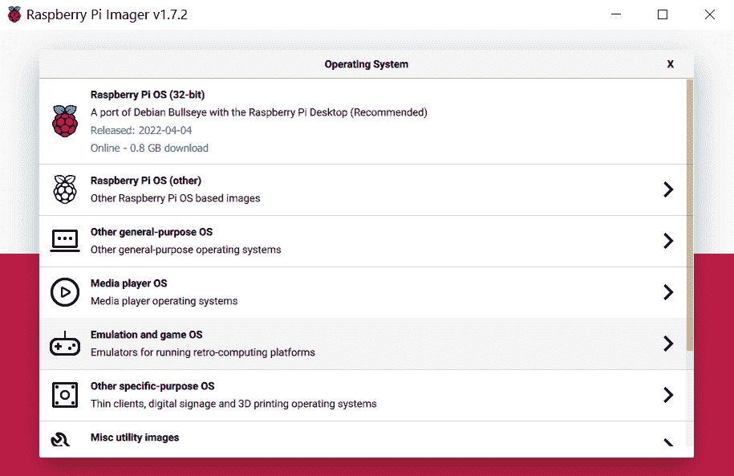
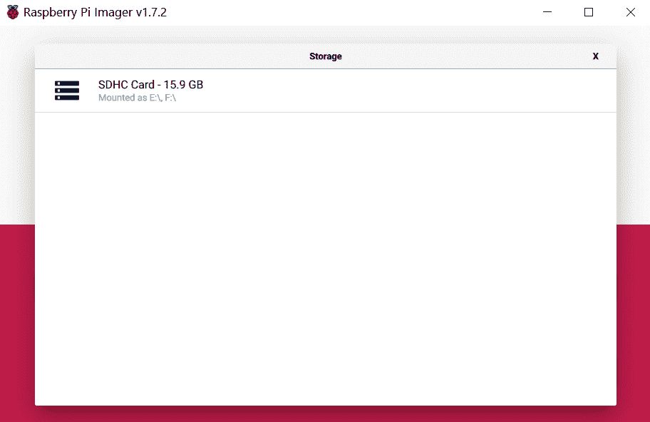
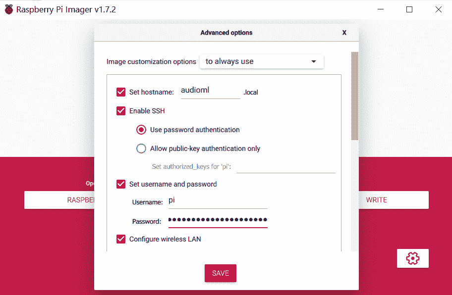

# B

# 树莓派设置

本附录介绍了如何设置树莓派，以便你可以使用它进行 第十三章、第十四章 和 第十五章 中的项目。这些项目适用于树莓派 3 型 B+ 或树莓派 4 型 B。两者的设置说明相同。除了开发板，你还需要一个兼容的电源和一个容量为 16GB 或更高的 micro SD 卡。

## 设置软件

有几种方法可以设置你的树莓派。这些步骤概述了其中一种最简单的方法，使用树莓派 Imager：

1.  1. 从树莓派官网 [`www.raspberrypi.com/software`](https://www.raspberrypi.com/software/) 下载树莓派 Imager。

1.  2. 将你的 SD 卡插入电脑。（根据你的系统，你可能需要一个 micro SD 卡适配器。）

1.  3. 打开 Pi Imager 并点击 **选择操作系统** 按钮。图 B-1 显示了结果对话框。

    

    图 B-1：树莓派 Imager 中的选择操作系统对话框

1.  4. 点击 **树莓派 OS** 选项。

1.  5. 点击 **选择存储** 按钮。你应该会看到像 图 B-2 中那样的界面。

    

    图 B-2：树莓派 Imager 中的选择存储对话框

1.  6. 屏幕上应该列出你的 SD 卡。点击它。

1.  7. 点击齿轮图标以打开高级选项对话框，如 图 B-3 所示。

    

    图 B-3：树莓派 Imager 中的高级选项对话框

1.  8. 在设置主机名框中输入树莓派的名称。我在 图 B-3 中将名称设置为 `audioml`。由于树莓派操作系统默认启用了名为 Avahi 的服务，你可以通过在设备名称后加上 `.local` 来在本地网络上访问你的树莓派——例如，`audioml.local`。这比记住和使用 IP 地址要方便得多。

1.  9. 在同一个对话框中，设置你的用户名和密码，并启用 SSH。然后向下滚动，查看 Wi-Fi 连接选项，如 图 B-4 所示。

    

    图 B-4：树莓派 Imager 中的 Wi-Fi 详情

1.  10. 输入你的 Wi-Fi 详情，类似于 图 B-4 中所示。完成后，点击 **保存**，然后点击 **写入** 按钮，将所有这些信息写入你的 SD 卡。

1.  11. 当 SD 卡准备好后，将其插入你的树莓派。然后启动树莓派，它将自动连接到你的 Wi-Fi 网络。

现在，您应该能够使用安全外壳（SSH）远程登录到您的 Pi，稍后我们将讨论这一点。

## 测试您的连接

要检查您的 Pi 是否连接到本地网络，在计算机的命令行中输入 `ping`，后面跟上您的 Pi 的设备名称。例如，下面是 Windows 命令行中 `ping` 会话的样子：

$ `ping audioml.local`

正在向 audioml.local [fe80::e3e0:1223:9b20:2d6f%6] 发送 32 字节数据：

来自 fe80::e3e0:1223:9b20:2d6f%6 的回复：时间=66ms

来自 fe80::e3e0:1223:9b20:2d6f%6 的回复：时间=3ms

来自 fe80::e3e0:1223:9b20:2d6f%6 的回复：时间=2ms

来自 fe80::e3e0:1223:9b20:2d6f%6 的回复：时间=3ms

来自 fe80::e3e0:1223:9b20:2d6f%6 的 Ping 统计：

数据包：已发送 = 4，已接收 = 4，丢失 = 0（丢包率 0%），

往返时间（以毫秒为单位）：

最小 = 2ms，最大 = 66ms，平均 = 18ms

这个 `ping` 输出显示了发送的字节数和收到回复所需的时间。如果您看到“请求超时...”的信息，那么就说明您的 Pi 没有连接到网络。在这种情况下，您可以尝试在互联网上搜索故障排除策略。例如，在 Windows 计算机上，您可以尝试以管理员身份打开命令提示符，并输入 `arp -d` 命令。这会清除 ARP 缓存。（ARP 是一种用于在网络上发现其他计算机的协议。）然后再试一次 `ping` 命令。如果仍然失败，您可能需要将显示器和键盘连接到 Pi，以检查它是否真的能够连接到互联网。

## 通过 SSH 登录到您的 Pi

您可以将键盘、鼠标和显示器连接到 Pi，直接与其互动，但对于本书的目的，最方便的方式是通过 SSH 从桌面或笔记本电脑远程登录到您的 Pi。如果您不仅经常这样做，而且每次都从同一台计算机进行，您可能会觉得每次都输入密码很麻烦。使用 SSH 附带的 `ssh-keygen` 工具，您可以设置公钥/私钥方案，这样就可以安全地登录到 Pi 而无需输入密码。对于 macOS 和 Linux 用户，请按照下列步骤操作。（对于 Windows 用户，PuTTY 也提供类似功能。搜索 “Generating an SSH key with PuTTY” 以了解更多信息。）

1.  1\. 在计算机的终端中，输入以下命令生成密钥文件：

$ `ssh-keygen`

正在生成公钥/私钥 RSA 密钥对。

输入要保存密钥的文件（/Users/`xxx`/.ssh/id_rsa）：

输入密码短语（若无密码短语请留空）：

请再次输入相同的密码短语：

您的身份已保存在 /Users/`xxx`/.ssh/id_rsa 中。

您的公钥已保存在 /Users/`xxx`/.ssh/id_rsa.pub 中。

密钥指纹是：

--`snip`--

1.  2\. 将密钥文件复制到 Pi。您可以使用 `scp` 命令，它是 SSH 的一部分。输入以下命令，替换适当的 Pi 的 IP 地址：

$ `scp ~/.ssh/id_rsa.pub pi@``192.168.4.32``:.ssh/`

无法验证主机 '192.168.4.32（192.168.4.32）' 的真实性

已建立连接。

RSA 密钥指纹是 f1:ab:07:e7:dc:2e:f1:37:1b:6f:9b:66:85:2a:33:a7。

你确定要继续连接吗（是/否）？`yes`

警告：永久将 '192.168.4.32'（RSA）添加到已知主机列表中

已知主机。

pi@192.168.4.32 的密码：

id_rsa.pub                                   100%  398     0.4KB/s   00:00

1.  3\. 登录到 Pi 并验证密钥文件是否已复制，记得替换为你 Pi 的 IP 地址：

$ `ssh pi@``192.168.4.32`

pi@192.168.4.32 的密码：

$ `cd .ssh`

$ `ls`

id_rsa.pub  known_hosts

$ `cat id_rsa.pub >> authorized_keys`

$ `ls`

authorized_keys  id_rsa.pub  known_hosts

$ `logout`

下次你登录 Pi 时，系统将不再要求输入密码。另外，请注意，在这个示例中我在 `ssh-keygen` 中使用了空的密码短语，这并不安全。这个设置可能适用于你不太关心安全性的树莓派硬件项目，但你可能需要考虑使用密码短语。

## 安装 Python 模块

大多数你在第十三章、第十四章和第十五章中需要的 Python 模块，已经包含在树莓派的安装中。剩下的，可以通过 SSH 连接到你的 Pi 后，逐个运行以下命令来安装：

$ `sudo pip3 install bottle`

$ `sudo apt install python3-matplotlib`

$ `sudo apt-get install python3-scipy`

$ `sudo apt-get install python3-pyaudio`

$ `sudo pip3 install tflite-runtime`

这样你就能开始进行本书中所有使用树莓派的项目了。

## 使用 Visual Studio Code 远程工作

一旦你获得了 SSH 访问权限，你可以在电脑上编辑源代码，并通过 `scp` 命令将其传输到 Pi，但这很快会变得繁琐。更好的方法是使用 Visual Studio Code（VS Code），这是微软推出的流行代码编辑器。该软件支持大量插件或扩展来增强其功能。其中一个扩展是 Visual Studio Code Remote - SSH 扩展，它允许你直接从电脑连接到 Pi 并编辑文件。你可以在 [`code.visualstudio.com/docs/remote/ssh`](https://code.visualstudio.com/docs/remote/ssh) 找到该扩展的安装详情。
