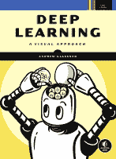
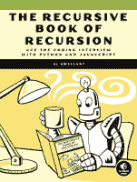
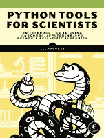
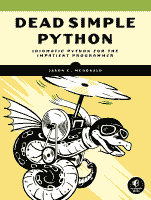
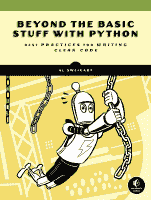
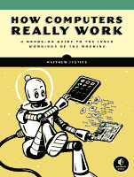

# 第十八章：索引

符号

2D 切片, 216, 220

3D 图形管线, 154

3D 打印, 289

3D 纹理, 217

3D 变换, 156–158

8 位图像, 103

16 位数据, 65, 69

`_bleio`, 322

`%`（取模运算符）, 51

A

Adafruit

`adafruit_ble` 库

`Advertisement` 类, 321

`BLE_ADV_INT`, 323

`BLERadio`, 322

`LazyObjectField`, 322

`ManufacturerDataField`, 322

`start_advertising()`, 323

`stop_advertising()`, 324

`adafruit_bmp280`, 322

`adafruit_sht31d`, 322

Feather Bluefruit nRF52840, 318

振幅, 63

匿名函数, 374

Arduino 草图, 293

`argparse` 模块, 33, 52, 72

`add_argument()`, 33, 199, 301, 340, 385

`ArgumentParser`, 33, 94, 107, 126, 145, 199, 301, 340, 385

`add_mutually_exclusive_group()`, 385

`parse_args()`, 33, 199, 301, 340, 385

人工生命, 45

ASCII 艺术, 101–102

长宽比, 103

亮度, 103, 104, 105

命令行选项, 107

字体, 103

生成, 102–104, 106–107

梯度, 103, 104

瓷砖, 103

写入文本文件, 107

长宽比, 103, 158

`assert` 方法, 123

Audacity, 65, 74

音频信号, 287

自动立体图, 135

命令行选项, 145

创建拼贴图像, 144

深度图, 138

深度感知, 137, 138

示例, 136, 146

线性间距, 136, 137

随机点, 142

重复图案, 137, 143

斜视, 137

平均色, 115

避免循环, 87

B

BLE, 313

广告, 313

中央, 313

外围, 313

扫描响应, 314

混合, 155, 216, 233

蓝牙低能耗. *见* BLE

BlueZ, 314

`fromhex`, 329

`hciconfig`, 314

`hcidump`, 314

输出, 328

`hcitool`, 314

解析数据, 327

启动扫描, 326

停止扫描, 327

`board` 模块

创建，332

I2C，322

路径，332

提供静态文件，332

Boids 仿真，79

添加一个 Boid，91–92

动画，92

边界条件，83

绘图，84–86

初始条件，81

障碍物回避，95

规则，80，86

散射，92

平铺边界条件，83

`Bottle` 模块，315

`route()`，315

运行，315，316

网络框架，315

BS170 MOSFET，285

`bytearray.fromhex()`，329

字节码，xxiv

C

元胞自动机，45

中央处理单元（CPU），153

重心，90

CircuitPython，318

`collections` 模块，66

颜色立方体，218

颜色表示，219

公共文件夹，395

复数，298

计算机生成的蜂群，79

计算机仿真边界条件，47

常数时间，66

康威，约翰，45

康威的生命游戏，45

边界条件，47

滑翔机，50

Gosper 滑翔机枪，55

初始条件，50

模式，54

规则，47，48

环形边界条件，47，51

CoolTerm，273

CPU（中央处理单元），153

CT 扫描, 215

D

DC 电动机, 281

去抖动, 274

装饰器, 274, 316

深度学习, 356

深度编码, 138

深度图, 138

深度感知, 137

`deque`

类, 66

容器, 66

示例, 67

直接内存访问（DMA）, 272

离散傅里叶变换（DFT）, 286

`dmesg` 命令, 364

E

邮件签名, 101

嵌入式 PostScript（EPS）, 32

纪元, 375

F

面剔除, 219

阶乘, 4

远平面, 158

快速傅里叶变换（FFT）, 286

振幅, 286

示例, 286, 287

频率, 287

采样率, 287

FBO（帧缓冲对象）, 220

视场, 158

文件句柄, 120

分形, 15

片段着色器, 155

帧缓冲对象（FBO）, 220

频率, 59

基础, 60, 62

G

生命游戏。*见* 康威的生命游戏

几何图元, 158

GitHub 书籍仓库, 395

GLFW, 154, 220, 238

`glfwCreateWindow()`, 163

`glfwGetFramebufferSize()`, 200

`glfwGetTime()`, 164, 200

`glfwInit()`, 162

`glfwMakeContextCurrent()`, 163

`glfwPollEvents()`, 165

`glfwSetKeyCallback()`, 163

`glfwSetTime()`, 164, 200

`glfwSwapBuffers()`, 165

`glfwTerminate()`, 165, 200

`glfwWindowHint()`, 162

`glfwWindowShouldClose()`, 164, 200

安装, 396, 397

键盘事件, 163

`GL_LINE_LOOP`, 155–156

`GL_LINES`, 155–156

`GL_LINE_STRIP`, 155–156

`glob` 模块, 366

`GL_POINTS`, 155–156

GLSL (OpenGL 着色语言), 153, 155, 158, 159, 160, 168, 169, 170, 216, 223, 224, 231, 232

编译, 165

计算位置, 169

`discard()` 方法, 169, 170

示例, 158

片段着色器, 159, 169, 189, 224, 232, 236

`gl_FragCoord`, 232

`gl_Position`, 159, 169, 188, 223, 231, 236

长度, 232

`mat4`，157，159，168，169，188，223，231

`normalize()`，189，204，232

`sampler2D`，168，169，232

`sampler3D`，232，237

纹理，169，232，237

`uniform`，159，168，169，188，223，231，232，235，236

`vec2`，168，169，173

`vec3`，158，168，172，188，189，223，232

`vec4`，157，159，169，173，188，223，224，231，232，236，237

顶点着色器，158，159，168，188，231，235

`glTexImage3D()`，223

`GL_TRIANGLE_FAN`，155–156

`GL_TRIANGLES`，155–156，219

`GL_TRIANGLE_STRIP`, 155–156, 161, 181, 184

脚本语言, xxv

Google Colab, 365

下载文件, 376

图形处理单元（GPU）, 153, 216

灰度图像和数值, 102

最大公约数（GCD）, 23

吉他, 60

H

谐波, 63

齐次坐标, 156, 182

热熔胶, 289

假圆轨迹, 22, 282

I

I2S 协议, 262

振幅, 263

SCK 信号, 262

SD 信号, 262

波形, 262

WS 信号, 262

IFTTT（如果这，那么那个）, 312

发送警报, 330, 342

设置, 319–320

幻觉, 135

基于图像的渲染, 216

树莓派上的推理, 376

`input()`, 300

物联网（IoT）, 311

`Io` 模块

`io.BytesIO`, 334

物联网花园, 311

`adafruit_ble`, 321

`adafruit_bmp280`, 321

`adafruit_sht31d`, 321

架构, 312

BLE 扫描仪, 325

完整代码, 345

`Bottle` 模块

完整代码, 349

创建路由, 332

主页 HTML 页面, 333

CircuitPython 代码, 321, 343

代码文件, 320

完整代码, 351

CSS, 338

获取传感器数据, 335

硬件, 318

IFTTT 警报, 342

JavaScript, 336

`async`, 336

`await`, 336

`Date()`, 336

日期选择器, 343

`fetch_data()`, 336

`getElementById()`, 336

`onload`, 337

`setInterval()`, 338

树莓派设置, 318

要求, 317

运行, 341

传感器数据, 333

SQLite 设置, 339

Web 服务器完整代码, 331

K

Karplus 在 Pico 上

组装好的硬件, 265

方框图, 261

代码清单, 266

完整代码, 275

电气连接, 265

生成笔记, 267

硬件连接, 264

硬件要求, 263

实现, 260

主函数, 270

五度音阶（小调）, 267

播放音符, 269

环形缓冲区, 268

运行代码, 272

串行输出, 273

Thonny, 272–273

Karplus-Strong 算法, 62

低通滤波器, 63

k-d 树, 114

定义, 117

示例, 117

最近邻搜索, 118

Koch 雪花, 3

组合, 9

完整代码清单, 16

计算, 5

分形, 3, 8

GitHub 代码, 11

递归, 3

基本情况, 5, 8

递归步骤, 5, 8

递归算法, 3

运行代码, 14

L

`lambda`, 374

激光, 279

激光音频

对准镜子, 289

附加镜子, 290

阻止图, 280

完整代码, 293, 305

构建激光显示, 289

显示, 303

硬件

已完成, 292

连接, 291, 292

控制, 294

要求, 288

激光与镜子, 282

驱动电机, 291

处理音频, 296

树莓派设置, 289

所需软件, 288

运行代码, 302–303

设置, 293

测试电机, 300

测试运行, 302

激光模块, 284

激光指示器, 281

线性代数, 6

线性搜索, 116

线性间距, 136, 137

列表推导式, 34

避免循环, 87

损失函数, 374

亮度, 105

M

MAC 地址, 323

机器学习

深度神经网络 (DNN), 356

梯度下降, 357

超参数, 357

推理, 356

监督学习, 356

训练, 356

无监督学习, 357

磁共振成像 (MRI), 215

向量的大小, 82

大调, 65

映射, 102

`math` 模块

`sqrt`, 87, 197

`matplotlib`, 72

库, 48

`animation`, 48, 53

`imshow`, 49

`interpolation`, 49

模块

`animation`, 85

`mpl_connect`, 91

矩阵乘法, 157

MAX98357A, 261

医疗数据, 217

微控制器, 259

MicroPython

`array` 模块, 267

`bytearray`, 269

`close`, 269, 270

`I2S` 模块, 263

创建, 271

内部缓冲区, 271

写入, 270

列表

`append()` 方法, 268

`pop()`, 268

`memoryview`, 269, 270, 276

打开, 269

`os` 模块

`listdir`, 268

`Pin` 模块, 270

按钮输入, 271

切换, 271

`random` 模块, 267

`readinto`, 270

设置, 266

切片, 270

定时, 274

写入, 269

`min()` 方法, 142

小型语音命令数据集, 359

小调五声音阶, 66

镜子, 281

附加, 289

激光, 282

模型视图矩阵, 224

模运算符 `(%)`, 51

电机驱动，284

`multiprocessing` 模块，305

`Process()`，378

`Queue`，378

`empty()`，383

`get()`，383

`put()`，380

音阶

大调，65

小调五声音阶，66

音调，65

N

*N*体模拟，80

近平面，158

`neopixel`，321

`show()`，324

归一化向量，183

nRF52840，318

`numpy` 模块，119，162

`abs()`，297，381，382

`argmax()`，375，381，385

排列，64

数组，49，50，53，85，87，92，105，120，166，222

`reshape()`，81

平均值，120

`average()`，105

广播，82

`cos()`，81

十字，198

FFT。*参见* 快速傅里叶变换

`rfft()`，297

`rfftfreq()`，305

`frombuffer()`，297

图像，106

`linalg`

`norm`，198

数学

弧度，198

`max()`，381

`min()`，381

优化，87

`ptp()`，380

`random`， 50， 72–73， 81

`choice`， 73， 196

`shuffle`， 367

`sin()`， 64， 81

`sum()`， 298

`zeros()`， 190， 379， 381

O

面向对象语言， xxiv

OpenGL

3D 图形管线， 154

3D 变换， 156–158

限制纹理， 171

颜色表示， 219

上下文， 161

显示， 161

面剔除， 219

几何原语， 158

`glActiveTexture()`， 168， 226

`glBindBuffer()`， 166， 195， 225， 234

`glBindFramebuffer()`， 226

`glBindRenderbuffer()`， 226

`glBindTexture()`， 168， 170， 222， 226

`glBindVertexArray()`， 166， 168， 195， 225， 228， 234

`glBufferData()`， 166， 225， 234

`glBufferSubData()`， 195

`GL_CCW`， 217

`glCheckFramebufferStatus()`， 227

`glClear()`， 164， 200

`glClearColor()`， 163

`GL_CULL_FACE`， 228

`glDrawArrays()`， 168

`glDrawElements()`， 228

`GL_ELEMENT_ARRAY_BUFFER`，226

`glEnable()`，163

`glEnableVertexAttribArray()`，166，234

`glFramebufferRenderbuffer()`，227

`glFramebufferTexture2D()`，226

`glGenBuffers()`，166，225，234

`glGenFramebuffers()`，226

`glGenRenderbuffers()`，226

`glGenTextures()`，170，222，226

`glGenVertexArrays()`，166，225，234

`glGetUniformLocation()`，166，190

`glMultiDrawArrays()`，191，195

`glPixelStorei()`，170，222

`glRenderbufferStorage()`，226

GLSL（OpenGL 着色语言），153，155，158，159，160，168，169，170，223，224，231，232

编译，165

计算位置，169

`discard()` 方法，169，170

示例，158

片段着色器，159，169，189，224，232，236

`gl_FragCoord`，232

`gl_Position`, 159, 169, 188, 223, 231, 236

length, 232

`mat4`, 157, 159, 168, 169, 188, 223, 231

`normalize()`, 189, 204, 232

`sampler2D`, 168, 169, 232

`sampler3D`, 232, 237

texture, 169, 232, 237

`uniform`, 159, 168, 169, 188, 223, 231, 232, 235, 236

`vec2`, 168, 169, 173

`vec3`, 158, 168, 172, 188, 189, 223, 232

`vec4`, 157, 159, 169, 173, 188, 223, 224, 231, 232, 236, 237

顶点着色器，158，159，168，188，231，235

`glTexImage2D()`，170，226

`glTexImage3D()`，223

`glTexParameterf()`，170，222

`glTexParameteri()`，226

`GL_TRIANGLES`，219

`GL_TRIANGLE_STRIP`，155，161，184

`glUniform1i()`，168

`glUniformMatrix4fv()`，167，195，228

`glUseProgram()`，165，167，195

`glVertexAttribPointer()`，166，234

`glViewport()`，163，200

线性过滤，171

modelview，157

投影，157

光栅化，155

纹理单元，168

三角形带，161

顶点数组对象（VAO），160

顶点缓冲对象（VBO），160

OpenSCAD，289

优化器，374

正交投影，158

`os` 模块

`listdir()`，119，221

`path`，72，119，222

泛音，60

P

并行处理，153

参数方程，20

对于一个旋画，20–24

模式，281

五声音阶，65

次要，267

性能分析，88

透视投影, 158

照片马赛克, 113

平均颜色值, 115, 120

命令行选项, 126

创建图像网格, 123–124

距离, 122

网格, 114, 120

图像匹配, 116, 121–122

测量距离, 116

读取输入图像, 119

RGB 值, 116

拆分目标图像, 115, 120

Pico, 259–263

引脚图, 264

使用 MicroPython 设置, 266

PIL（Python 图像库）, 25

`Pillow` 模块, 25, 104, 119, 141

程序化语言, xxiv

投影矩阵, 224

公钥/私钥方案, 402

脉宽调制, 282

PuTTY, 402

`PWM` 对象, 282, 284

`pyaudio` 模块

`close()`, 299

创建, 296, 378

`get_device_count()`, 378

`get_device_info_by_index()`, 378

`open()`, 296, 379

读取, 379

`stop_stream`, 299

`terminate()`, 378

`write()`， 297

`pygame` 模块, 66, 69

`PyOpenGL` 模块, 162, 187, 220

Python 图像库（PIL）, 25

`convert()` 方法, 105

`Image`，104，105

`convert()`，104，105，144

`copy()`，56，144

`crop()`，106，107，121

`load()`，119，120，144，145

`new()`，123，142，143

`open()`，32，104，105，119，120

`paste()`，123，124，143，147

`pixel access`，144

`size()`，105，120，123，127，143

`thumbnail()`，127

`ImageDraw`，142

亮度，105

Python 安装

Anaconda

macOS，397

Windows，396

`PYTHONPATH`，396，397

Python 解释器，xxv

R

`random` 模块

`choice()`，73

`hideturtle()`，31–32

`randint()`，142

`showturtle()`，31–32

`range()` 方法，24

树莓派

BCM 引脚编号，291

主机名，401

Imager，399

安装 Python 模块，404

`local`，401

使用 SSH 登录，402

Pico，259–263

引脚图，264

使用 MicroPython 设置, 266

`ping`, 402

引脚布局, 291

`scp`, 403

设置, 399

Visual Studio Code, 404

光栅化, 155

ray, 216

生成, 217–218

光线投射算法, 216, 220, 229

反射, 281

相对路径, 119

`requests`模块

`post()`, 330

分辨率, 113

声音, 64

Reynolds, Craig, 79

RGB 值, 116

环形缓冲区, 67

均方根（RMS）, 304

RP2040 芯片, 259

`RPi`模块

`GPIO`, 293

输出, 294, 295

PWM, 294

`setmode()`, 294

`setup()`, 294

`GPIO.PWM`

`ChangeDutyCycle()`, 295

`start()`, 295

`stop()`, 295

S

采样率, 64

采样定理, 370

`scipy`模块

`spatial.distance`模块, 88

`spatial.pdist()`模块, 88

`spatial.squareform()`, 87

`stft()`, 371, 382

`scipy.spatial`模块, 80, 87

`KDTree`

创建, 125

`query()`, 122

脚本语言, xxiv

安全外壳（SSH）, 402

半音, 65

着色器, 153, 158

片段, 159

顶点, 158–159

轴, 281

短时傅里叶变换（STFT）, 360

Sierpiński, Wacław, 15

Sierpiński 三角形, 15

正弦波, 59, 64

声音

振幅, 63

频率, 59

基本频率, 60

泛音, 60

谱图, 74

声谱图, 359

语音识别, 355

音频准备, 382

方框图, 358

清洗数据, 368

训练代码, 365

完整代码, 389

深度神经网络（DNN）架构, 357

下载训练数据, 366

导出模型, 376

推理策略, 362

列出输入设备, 377

Mini 语音命令数据集, 366

准备音频数据, 380

所需硬件, 364

所需软件, 364

运行, 386

运行推理, 383

声谱图示例, 369

训练模型, 370

螺旋, 36

螺旋图方程, 21

周期性, 23–24

`sqlite` 模块, 316

`close()`, 317

`commit()`, 317

`connect()`, 317

`CREATE TABLE`, 317

`cursor()`, 317

`execute()`, 317

`fetchall()`, 317

`ID`, 317

`SELECT`, 317

`sqlite3`, 316

`TS`, 317

`VAL`, 317

`ssh-keygen`, 402

短时傅里叶变换 (STFT), 360

`string` 模块

`decode()`, 327

`split()`, 300, 327

`startswith()`, 327

系统资源, 120

T

TB6612FNG, 283

连接中, 291

TensorFlow

`allocate_tensors()`, 386

`argmax()`, 371

`astype()`, 384

`audio.decode_wav()`, 371

`concat()`, 371

`convert_to_tensor()`, 371

`expand_dims()`, 371

`keras.utils.get_file()`, 366

`py_function()`, 371

`shape()`, 371

`squeeze()`, 371

`Tensor`, 371

`tf.data.Dataset`

`batch()`, 373

`from_tensor_slices()`, 372

`map()`, 373

`tf.io.read_file()`, 371

`tf.keras.callbacks.EarlyStopping()`, 375

`tf.keras.layers`

`adapt()`, 373

`Conv2D()`, 373

`Dense()`, 373

`Dropout()`, 373

`Flatten()`, 373

`MaxPooling2D()`, 373

`tf.keras.layers.experimental.Normalization()`, 373

`tf.keras.losses.SparseCategoricalCrossentropy()`, 374

`tf.keras.Model`

`fit()`, 375

`save()`, 376

`summary()`, 373

`tf.keras.models.Sequential()`, 373

`tf.keras.optimizers.Adam()`, 374

`tflite_runtime`

`get_input_details()`, 383

`get_output_details()`, 383

`get_tensor()`, 384

`Interpreter`, 386

`invoke()`, 384

`tflite_runtime`，377

`tf.lite.TFLiteConverter`，376

`tf.string.split()`，371

`zeros()`，371

TensorFlow Lite，359，376

文本图形，101

纹理映射，160–161

纹理单元，168

`timeit` 模块，89，127

`time` 模块

`sleep()`，72，301

`time()`，330

时序，88

`tkinter` 模块，10，25

`canvas`，32

音调，65

环面

计算顶点，191

相机，185

完整代码，211

单元颜色，194

着色，185

完整代码，203

计算法线，183

计算顶点，180

创建相机，197

片段着色器，189

生命游戏，196

完整代码，209

渲染，202

映射模拟网格，187

渲染，183

`RenderWindow`

完整代码，211

旋转相机，198

运行代码，201

环面类，190

变换矩阵，182

顶点着色器，188

平移矩阵，156

`turtle` 模块，24

`down()`，24

绘制圆形，24

绘制旋花，27

图形，9

`down()`，10

`mainloop()`，10

`setpos()`, 10

`tkinter()`, 10

`up()`, 10

`hideturtle()`, 31–32

隐藏光标, 31–32

`listen()`, 33

`mainloop()`, 24

`onkey()`, 33

`ontimer()`, 29

`setheading()`, 36

`setpos()`, 24

设置光标, 25–26

`setup()`, 33–34

`showturtle()`, 31–32

`title()`, 33

`up()`, 24

`window_height()`, 29

`window_width()`, 29

U

USB 麦克风, 364

V

向量

幅度, 82

velocity, 82

顶点数组对象, 160

顶点缓冲对象, 160

顶点着色器, 155

体积渲染, 215

2D 切片, 220, 233, 234, 235, 236, 237

3D 纹理坐标, 217

彩色立方体, 218, 220, 225, 226, 227, 228

几何定义, 224

最大强度投影, 240

光线投射, 216, 220, 221, 229, 230, 231, 232, 233

算法, 216, 220, 229

读取数据, 221–223

扩展，240

体积数据, 215

W

`wavefile.read()`，367，386

`wave` 模块，64

`getframerate()`，296，297

`getnchannels()`，296

`getsampwidth()`，296

`open()`，296

`readframes()`，297

WAV 文件格式，64–65

创建，64

玩，69

写作，69

Z

`zip()` 方法，82

更多直截了当的书籍来自 

深度学习

视觉化方法

由 ANDREW GLASSNER 编著

768 页，$99.99

ISBN 978-1-7185-0072-3

全彩

递归的递归书

用 Python 和 JavaScript 赢得编程面试

由 AL SWEIGART 编著

328 页，$39.99

ISBN 978-1-7185-0202-4

科学家的 Python 工具

使用 Anaconda、JupyterLab 和 Python 科学库的入门

由 LEE VAUGHAN 编著

744 页，$49.99

ISBN 978-1-7185-0266-6

超简单 Python

给急躁程序员的地道 Python

由 JASON C. MCDONALD 编著

752 页，$59.99

ISBN 978-1-7185-0092-1

超越 Python 基础

编写清晰代码的最佳实践

由 AL SWEIGART 编著

384 页，$34.95

ISBN 978-1-59327-966-0

计算机是如何真正工作的

机器内部工作原理的动手指南

由 MATTHEW JUSTICE 编著

392 页，$39.95

ISBN 978-1-7185-0066-2
