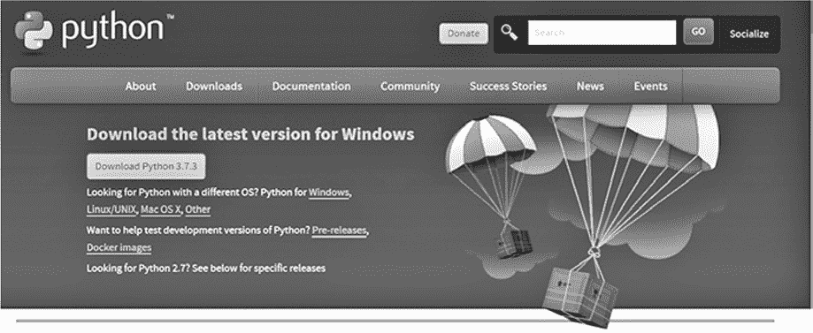
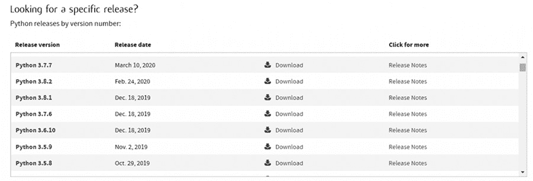
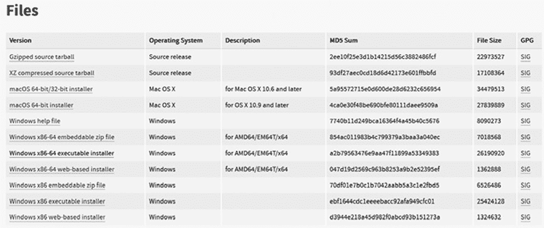
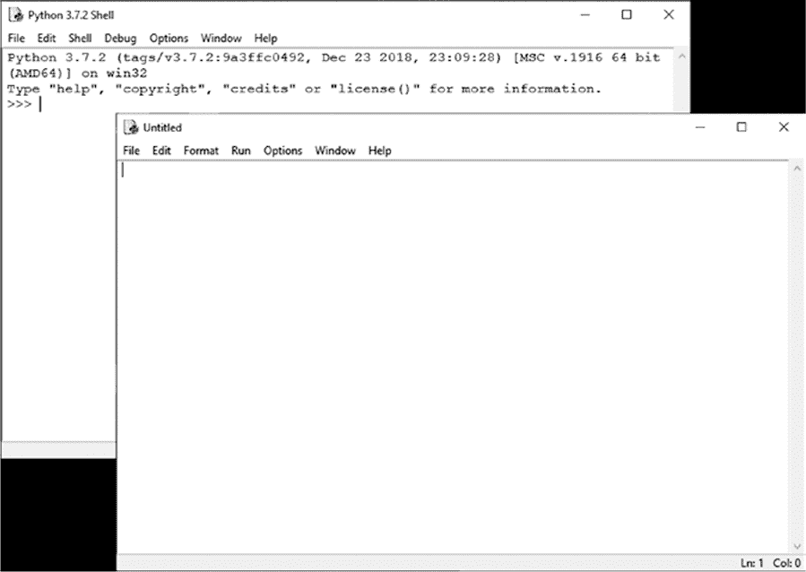

## **导言**

如果你已经学习了 Python 编程的基础，那么你已经可以编写完整的程序来处理现实世界的任务。在《现实世界中的 Python》一书中，你将编写程序，帮助阿波罗 8 号赢得登月竞赛，协助克莱德·汤博发现冥王星，为火星探测器选择着陆点，定位系外行星，向朋友发送超级机密的消息，战斗巨型突变体，救援遇难水手，逃离行尸走肉等，所有这些都使用 Python 编程语言。在此过程中，你将应用强大的计算机视觉、自然语言处理和科学模块，如 OpenCV、NLTK、NumPy、pandas 和 matplotlib，以及其他多个包，这些工具旨在让你的计算机使用更加轻松便捷。

### **谁应该阅读本书？**

你可以把这本书看作是一本面向大二学生的 Python 书籍。它不是一本编程基础教程，而是帮助你继续通过项目驱动的方式进行学习。这样，你就不需要浪费时间和空间重新学习你已经掌握的概念。我仍然会逐步解释每一个项目，并提供关于如何使用库和模块的详细说明，包括如何安装它们。

这些项目适合任何希望利用编程进行实验、测试理论、模拟自然现象或只是为了娱乐的人。在完成这些项目的过程中，你将提升对 Python 库和模块的理解，并学习到实用的快捷方式、有用的函数和有益的技巧。与其专注于孤立的模块化代码片段，这些项目教你如何构建完整的、能在现实应用中运行的程序，涉及实际的应用、数据集和问题。

### **为什么选择 Python？**

Python 是一种高级的、解释型的通用编程语言。它是免费的，具有高度交互性，并且可以跨所有主要平台和微控制器（如树莓派）使用。Python 支持函数式编程和面向对象编程，并能够与许多其他编程语言（如 C++）编写的代码进行交互。

由于 Python 易于初学者上手，又对专家有用，它已经渗透到学校、大学、大公司、金融机构以及几乎所有科学领域。因此，Python 现在已成为机器学习、数据科学和人工智能应用中最流行的语言。

### **本书包含什么内容？**

以下是本书各章的概述。你不需要按顺序完成它们，但我会在首次介绍新模块和技巧时，进行更详细的解释。

**第一章：利用贝叶斯定理救助遇难的水手** 使用贝叶斯概率高效地指挥海岸警卫队在 Python 岬的搜索和救援工作。通过此项目，掌握 OpenCV、NumPy 和 itertools 模块的使用。

**第二章：利用文体学确认作者** 使用自然语言处理技术判断是阿瑟·柯南·道尔还是赫伯特·乔治·威尔斯创作了小说《*失落的世界*》。获得 NLTK、matplotlib 和文体学技术（如停用词、词性、词汇丰富度和 Jaccard 相似性）的实践经验。

**第三章：利用自然语言处理总结演讲** 从互联网上抓取著名演讲，并自动生成要点总结。然后，将小说的文本转化为一个酷炫的广告或宣传展示。获得 BeautifulSoup、Requests、正则表达式、NLTK、Collections、wordcloud 和 matplotlib 的实践经验。

**第四章：用书籍密码发送超级机密信息** 通过数字化复现 Ken Follet 的畅销间谍小说《*Rebecca 的钥匙*》中使用的一次性密码方法，与朋友分享无法破解的密码。获得 Collections 模块的实践经验。

**第五章：寻找冥王星** 复现克莱德·汤博发现冥王星的闪烁比较仪，该仪器于 1930 年首次使用。然后，利用现代计算机视觉技术自动发现并跟踪如彗星和小行星等在星空背景下微弱的瞬时变化。获得 OpenCV 和 NumPy 的实践经验。

**第六章: 赢得登月竞赛—阿波罗 8 号** 冒险并帮助美国通过阿波罗 8 号赢得登月竞赛。绘制并执行巧妙的自由返回轨道，这一轨道使 NASA 决定提前一年登月，并有效地终结了苏联的太空计划。获得 turtle 模块的实践经验。

**第七章：选择火星着陆点** 根据实际的任务目标，选择火星着陆器的潜在着陆地点。在火星地图上显示候选地点，并附上相关的统计数据总结。获得 OpenCV、Python 图像库、NumPy 和 tkinter 的实践经验。

**第八章：检测远距离系外行星** 模拟一个系外行星经过其太阳前方的过程，绘制由此产生的相对亮度变化，并估算该行星的直径。最后，模拟新型詹姆斯·韦伯太空望远镜直接观察系外行星的过程，包括估算该行星的一天长度。使用 OpenCV、NumPy 和 matplotlib。

**第九章：识别敌友** 编写一个机器人守卫枪程序，通过视觉区分太空部队海军陆战队和邪恶突变体。获得 OpenCV、NumPy、playsound、pyttsxw 和 datetime 的实践经验。

**第十章：通过面部识别限制访问权限** 使用面部识别技术限制对安全实验室的访问。使用 OpenCV、NumPy、playsound、pyttsxw 和 datetime。

**第十一章：创建互动式僵尸逃脱地图** 构建一张人口密度地图，帮助电视剧 *行尸走肉*（The Walking Dead）中的幸存者逃离亚特兰大，前往美国西部的安全地带。通过该项目，学习 pandas、bokeh、holoviews 和 webbrowser。

**第十二章：我们生活在计算机模拟中吗？** 找出一种方法，让模拟生命体——也许是我们——发现自己生活在计算机模拟中。使用 turtle、统计学和 perf_counter。

每一章的结尾都会有至少一个练习或挑战项目。你可以在附录或网上找到这些练习项目的解决方案。这些不是唯一的解决方案，也不一定是最好的；你可能自己能找到更好的方案。

然而，对于挑战性项目，你将独立完成。这是沉浮自知的时刻，非常适合学习！我希望本书能激励你创造新的项目，把这些挑战性项目看作是你想象力沃土上的种子。

你可以从本书的官方网站 *[`nostarch.com/real-world-python/`](https://nostarch.com/real-world-python/)* 下载本书的所有代码，包括练习项目的解决方案。你还可以在该网站上找到勘误表及其他更新信息。

编写这样一本书几乎不可能没有一些初步的错误。如果你发现了问题，请将其反馈给出版社，邮箱是 *errata@nostarch.com*。我们将把任何必要的更正加入勘误表，并在未来的印刷版本中更新，你将因此获得永恒的荣耀。

#### ***Python 版本、平台和集成开发环境（IDE）***

我在本书中的所有项目都是在 Microsoft Windows 10 环境下使用 Python v3.7.2 构建的。如果你使用的是不同的操作系统，也没问题：我会在适当的地方为其他平台推荐兼容的模块。

本书中的代码示例来自于 Python IDLE 文本编辑器或交互式 shell。IDLE 代表 *集成开发与学习环境*（Integrated Development and Learning Environment）。它是一个 *集成开发环境（IDE）*，并且增加了一个 *L* 字母，以便这个缩写也能指代 *蒙提·派森*（Monty Python）名声在外的 Eric Idle。交互式 shell，也叫做 *解释器*，是一个可以让你立即执行命令并测试代码的窗口，无需创建文件。

IDLE 有很多缺点，比如没有行号列，但它是免费的并且捆绑在 Python 中，所有人都可以使用它。你可以随意使用任何你喜欢的 IDE。常用的选择包括 Visual Studio Code、Atom、Geany（发音为“genie”）、PyCharm 和 Sublime Text。这些都支持多种操作系统，包括 Linux、macOS 和 Windows。另一个 IDE，PyScripter，仅支持 Windows。有关可用的 Python 编辑器和兼容平台的详细列表，请访问 *[`wiki.python.org/moin/PythonEditors/`](https://wiki.python.org/moin/PythonEditors/)*。

#### ***安装 Python***

你可以选择直接在机器上安装 Python，或者通过发行版进行安装。要直接安装，请在*[`www.python.org/downloads/`](https://www.python.org/downloads/)*查找适合你操作系统的安装说明。Linux 和 macOS 机器通常会预装 Python，但你可能想要升级该安装。随着每个新版本的发布，Python 会增加一些新功能，同时弃用一些旧功能，因此，如果你的版本早于 Python v3.6，我建议你进行升级。

Python 网站上的下载按钮（图 1）可能默认安装 32 位版本的 Python。

图 1：[Python.org](http://Python.org)的下载页面，包含适用于 Windows 平台的“简易按钮”

如果你想要 64 位版本，请向下滚动到特定版本的列表（图 2），点击具有相同版本号的链接。

图 2：在[Python.org](http://Python.org)下载页面上列出特定版本

点击特定版本会带你进入图 3 中所示的页面。在此页面中，点击 64 位可执行安装程序，启动安装向导。按照向导的指示操作，并选择默认建议。

图 3：在[Python.org](http://Python.org)上查看 Python 3.8.2 版本的文件列表

本书中的一些项目要求安装非标准的包，你需要单独安装这些包。虽然这并不困难，但你可以通过安装一个有效加载和管理数百个 Python 包的 Python 发行版来简化这一过程。可以把它当作一站式购物。这些发行版中的包管理器会自动找到并下载包的最新版本，包括所有依赖项。

Anaconda 是由 Continuum Analytics 提供的流行免费 Python 发行版。你可以从*[`www.anaconda.com/`](https://www.anaconda.com/)*下载它。另一个是 Enthought Canopy，虽然只有基础版本是免费的。你可以在*[`www.enthought.com/product/canopy/`](https://www.enthought.com/product/canopy/)*找到它。无论你是单独安装 Python 及其包，还是通过发行版安装，你都应该能顺利完成书中的项目。

#### ***运行 Python***

安装后，Python 应该会出现在操作系统的应用程序列表中。当你启动它时，shell 窗口应该会出现（如图 4 背景所示）。你可以使用这个交互式环境来运行和测试代码片段。但要编写较大的程序，你将使用文本编辑器，它可以让你保存代码，如图 4（前景）所示。

图 4：本地 Python shell 窗口（背景）和文本编辑器（前景）

要在 IDLE 文本编辑器中创建新文件，点击**文件**▸**新建文件**。要打开现有文件，点击**文件**▸**打开**或**文件**▸**最近文件**。在这里，你可以通过点击**运行**▸**运行模块**，或者在编辑窗口中点击后按 F5 来运行代码。注意，如果你选择了使用像 Anaconda 这样的包管理器或像 PyCharm 这样的 IDE，你的环境可能与图 4 不同。

你也可以通过在 PowerShell 或终端中输入程序名称来启动 Python 程序。你需要处于存放 Python 程序的目录中。例如，如果你没有从正确的目录启动 Windows PowerShell，你需要使用 cd 命令更改目录路径（参见图 5）。

图 5：在 Windows PowerShell 中更改目录并运行 Python 程序

要了解更多内容，请参阅 *[`pythonbasics.org/execute-python-scripts/`](https://pythonbasics.org/execute-python-scripts/)*。

#### ***使用虚拟环境***

最后，你可能想为每一章在单独的虚拟环境中安装依赖包。在 Python 中，*虚拟环境*是一个自包含的目录树，包括 Python 安装和若干附加包。当你安装了多个版本的 Python 时，它们非常有用，因为某些包可能与某个版本兼容，但与其他版本不兼容。此外，某些项目可能需要同一包的不同版本。保持这些安装的独立性可以防止兼容性问题。

本书中的项目不需要使用虚拟环境，如果你按照我的指示操作，你将全局安装所需的包。不过，如果你确实需要将包与操作系统隔离开来，可以考虑为每一章安装一个不同的虚拟环境（请参见 *[`docs.python.org/3.8/library/venv.html#module-venv`](https://docs.python.org/3.8/library/venv.html#module-venv)* 和 *[`docs.python.org/3/tutorial/venv.html`](https://docs.python.org/3/tutorial/venv.html)*）。

### **前进！**

本书中的许多项目依赖于几百年历史的统计学和科学概念，这些概念手工操作时不太实用。但随着 1975 年个人计算机的问世，我们存储、处理和共享信息的能力已经增加了数个数量级。

在 20 万年的人类历史中，只有过去 45 年里的人们才有幸使用这种神奇的设备，实现那些曾经遥不可及的梦想。用莎士比亚的话说：“我们这些人。我们这群幸福的人。”

让我们充分利用这个机会。在接下来的页面中，你将轻松完成那些曾让过去的天才们感到困惑的任务。你将触及我们最近取得的一些惊人壮举的表面，甚至可能开始想象未来将会有的发现。
