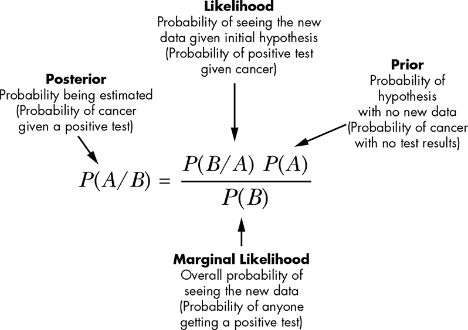
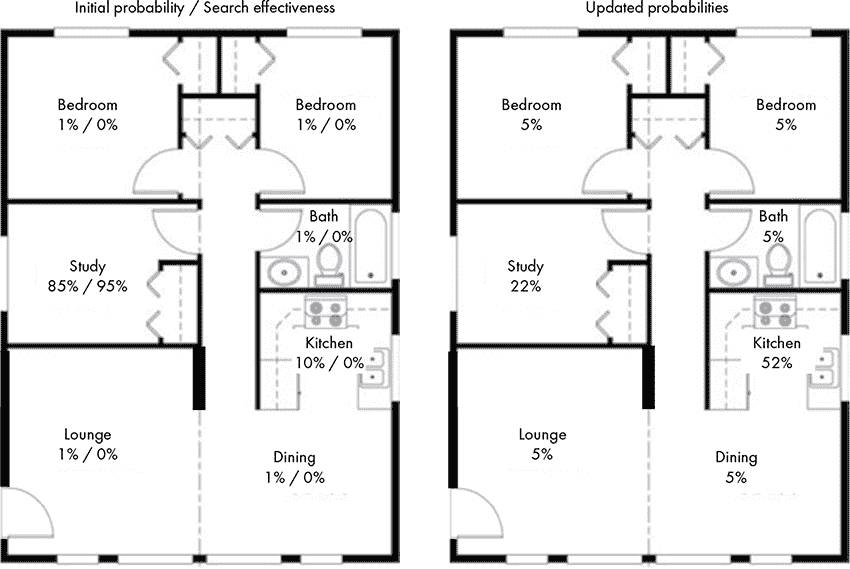
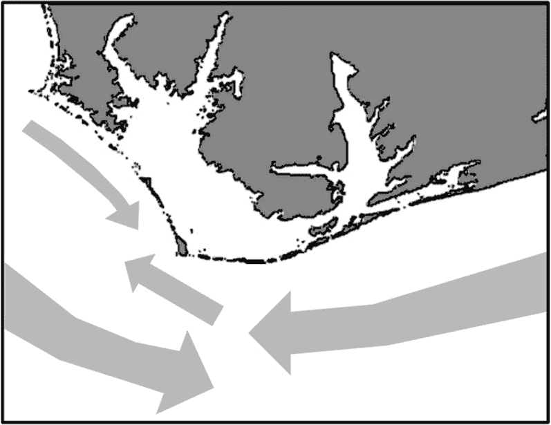
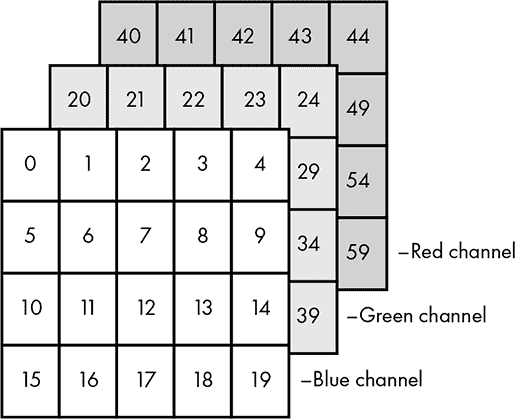
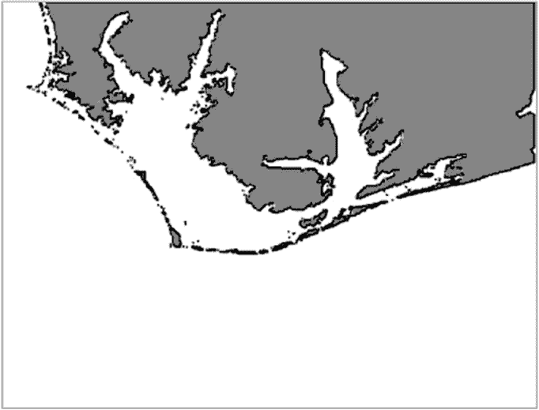
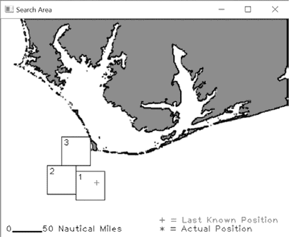
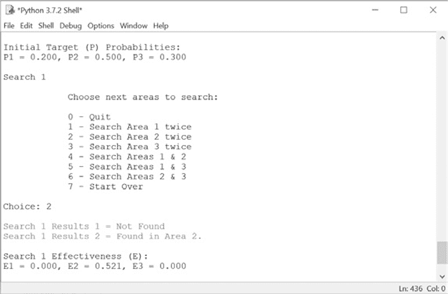
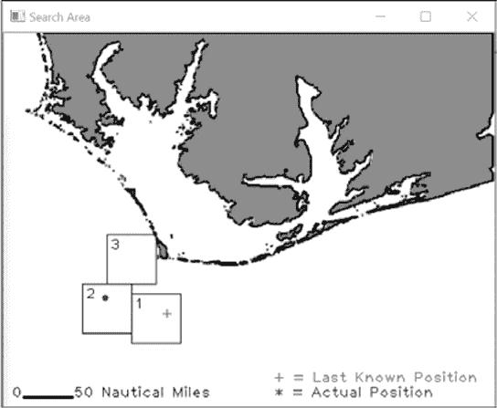

## 第一章：使用贝叶斯定理拯救海上遇难海员


大约在 1740 年左右，一位名叫托马斯·贝叶斯的英国长老会牧师决定用数学证明上帝的存在。他的独特解决方案——现在被称为*贝叶斯定理*——成为了有史以来最成功的统计概念之一。但由于其繁琐的数学计算无法手动完成，这个定理在 200 年里几乎被忽视。直到现代计算机的发明，贝叶斯定理才发挥出它的全部潜力。如今，得益于我们快速的处理器，它已经成为数据科学和机器学习的重要组成部分。

因为贝叶斯定理为我们提供了一个数学上正确的方式来纳入新数据并重新计算概率估计，它几乎渗透到了所有人类活动中，从破解密码到预测总统选举结果，再到证明高胆固醇会导致心脏病发作。贝叶斯定理的应用列表足以填满这一章。但因为没有什么比拯救生命更重要，我们将专注于如何利用贝叶斯定理帮助救援失事海员。

在本章中，你将创建一个模拟游戏，用于海岸警卫队的搜救行动。玩家将使用贝叶斯定理来指导决策，以便尽快定位失踪的海员。在此过程中，你将开始使用流行的计算机视觉和数据科学工具，如开源计算机视觉库（OpenCV）和 NumPy。

### **贝叶斯定理**

贝叶斯定理帮助研究人员根据新证据确定某事是否成立的概率。正如伟大的法国数学家拉普拉斯所说：“一个原因的概率——给定一个事件——与这个事件的概率——给定它的原因——成正比。”基本公式是


其中，*A*是一个假设，*B*是数据。*P*(*A*/*B*)表示在给定*B*的情况下，*A*的概率。*P*(*B*/*A*)表示在给定*A*的情况下，*B*的概率。例如，假设我们知道某个癌症的检测并不总是准确，可能会出现假阳性，表示你得了癌症而实际上并没有。贝叶斯表达式为


初始概率将基于临床研究。例如，1,000 名患癌症的人中，800 人可能会收到阳性检测结果，而 100 人可能会被误诊。根据疾病的发生率，一个人患癌症的总体概率可能仅为每 10,000 人中有 50 人。因此，如果患癌症的总体概率较低，而得到阳性检测结果的总体概率相对较高，那么在阳性检测结果下患癌症的概率就会降低。如果研究记录了不准确检测结果的频率，贝叶斯定理可以修正测量误差！

现在你已经看到了一个应用实例，请查看图 1-1，它展示了贝叶斯定理中各个术语的名称，以及它们如何与癌症例子相关。



图 1-1：定义了术语并与癌症检测示例相关的贝叶斯定理

为了进一步说明，假设一位女士在家里丢失了她的阅读眼镜。她最后记得戴眼镜时是在书房。她去了书房并四处寻找。她没有找到眼镜，但看到了一个茶杯，并记得她去了厨房。此时，她必须做出选择：要么更加彻底地搜索书房，要么离开去厨房检查。她决定去厨房。她不知不觉中做出了一个贝叶斯决策。

她首先去了书房，因为她觉得在书房找到眼镜的成功概率最高。从贝叶斯的角度来看，最初在书房找到眼镜的概率被称为*先验*。经过简略的搜索后，她根据两个新获得的信息改变了决定：她没有轻易找到眼镜，而且她看到了茶杯。这代表了一个*贝叶斯更新*，其中随着更多证据的出现，新的后验估计（在图 1-1 中为*P*(*A*/*B*)）被计算出来。

假设这位女士决定在搜索过程中使用贝叶斯定理。她会为眼镜在书房或厨房中的可能性以及她在这两个房间中搜索的有效性分配实际的概率。与其凭直觉做决定，她的选择现在建立在数学基础上，如果未来的搜索失败，这些决策可以持续更新。

图 1-2 展示了这位女士在分配了这些概率后的眼镜搜索过程。



图 1-2：眼镜位置的初始概率和搜索有效性（左）与更新后的眼镜目标概率（右）

左侧图表示最初的情况；右侧图是根据贝叶斯定理更新后的图。最初，假设在书房找到眼镜的概率是 85%，在厨房找到眼镜的概率是 10%。其他可能的房间被赋予 1%的概率，因为贝叶斯定理无法更新为零的目标概率（而且总是有一个小概率她将眼镜落在其他房间）。

左图中每个斜杠后的数字代表*搜索有效性概率（SEP）*。SEP 是对你搜索一个区域的有效性的估计。由于这位女士目前只在书房进行了搜索，因此其他房间的搜索有效性概率为零。在贝叶斯更新后（发现茶杯），她可以根据搜索结果重新计算概率，更新后的概率如右图所示。现在厨房是最可能的搜索地点，但其他房间的概率也有所增加。

人类直觉告诉我们，如果某物不在我们认为它所在的地方，那么它出现在其他地方的概率就会增加。贝叶斯法则考虑到了这一点，因此眼镜出现在其他房间的概率也会增加。但只有在一开始就有它们可能出现在其他房间的情况时，这种情况才会发生。

用于计算眼镜在给定房间中概率的公式，考虑了搜索效果，公式为：


其中 *G* 是眼镜在某房间中的概率，*E* 是搜索效果，*P*[prior] 是接收到新证据前的先验概率估计。

你可以通过将目标和搜索效果概率插入方程来获取眼镜在书房中的更新概率，具体如下：


如你所见，贝叶斯法则背后的简单数学运算如果手工计算会变得很繁琐。幸运的是，我们生活在计算机的奇妙时代，所以我们可以让 Python 来处理这些无聊的计算工作！

### **项目 #1：搜索与救援**

在这个项目中，你将编写一个 Python 程序，使用贝叶斯法则来寻找在 Python 岬失踪的独自渔民。作为该地区海岸警卫队搜索与救援行动的负责人，你已经采访了他的妻子，并确定了他最后一次被见到的位置，距离现在已经超过六小时。他通过无线电报告说他要弃船，但没人知道他是坐上了救生艇还是漂浮在海中。岬角周围的水域温暖，但如果他被浸泡在水中，大约 12 小时后他会发生体温过低。如果他穿着个人漂浮装置并且幸运的话，他可能能撑三天。

Python 岬的海洋洋流复杂多变（图 1-3），目前风从西南方向吹来。能见度良好，但波浪较为汹涌，使得人头较难被察觉。



图 1-3：海洋洋流——Python 岬

在现实生活中，你的下一步行动是将你所掌握的所有信息输入海岸警卫队的搜索与救援最优规划系统（SAROPS）。该软件会考虑风、潮汐、洋流、物体是否漂浮在水面或在船上等因素。然后，它会生成矩形搜索区域，计算在每个区域内找到失踪水手的初步概率，并绘制出最有效的飞行路线。

对于这个项目，你将假设 SAROPS 已经确定了三个搜索区域。你需要做的就是编写应用贝叶斯法则的程序。你也有足够的资源来在一天内搜索这三个区域中的两个。你必须决定如何分配这些资源。这很有压力，但你有一个强大的助手帮助你：贝叶斯法则。

目标

创建一个搜索与救援游戏，利用贝叶斯法则帮助玩家决定如何进行搜索。

#### ***策略***

寻找水手就像我们之前例子中寻找丢失的眼镜一样。你将从水手位置的初始目标概率开始，并根据搜索结果更新它们。如果你有效地搜索了一个区域，但什么也没找到，那么水手在另一个区域的概率将增加。

但就像在现实生活中一样，事情可能会有两种方式出错：你彻底搜索了一个区域，但仍然没有找到水手，或者你的搜索不顺利，浪费了一整天的努力。为了与搜索效果评分相匹配，在第一种情况下，你的 SEP 可能是 0.85，但水手在剩下的 15%未搜索的区域中。在第二种情况下，你的 SEP 是 0.2，而你已经有 80%的区域没有搜索！

你可以看到真正的指挥官面临的困境。你是凭直觉行事并忽略贝叶斯方法吗？你是坚持贝叶斯的纯粹冷逻辑，因为你认为这是最好的答案吗？还是你为了权衡和保护自己的职业和声誉，即使怀疑贝叶斯方法，也选择采用它？

为了帮助玩家，你将使用 OpenCV 库来构建一个与程序交互的界面。虽然界面可以是简单的，例如在命令行中构建的菜单，但你还需要一张岬角和搜索区域的地图。你将使用这张地图来显示水手最后已知的位置和找到时的位置。OpenCV 库是这个游戏的理想选择，因为它允许你显示图像，并添加绘图和文本。

#### ***安装 Python 库***

*OpenCV* 是世界上最流行的计算机视觉库。*计算机视觉* 是一个深度学习领域，使机器能够像人类一样看到、识别和处理图像。OpenCV 最初是英特尔研究的一个项目，始于 1999 年，现在由 OpenCV 基金会维护，这是一个非营利性基金会，提供免费的软件。

OpenCV 是用 C++编写的，但也有其他语言的绑定，例如 Python 和 Java。尽管主要面向实时计算机视觉应用，OpenCV 也包括常见的图像处理工具，例如 Python 图像库中的工具。截止本书编写时，当前版本为 OpenCV 4.1。

OpenCV 需要数值计算库（NumPy）和科学计算库（SciPy）来执行 Python 中的数值和科学计算。OpenCV 将图像视为三维 NumPy 数组（图 1-4）。这使得与其他 Python 科学库的互操作性达到最大化。



图 1-4：三通道彩色图像数组的视觉表示

OpenCV 将图像的属性存储为行、列和通道。对于图 1-4 中表示的图像，其“形状”将是一个三元素元组(4, 5, 3)。每一堆单元格，如 0-20-40 或 19-39-59，代表一个单独的像素。显示的数字是该像素的每个颜色通道的强度值。

由于本书中的许多项目需要像 NumPy 和 matplotlib 这样的科学计算 Python 库，因此现在是安装它们的好时机。

安装这些包的方法有很多。一种方法是使用 SciPy，它是一个用于科学和技术计算的开源 Python 库（详情见 *[`scipy.org/index.html`](https://scipy.org/index.html)*）。

另外，如果你打算在自己的时间进行大量数据分析和绘图，你可能希望下载并使用一个免费的 Python 发行版，如 Anaconda 或 Enthought Canopy，它们都可以在 Windows、Linux 和 macOS 上使用。这些发行版省去了你寻找和安装所有所需数据科学库（如 NumPy、SciPy 等）的麻烦。可以在 *[`scipy.org/install.html`](https://scipy.org/install.html)* 找到这些发行版的列表，并附有它们的网站链接。

##### **使用 pip 安装 NumPy 和其他科学包**

如果你想直接安装这些软件包，可以使用*首选安装程序（pip）*，这是一种软件包管理系统，可以轻松安装基于 Python 的软件（详情见 *[`docs.python.org/3/installing/`](https://docs.python.org/3/installing/)*）。对于 Windows 和 macOS，Python 3.4 及更高版本已预安装 pip。Linux 用户可能需要单独安装 pip。要安装或升级 pip，查看 *[`pip.pypa.io/en/stable/installing/`](https://pip.pypa.io/en/stable/installing/)* 上的说明，或在线搜索有关如何在你特定操作系统上安装 pip 的指南。

我使用 pip 安装了科学计算包，参考了* [`scipy.org/install.html`](https://scipy.org/install.html) *上的说明。由于 matplotlib 需要多个依赖包，你也需要安装这些依赖包。对于 Windows 系统，可以在包含当前 Python 安装目录的文件夹内，使用 PowerShell（通过 SHIFT-右键点击启动）运行以下 Python 3 特定命令：

```py
$ python -m pip install --user numpy scipy matplotlib ipython jupyter pandas sympy nose
```

如果你安装了 Python 2 和 3，请使用 python3 来代替 python。

为了验证 NumPy 是否已经安装并且可以在 OpenCV 中使用，请打开 Python shell 并输入以下内容：

```py
>>> import numpy
```

如果没有看到错误，你就可以准备安装 OpenCV 了。

##### **使用 pip 安装 OpenCV**

你可以在 *[`pypi.org/project/opencv-python/`](https://pypi.org/project/opencv-python/)* 找到 OpenCV 的安装说明。要为标准桌面环境（Windows、macOS 以及几乎所有 GNU/Linux 发行版）安装 OpenCV，请在 PowerShell 或终端窗口中输入以下命令：

```py
pip install opencv-contrib-python
```

或者

```py
python -m pip install opencv-contrib-python
```

如果你安装了多个 Python 版本（如 2.7 和 3.7），你需要指定你想要使用的 Python 版本。

```py
py -3.7 -m pip install --user opencv-contrib-python
```

如果你使用 Anaconda 作为发行版媒介，你可以运行以下命令：

```py
conda install opencv
```

为了检查一切是否正确加载，请在 shell 中输入以下内容：

```py
>>> import cv2
```

没有错误意味着一切顺利！如果你遇到错误，可以阅读故障排除列表，访问 *[`pypi.org/project/opencv-python/`](https://pypi.org/project/opencv-python/)*。

#### ***贝叶斯代码***

你将在本节中编写的 *bayes.py* 程序模拟了在三个连续搜索区域中寻找失踪水手的过程。它将显示地图，打印用户可以选择的搜索菜单，随机选择一个水手的位置，如果找到水手，将显示该位置，或者执行贝叶斯更新，更新每个搜索区域找到水手的概率。你可以从 *[`nostarch.com/real-world-python/`](https://nostarch.com/real-world-python/)* 下载代码和地图图像（*cape_python.png*）。

##### **导入模块**

清单 1-1 通过导入所需的模块并分配一些常量来启动 *bayes.py* 程序。我们将在实现代码时查看这些模块的功能。

```py
bayes.py, part 1
import sys
import random
import itertools
import numpy as np
import cv2 as cv

MAP_FILE = 'cape_python.png'

SA1_CORNERS = (130, 265, 180, 315)  # (UL-X, UL-Y, LR-X, LR-Y)
SA2_CORNERS = (80, 255, 130, 305)  # (UL-X, UL-Y, LR-X, LR-Y)
SA3_CORNERS = (105, 205, 155, 255)  # (UL-X, UL-Y, LR-X, LR-Y)
```

清单 1-1：导入模块并分配在 bayes.py 程序中使用的常量

当将模块导入到程序中时，推荐的顺序是首先导入 Python 标准库模块，其次是第三方模块，最后是用户定义的模块。sys 模块包含操作系统的命令，如退出。random 模块允许你生成伪随机数。itertools 模块帮助你进行循环。最后，numpy 和 cv2 分别导入 NumPy 和 OpenCV。你还可以为这些模块分配简短的名称（np，cv），以减少后续的输入。

接下来，分配一些常量。根据 PEP8 Python 风格指南 (*[`www.python.org/dev/peps/pep-0008/`](https://www.python.org/dev/peps/pep-0008/)*)，常量名称应全部大写。这并不意味着这些变量是不可变的，但它确实提醒其他开发者不应更改这些变量。

你将用于虚构的“海角 Python”区域的地图是一个名为*cape_python.png*的图像文件（图 1-5）。将此图像文件分配给一个名为 MAP_FILE 的常量变量。



图 1-5：海角 Python 的灰度基础地图（cape_python.png）

你将把搜索区域作为矩形绘制在图像上。OpenCV 将通过角点的像素数定义每个矩形，因此要为这四个点分配一个元组变量。所需的顺序是左上角 *x*，左上角 *y*，右下角 *x*，右下角 *y*。在变量名中使用 SA 来表示“搜索区域”。

##### **定义搜索类**

*类*是面向对象编程（OOP）中的一种数据类型。OOP 是功能/过程编程的另一种方法。它特别适用于大型复杂的程序，因为它产生的代码更易于更新、维护和重用，同时减少了代码重复。OOP 围绕着被称为*对象*的数据结构构建，这些对象由数据、方法及其之间的交互组成。因此，它非常适合游戏程序，游戏程序通常使用交互的对象，如宇宙飞船和小行星。

类是一个模板，可以用来创建多个对象。例如，你可以有一个类来构建二战游戏中的战列舰。每个战列舰将继承某些一致的特性，如吨位、巡航速度、燃料水平、损伤程度、武器等。你还可以给每个战列舰对象赋予独特的特性，比如不同的名字。一旦创建，或者说*实例化*，每个战列舰的个体特性将开始分化，具体取决于船只燃烧了多少燃料、受到多少伤害、使用了多少弹药等等。

在*bayes.py*中，你将使用一个类作为模板，创建一个搜索和救援任务，允许三个搜索区域。列表 1-2 定义了 Search 类，它将作为你的游戏蓝图。

```py
bayes.py, part 2
class Search():
    """Bayesian Search & Rescue game with 3 search areas."""

    def __init__(self, name):
        self.name = name

     ➊ self.img = cv.imread(MAP_FILE, cv.IMREAD_COLOR)
        if self.img is None:
            print('Could not load map file {}'.format(MAP_FILE),
                  file=sys.stderr)
            sys.exit(1)

     ➋ self.area_actual = 0 
        self.sailor_actual = [0, 0] # As "local" coords within search area

     ➌ self.sa1 = self.img[SA1_CORNERS[1] : SA1_CORNERS[3], 
                            SA1_CORNERS[0] : SA1_CORNERS[2]]

        self.sa2 = self.img[SA2_CORNERS[1] : SA2_CORNERS[3], 
                            SA2_CORNERS[0] : SA2_CORNERS[2]]

        self.sa3 = self.img[SA3_CORNERS[1] : SA3_CORNERS[3], 
                            SA3_CORNERS[0] : SA3_CORNERS[2]]

     ➍ self.p1 = 0.2
        self.p2 = 0.5
        self.p3 = 0.3

        self.sep1 = 0
        self.sep2 = 0
        self.sep3 = 0
```

列表 1-2：定义 Search 类和`__init__()`方法

从定义一个名为 Search 的类开始。根据 PEP8 规范，类名的首字母应该大写。

接下来，定义一个方法，用于为你的对象设置初始属性值。在面向对象编程（OOP）中，*属性*是与对象相关联的命名值。如果你的对象是一个人，属性可能是他们的体重或眼睛颜色。*方法*是属性的一种，它们实际上是函数，在运行时会传入对实例的引用。`__init__()`方法是一个特殊的内建函数，Python 会在创建新对象时自动调用它。它绑定每个新创建的类实例的属性。在这个例子中，你传递两个参数：self 和你想为对象使用的名字。

self 参数是对正在创建的类实例，或被调用方法的实例的引用，技术上称为*上下文*实例。例如，如果你创建了一个名为*密苏里*的战列舰，那么对于该对象，self 就成为了 Missouri，你可以通过点表示法调用该对象的方法，例如执行一个大炮开火的方法：Missouri.fire_big_guns()。通过在实例化时为对象赋予独特的名字，每个对象的属性范围都与其他对象分开。这样，一个战列舰所受的伤害就不会与其他舰船共享。

在 __init__() 方法下列出对象的所有初始属性值是一种良好的实践。这样，用户可以查看对象的所有关键属性，这些属性将在后续的各个方法中使用，并且你的代码将更具可读性和可更新性。在清单 1-2 中，这些是 self 属性，比如 self.name。

分配给 self 的属性也将像过程式编程中的全局变量一样行为。类中的方法可以直接访问这些属性，而无需传递参数。因为这些属性被“屏蔽”在*类*的范畴下，它们的使用不像真正的全局变量那样受到限制，后者是在全局作用域中赋值并在单个函数的局部作用域中修改。

使用 OpenCV 的 imread() 方法 ➊ 将 MAP_FILE 变量分配给 self.img 属性。MAP_FILE 图像是灰度图像，但在搜索过程中你可能需要为其添加一些颜色。因此，使用 ImreadFlag，如 cv.IMREAD_COLOR，来以彩色模式加载图像。这将为你设置三个颜色通道（B、G、R），以便稍后使用。

如果图像文件不存在（或用户输入了错误的文件名），OpenCV 将抛出一个令人困惑的错误（NoneType 对象不可下标）。为了解决这个问题，使用条件语句检查 self.img 是否为 None。如果是，打印错误信息，然后使用 sys 模块退出程序。传递退出代码 1 表示程序以错误结束。设置 file=stderr 会导致在 Python 解释器窗口中使用标准的“错误红色”文本颜色，但在其他窗口如 PowerShell 中不会出现此颜色。

接下来，为找到的水手的实际位置分配两个属性。第一个将保存搜索区域的编号 ➋，第二个将保存精确的 (*x*, *y*) 坐标。分配的值现在将是占位符。稍后，你将定义一个方法来随机选择最终的值。请注意，使用列表作为位置坐标，因为你需要一个可变容器。

地图图像被加载为*数组*。数组是一个固定大小的、包含相同类型对象的集合。数组是内存高效的容器，提供快速的数值操作，并有效利用计算机的地址逻辑。使得 NumPy 特别强大的一个概念是*向量化*，它用更高效的数组表达式替代了显式的循环。基本上，操作是在整个数组上进行，而不是单独对其元素进行操作。使用 NumPy 时，内部循环会被导向高效的 C 和 Fortran 函数，这些函数比标准的 Python 技术更快。

为了便于在搜索区域内使用局部坐标，您可以从数组 ➌ 中创建一个子数组。请注意，这是通过索引实现的。首先提供从左上角的*y*值到右下角的*y*，然后是从左上角的*x*到右下角的*x*。这是 NumPy 的一个特性，刚开始可能需要适应，尤其是大多数人习惯于在笛卡尔坐标中*x*排在*y*之前。

对下两个搜索区域重复此过程，然后设置每个搜索区域中找到水手的前期搜索概率 ➍。在现实中，这些数据来自 SAROPS 程序。当然，p1 代表区域 1，p2 代表区域 2，以此类推。最后使用占位符属性表示 SEP。

##### **绘制地图**

在 Search 类中，您将使用 OpenCV 中的功能创建一个方法，显示基础地图。该地图将包括搜索区域、比例尺以及水手的最后已知位置（图 1-6）。



图 1-6：bayes.py 的初始游戏屏幕（基础地图）

清单 1-3 定义了 draw_map()方法，用于显示初始地图。

```py
bayes.py, part 3
def draw_map(self, last_known):
    """Display basemap with scale, last known xy location, search areas."""
    cv.line(self.img, (20, 370), (70, 370), (0, 0, 0), 2)
    cv.putText(self.img, '0', (8, 370), cv.FONT_HERSHEY_PLAIN, 1, (0, 0, 0))
    cv.putText(self.img, '50 Nautical Miles', (71, 370),
               cv.FONT_HERSHEY_PLAIN, 1, (0, 0, 0))

➊ cv.rectangle(self.img, (SA1_CORNERS[0], SA1_CORNERS[1]),
                           (SA1_CORNERS[2], SA1_CORNERS[3]), (0, 0, 0), 1)
   cv.putText(self.img, '1',
              (SA1_CORNERS[0] + 3, SA1_CORNERS[1] + 15),
              cv.FONT_HERSHEY_PLAIN, 1, 0)
   cv.rectangle(self.img, (SA2_CORNERS[0], SA2_CORNERS[1]),
                (SA2_CORNERS[2], SA2_CORNERS[3]), (0, 0, 0), 1)
   cv.putText(self.img, '2',
              (SA2_CORNERS[0] + 3, SA2_CORNERS[1] + 15),
              cv.FONT_HERSHEY_PLAIN, 1, 0)
   cv.rectangle(self.img, (SA3_CORNERS[0], SA3_CORNERS[1]),
                (SA3_CORNERS[2], SA3_CORNERS[3]), (0, 0, 0), 1)
   cv.putText(self.img, '3',
              (SA3_CORNERS[0] + 3, SA3_CORNERS[1] + 15),
              cv.FONT_HERSHEY_PLAIN, 1, 0)

➋ cv.putText(self.img, '+', (last_known),
              cv.FONT_HERSHEY_PLAIN, 1, (0, 0, 255))
   cv.putText(self.img, '+ = Last Known Position', (274, 355),
              cv.FONT_HERSHEY_PLAIN, 1, (0, 0, 255))
   cv.putText(self.img, '* = Actual Position', (275, 370),
              cv.FONT_HERSHEY_PLAIN, 1, (255, 0, 0))

➌ cv.imshow('Search Area', self.img)
   cv.moveWindow('Search Area', 750, 10)
   cv.waitKey(500)
```

清单 1-3：定义一个显示基础地图的方法

使用 self 和水手的最后已知坐标（last_known）作为两个参数，定义 draw_map()方法。然后使用 OpenCV 的 line()方法绘制比例尺。传递基础地图图像、左上角和右下角的(*x*, *y*)坐标元组、线条颜色元组以及线条宽度作为参数。

使用 putText()方法为比例尺添加注释。传递基础地图图像的属性，然后是实际文本，接着是文本左下角的坐标元组。然后添加字体名称、字体缩放和颜色元组。

现在为第一个搜索区域 ➊ 绘制一个矩形。像往常一样，传递基础地图图像、表示矩形四个角的变量，最后是颜色元组和线条宽度。再次使用 putText()方法在左上角内放置搜索区域编号。对于搜索区域 2 和 3，重复这些步骤。

使用 putText()方法在水手的最后已知位置 ➋ 处放置一个“+”。请注意，符号是红色的，但颜色元组为(0, 0, 255)，而不是(255, 0, 0)。这是因为 OpenCV 使用蓝绿红（BGR）颜色格式，而不是更常见的红绿蓝（RGB）格式。

接下来，添加描述水手最后已知位置和实际位置符号的图例文本，这些符号应当在玩家的搜索中找到水手时显示。实际位置标记使用蓝色。

完成该方法，通过使用 OpenCV 的 imshow()方法 ➌ 显示基础地图。传递给它窗口的标题和图像。

为了尽可能避免基础地图和解释器窗口相互干扰，强制让基础地图显示在显示器的右上角（你可能需要根据你的机器调整坐标）。使用 OpenCV 的 moveWindow()方法，并传递窗口的名称‘Search Area’和左上角的坐标。

最后使用 waitKey()方法，它在渲染图像到窗口时引入* n *毫秒的延迟。传递 500，表示 500 毫秒。这应该会导致游戏菜单在基础地图之后半秒出现。

##### **选择水手的最终位置**

列表 1-4 定义了一个方法来随机选择水手的实际位置。为了方便起见，坐标最初在一个搜索区域的子数组内找到，然后转换为全局坐标，参照完整的基础地图图像。这个方法可行是因为所有搜索区域的大小和形状相同，因此可以使用相同的内部坐标。

```py
bayes.py, part 4
def sailor_final_location(self, num_search_areas):
    """Return the actual x,y location of the missing sailor."""   
    # Find sailor coordinates with respect to any Search Area subarray.
    self.sailor_actual[0] = np.random.choice(self.sa1.shape[1], 1)
    self.sailor_actual[1] = np.random.choice(self.sa1.shape[0], 1)

➊ area = int(random.triangular(1, num_search_areas + 1))

    if area == 1:
        x = self.sailor_actual[0] + SA1_CORNERS[0]
        y = self.sailor_actual[1] + SA1_CORNERS[1]
     ➋ self.area_actual = 1
    elif area == 2:
        x = self.sailor_actual[0] + SA2_CORNERS[0]
        y = self.sailor_actual[1] + SA2_CORNERS[1]
        self.area_actual = 2
    elif area == 3:
        x = self.sailor_actual[0] + SA3_CORNERS[0]
        y = self.sailor_actual[1] + SA3_CORNERS[1]
        self.area_actual = 3
    return x, y
```

列表 1-4：定义一个方法来随机选择水手的实际位置

定义 sailor_final_location()方法，接受两个参数：self 和正在使用的搜索区域数量。对于 self.sailor_actual 列表中的第一个(*x*)坐标，使用 NumPy 的 random.choice()方法从区域 1 的子数组中选择一个值。记住，搜索区域是从更大的图像数组中复制出来的 NumPy 数组。因为搜索区域/子数组的大小相同，所以从一个区域中选择的坐标将适用于所有区域。

你可以通过以下方式获取数组的坐标：

```py
>>> print(np.shape(self.SA1))
(50, 50, 3)
```

NumPy 数组的 shape 属性必须是一个元组，其元素个数与数组的维度数相同。并且记住，在 OpenCV 中的数组，元组中元素的顺序是行、列，再到通道。

现有的每个搜索区域都是一个大小为 50×50 像素的三维数组。因此，*x*和*y*的内部坐标范围为 0 到 49。使用 random.choice()选择[0]意味着使用的是行，最后一个参数 1 选择单个元素。选择[1]则是从列中选择。

random.choice()生成的坐标范围是 0 到 49。为了将这些坐标与完整的基础地图图像结合使用，你首先需要选择一个搜索区域➊。使用在程序开始时导入的 random 模块来实现这一点。根据 SAROPS 输出，水手最有可能位于区域 2，其次是区域 3。由于这些初步的目标概率是基于猜测的，可能不会直接对应现实，因此使用三角分布来选择包含水手的区域。参数是低端和高端。如果没有提供最终的模式参数，默认的模式是低端和高端之间的中点。这将与 SAROPS 结果一致，因为区域 2 会被最常选择。

请注意，您在方法中使用的是局部变量 area，而不是 `self.area` 属性，因为没有必要与其他方法共享此变量。

要在基础地图上绘制水手的位置，您需要添加适当的搜索区域角点坐标。这将“本地”搜索区域坐标转换为“全局”基础地图图像的坐标。您还需要跟踪搜索区域，因此请更新`self.area_actual`属性 ➋。

对搜索区域 2 和 3 重复这些步骤，然后返回 (*x*, *y*) 坐标。

**注意**

*在现实生活中，水手会漂移，随着每次搜索，他进入区域 3 的几率会增加。然而，我选择使用静态位置，以便尽可能清楚地展示贝叶斯定理背后的逻辑。因此，这种场景更像是在搜索一艘沉没的潜艇。*

##### **计算搜索有效性并执行搜索**

在现实生活中，天气和机械问题可能导致低搜索有效性评分。因此，每次搜索的策略将是生成搜索区域内所有可能位置的列表，打乱列表，然后根据搜索有效性值进行抽样。因为 SEP 永远不会是 1.0，如果您只是从列表的开始或末尾进行抽样——不打乱列表——您将永远无法访问其“尾部”中隐藏的坐标。

列表 1-5，仍然在 Search 类中，定义了一个方法来随机计算给定搜索的有效性，并定义了另一个方法来执行搜索。

```py
bayes.py, part 5
   def calc_search_effectiveness(self):
       """Set decimal search effectiveness value per search area."""
       self.sep1 = random.uniform(0.2, 0.9)
       self.sep2 = random.uniform(0.2, 0.9)
       self.sep3 = random.uniform(0.2, 0.9)

➊ def conduct_search(self, area_num, area_array, effectiveness_prob):
       """Return search results and list of searched coordinates."""
       local_y_range = range(area_array.shape[0])
       local_x_range = range(area_array.shape[1])
     ➋ coords = list(itertools.product(local_x_range, local_y_range))
       random.shuffle(coords)
       coords = coords[:int((len(coords) * effectiveness_prob))]
     ➌ loc_actual = (self.sailor_actual[0], self.sailor_actual[1])
       if area_num == self.area_actual and loc_actual in coords:
           return 'Found in Area {}.'.format(area_num), coords    
       else:
           return 'Not Found', coords
```

列表 1-5：定义方法以随机选择搜索有效性并执行搜索

首先定义搜索有效性方法。唯一需要的参数是 self。对于每个搜索有效性属性，如 E1，随机选择一个值，范围在 0.2 到 0.9 之间。这些是任意值，意味着您总是会至少搜索该区域的 20%，但不会超过 90%。

您可以认为三个搜索区域的搜索有效性属性是相关的。例如，雾霾可能会影响所有三个区域，导致结果普遍较差。另一方面，您的某些直升机可能配备红外成像设备，表现会更好。无论如何，像这里一样将它们设为独立，可以使模拟更加动态。

接下来，定义一个方法来执行搜索 ➊。必要的参数是对象本身、区域编号（由用户选择）、所选区域的子数组和随机选择的搜索有效性值。

您需要生成一个给定搜索区域内所有坐标的列表。命名一个变量 `local_y_range`，并根据数组形状元组中的第一个索引（表示行）为其分配一个范围。对 `x_range` 值重复此操作。

为了生成搜索区域内所有坐标的列表，使用 itertools 模块 ➋。该模块是 Python 标准库中的一组函数，用于创建高效的迭代器以便进行循环。product() 函数返回给定序列的所有带重复的排列组合。在此案例中，你是在寻找搜索区域内所有可能的 *x* 和 *y* 的组合。要查看其实际操作，在终端中输入以下内容：

```py
>>> import itertools
>>> x_range = [1, 2, 3]
>>> y_range = [4, 5, 6]
>>> coords = list(itertools.product(x_range, y_range))
>>> coords
[(1, 4), (1, 5), (1, 6), (2, 4), (2, 5), (2, 6), (3, 4), (3, 5), (3, 6)]
```

如你所见，coords 列表包含了 x_range 和 y_range 列表中所有可能的配对组合。

接下来，打乱坐标列表。这是为了避免每次搜索时都从列表的同一端开始。下一行中，使用索引切片根据搜索有效性概率来修剪列表。例如，0.3 的低搜索有效性意味着列表中仅包含该区域三分之一的可能位置。由于你将根据这个列表检查水手的实际位置，因此实际上你会将该区域的三分之二“未搜索”。

分配一个局部变量 loc_actual 来保存水手的实际位置 ➌。然后使用条件语句检查水手是否被找到。如果用户选择了正确的搜索区域，并且打乱和修剪后的 coords 列表包含水手的 (*x*, *y*) 位置，则返回一条字符串，表示水手已找到，以及 coords 列表。否则，返回一条字符串，表示水手未找到，并附上 coords 列表。

##### **应用贝叶斯法则并绘制菜单**

列表 1-6，仍然是在 Search 类中，定义了一个方法和一个函数。revise_target_probs() 方法使用贝叶斯法则来更新目标概率，这些目标概率表示在每个搜索区域内找到水手的概率。draw_menu() 函数在 Search 类外部定义，显示一个菜单，该菜单将作为图形用户界面（GUI）来运行游戏。

```py
bayes.py, part 6
    def revise_target_probs(self):
        """Update area target probabilities based on search effectiveness.""" 
        denom = self.p1 * (1 - self.sep1) + self.p2 * (1 - self.sep2) \
                + self.p3 * (1 - self.sep3)
        self.p1 = self.p1 * (1 - self.sep1) / denom
        self.p2 = self.p2 * (1 - self.sep2) / denom
        self.p3 = self.p3 * (1 - self.sep3) / denom

def draw_menu(search_num):
    """Print menu of choices for conducting area searches."""
    print('\nSearch {}'.format(search_num))
    print(
        """
        Choose next areas to search:

        0 - Quit
        1 - Search Area 1 twice
        2 - Search Area 2 twice
        3 - Search Area 3 twice
        4 - Search Areas 1 & 2
        5 - Search Areas 1 & 3
        6 - Search Areas 2 & 3
        7 - Start Over
        """
        )
```

列表 1-6：在 Python Shell 中定义应用贝叶斯法则和绘制菜单的方法

定义 revise_target_probs() 方法来更新水手在每个搜索区域内的概率。它的唯一参数是 self。

为了方便起见，将贝叶斯方程分成两部分，从分母开始。你需要将前一个目标概率与当前的搜索有效性值相乘（请参阅第 5 页以复习这一过程）。

计算出分母后，使用它来完成贝叶斯方程。在面向对象编程（OOP）中，你不需要返回任何东西。你可以直接在方法中更新属性，就像它是过程式编程中的一个全局变量一样。

接下来，在全局作用域中定义 draw_menu() 函数来绘制菜单。它的唯一参数是正在进行的搜索编号。由于此函数没有“self”参数，因此不必将其包括在类定义中，尽管这也是一个有效的选项。

开始时打印搜索次数。你需要这个来跟踪是否已经在规定次数的搜索中找到水手，我们目前设置的搜索次数为 3 次。

使用三引号和 print() 函数显示菜单。注意，用户将有选择将两个搜索小组分配到同一区域，或将它们分配到两个不同区域的选项。

##### **定义 main() 函数**

现在你已经完成了 Search 类的学习，准备好将所有这些属性和方法投入实际应用了！清单 1-7 开始定义 main() 函数，用于运行程序。

```py
bayes.py, part 7 
def main():    
    app = Search('Cape_Python')
    app.draw_map(last_known=(160, 290))
    sailor_x, sailor_y = app.sailor_final_location(num_search_areas=3)
    print("-" * 65)
    print("\nInitial Target (P) Probabilities:")
    print("P1 = {:.3f}, P2 = {:.3f}, P3 = {:.3f}".format(app.p1, app.p2, app.p3))
    search_num = 1
```

清单 1-7：定义 main() 函数的开始部分，用于运行程序

main() 函数不需要任何参数。首先，使用 Search 类创建一个名为 app 的游戏应用。将该对象命名为 Cape_Python。

接下来，调用显示地图的方法。传递给它水手的最后已知位置，作为一个 (*x*, *y*) 坐标的元组。注意使用关键字参数 last_known=(160, 290)，以提高清晰度。

现在，通过调用相应的方法并传递搜索区域的数量，获取水手的 *x* 和 *y* 位置。然后打印初始目标概率，或者先验概率，这些是你的海岸警卫队下属通过蒙特卡洛模拟计算的，而不是通过贝叶斯规则得出的。最后，命名一个变量 search_num，并将其值设置为 1。这个变量将跟踪你已经进行了多少次搜索。

##### **评估菜单选择**

清单 1-8 开始了 while 循环，用于在 main() 中运行游戏。在这个循环中，玩家评估并选择菜单选项。选项包括对单个区域进行两次搜索、将搜索工作分配到两个区域、重新开始游戏和退出游戏。请注意，玩家可以进行任意次数的搜索来找到水手；我们目前设置的三天限制并没有“硬编码”到游戏中。

```py
bayes.py, part 8 
while True:
    app.calc_search_effectiveness()
    draw_menu(search_num)
    choice = input("Choice: ")

    if choice == "0":
        sys.exit()
➊ elif choice == "1":
       results_1, coords_1 = app.conduct_search(1, app.sa1, app.sep1)
       results_2, coords_2 = app.conduct_search(1, app.sa1, app.sep1)
    ➋ app.sep1 = (len(set(coords_1 + coords_2))) / (len(app.sa1)**2)
       app.sep2 = 0
       app.sep3 = 0

    elif choice == "2":
        results_1, coords_1 = app.conduct_search(2, app.sa2, app.sep2)
        results_2, coords_2 = app.conduct_search(2, app.sa2, app.sep2)
        app.sep1 = 0
        app.sep2 = (len(set(coords_1 + coords_2))) / (len(app.sa2)**2)
        app.sep3 = 0

    elif choice == "3":
        results_1, coords_1 = app.conduct_search(3, app.sa3, app.sep3)
        results_2, coords_2 = app.conduct_search(3, app.sa3, app.sep3)
        app.sep1 = 0
        app.sep2 = 0
        app.sep3 = (len(set(coords_1 + coords_2))) / (len(app.sa3)**2)

➌ elif choice == "4":
       results_1, coords_1 = app.conduct_search(1, app.sa1, app.sep1)
       results_2, coords_2 = app.conduct_search(2, app.sa2, app.sep2)
       app.sep3 = 0

   elif choice == "5":
       results_1, coords_1 = app.conduct_search(1, app.sa1, app.sep1)
       results_2, coords_2 = app.conduct_search(3, app.sa3, app.sep3)
       app.sep2 = 0

   elif choice == "6":
       results_1, coords_1 = app.conduct_search(2, app.sa2, app.sep2)
       results_2, coords_2 = app.conduct_search(3, app.sa3, app.sep3)
       app.sep1 = 0

➍ elif choice == "7":
       main()

   else:
       print("\nSorry, but that isn't a valid choice.", file=sys.stderr)
       continue
```

清单 1-8：使用循环来评估菜单选择并运行游戏

启动一个 while 循环，直到用户选择退出。立即使用点符号调用计算搜索效果的方法。然后调用显示游戏菜单的函数，并将搜索次数传递给它。最后，通过使用 input() 函数要求用户做出选择，完成准备阶段。

玩家选择将通过一系列条件语句进行评估。如果选择 0，则退出游戏。退出操作使用了你在程序开头导入的 sys 模块。

如果玩家选择了 1、2 或 3，意味着他们希望将两个搜索队伍派往对应编号的区域。你需要调用 conduct_search() 方法两次，生成两组结果和坐标 ➊。这里的难点是确定总体的 SEP，因为每次搜索都有自己的 SEP。为此，将两个 coords 列表合并，并将结果转换为集合以去除重复项 ➋。获取集合的长度，然后除以 50×50 搜索区域中的像素数量。由于你没有搜索其他区域，将它们的 SEP 设置为 0。

重复并调整前面的代码以适应搜索区域 2 和 3。使用 elif 语句，因为每次循环只有一个有效的菜单选择。这比使用额外的 if 语句更高效，因为所有在响应为真之后的 elif 语句都会被跳过。

如果玩家选择了 4、5 或 6，意味着他们希望将队伍分配到两个区域之间。在这种情况下，不需要重新计算 SEP ➌。

如果玩家找到了水手并且想要重新开始或仅仅想重新启动游戏，调用 main() 函数 ➍。这将重置游戏并清除地图。

如果玩家做出了无效选择，例如“Bob”，通过消息提示他们并使用 continue 跳回循环的起始位置，重新请求玩家的选择。

##### **完成并调用 main()**

列表 1-9，仍在 while 循环中，完成了 main() 函数并调用它来运行程序。

```py
bayes.py, part 9 
        app.revise_target_probs()  # Use Bayes' rule to update target probs.

        print("\nSearch {} Results 1 = {}"
              .format(search_num, results_1), file=sys.stderr)
        print("Search {} Results 2 = {}\n"
              .format(search_num, results_2), file=sys.stderr)
        print("Search {} Effectiveness (E):".format(search_num))
        print("E1 = {:.3f}, E2 = {:.3f}, E3 = {:.3f}"
              .format(app.sep1, app.sep2, app.sep3))

     ➊ if results_1 == 'Not Found' and results_2 == 'Not Found':
            print("\nNew Target Probabilities (P) for Search {}:"
                  .format(search_num + 1))
            print("P1 = {:.3f}, P2 = {:.3f}, P3 = {:.3f}"
                  .format(app.p1, app.p2, app.p3))
        else:
            cv.circle(app.img, (sailor_x, sailor_y), 3, (255, 0, 0), -1)
         ➋ cv.imshow('Search Area', app.img)
            cv.waitKey(1500)
            main()
        search_num += 1

if __name__ == '__main__':
    main()
```

列表 1-9：完成并调用 main() 函数

调用 revise_target_probs() 方法来应用贝叶斯定理，并根据搜索结果重新计算水手位于每个搜索区域的概率。接下来，在命令行中显示搜索结果和搜索有效性概率。

如果两次搜索的结果都是负面，显示更新后的目标概率，玩家将用这些概率来指导下一次搜索 ➊。否则，显示水手在地图上的位置。使用 OpenCV 绘制圆圈，并将方法传入基础地图图像、水手的 (*x*, *y*) 元组作为圆心、半径（像素）、颜色和 –1 的厚度。负厚度值将填充圆圈并给圆圈上色。

通过使用类似于 列表 1-3 的代码来展示基础地图，完成 main() ➋。将 waitKey() 方法传入 1500，显示水手的实际位置 1.5 秒后，游戏会调用 main() 并自动重置。在循环结束时，将搜索次数变量加 1。你希望在循环后进行此操作，以便无效选择不被算作一次搜索。

在全局空间中，应用可以让程序作为模块导入或独立运行的代码。__name__ 变量是一个内置变量，用于判断程序是自主运行还是被导入到另一个程序中。如果你直接运行这个程序，__name__ 会被设置为 __main__，if 语句的条件得到满足，main() 会被自动调用。如果程序被导入，则直到显式调用，main() 函数才会运行。

#### ***游戏玩法***

要玩这个游戏，请在文本编辑器中选择**运行**▸**运行模块**，或者直接按 F5。 图 1-7 和 1-8 显示了最终的游戏屏幕，其中展示了第一次搜索成功的结果。



图 1-7：带有成功搜索结果的 Python 解释器窗口



图 1-8：成功搜索结果的基础地图图像

在这个示例搜索中，玩家选择将两个搜索都提交到区域 2，该区域最初有 50% 的概率包含水手。第一次搜索没有成功，但第二次搜索找到了水手。请注意，搜索的效果仅比 50% 略好。这意味着第一次搜索找到水手的概率仅为四分之一（0.5 × 0.521 = 0.260）。尽管做出了明智的选择，玩家最终仍然需要依赖一点运气！

玩这个游戏时，尽量沉浸在情境中。你的决定将决定一个人的生死，而且你没有太多时间。如果水手漂浮在水面上，你只有三次机会来猜对。请明智地使用它们！

根据游戏开始时的目标概率，水手最有可能在区域 2，其次是区域 3。因此，一个好的初步策略是要么对区域 2 进行两次搜索（菜单选项 2），要么同时搜索区域 2 和区域 3（菜单选项 6）。你需要密切关注搜索效果输出。如果某个区域的效果得分很高，意味着该区域已被彻底搜索过，那么你可能想在游戏的剩余部分将精力集中在其他地方。

以下输出代表了作为决策者可能遇到的最糟糕的情况之一：

```py
Search 2 Results 1 = Not Found
Search 2 Results 2 = Not Found

Search 2 Effectiveness (E):
E1 = 0.000, E2 = 0.234, E3 = 0.610

New Target Probabilities (P) for Search 3:
P1 = 0.382, P2 = 0.395, P3 = 0.223
```

在搜索 2 之后，只剩下最后一次搜索，目标概率如此相似，以至于几乎无法提供有用的指导，帮助你决定接下来该搜索哪里。在这种情况下，最好的做法是将搜索分配到两个区域之间，并寄希望于好运。

玩几次游戏，通过盲目地按初始概率的顺序搜索区域，先加倍搜索区域 2，再是区域 3，然后是区域 1。接下来，严格遵循贝叶斯结果，总是加倍搜索当前目标概率最高的区域。然后，尝试将搜索分配给具有两个最高概率的区域。之后，让自己的直觉发挥作用，在感觉合适时超越贝叶斯法则。正如你能想象的那样，随着搜索区域和搜索天数的增加，人类的直觉很快会感到不堪重负。

### **总结**

本章介绍了贝叶斯法则，这是一条简单的统计定理，在我们现代世界中有着广泛的应用。你编写了一个程序，利用贝叶斯法则将新的信息——即搜索效果的估计——应用于更新在每个被搜索区域中找到失踪水手的概率。

你还加载并使用了多个科学包，如 NumPy 和 OpenCV，它们将在本书中贯穿实现。同时，你还应用了 Python 标准库中的有用模块，如 itertools、sys 和 random。

### **进一步阅读**

*《不会消逝的理论：贝叶斯法则如何破解密码、追踪俄罗斯潜艇，并从两百年的争议中脱颖而出*（耶鲁大学出版社，2011 年），由 Sharon Bertsch McGrayne 编著，回顾了贝叶斯法则的发现与争议历史。附录中包括了贝叶斯法则的几个应用实例，其中一个启发了本章使用的失踪水手场景。

NumPy 的主要文档来源是 *[`docs.scipy.org/doc/`](https://docs.scipy.org/doc/)*。

### **挑战项目：更智能的搜索**

当前的 *bayes.py* 程序将所有坐标放入搜索区域的列表中并进行随机打乱。之后对同一地区的再次搜索可能会重复之前的轨迹。从现实生活角度来看，这不一定是坏事，因为水手会一直漂移，但总体来说，最好尽可能覆盖整个区域而不重复。

复制并编辑程序，使其跟踪在一个区域内哪些坐标已被搜索过，并将这些坐标从未来的搜索中排除（直到再次调用 main()，无论是因为玩家找到水手，还是选择菜单选项 7 来重启）。测试这两个版本的游戏，看看你的修改是否明显影响了结果。

### **挑战项目：使用 MCS 找到最佳策略**

蒙特卡洛模拟（MCS）使用重复的随机抽样来预测在指定条件范围下的不同结果。创建一个*bayes.py*版本，自动选择菜单项并跟踪成千上万的结果，使你能够确定最成功的搜索策略。例如，让程序根据最高的贝叶斯目标概率选择菜单项 1、2 或 3，然后记录发现水手时的搜索次数。重复此过程 10,000 次，并取所有搜索次数的平均值。然后再次循环，根据最高的组合目标概率选择菜单项 4、5 或 6。比较最终的平均值。是集中搜索一个区域更好，还是分配到两个区域之间更好？

### **挑战项目：计算检测概率**

在实际的搜索和救援行动中，你需要在进行搜索前，估计每个区域的*预期*搜索有效性概率。这个预期或*计划*概率主要由天气报告提供。例如，雾气可能会侵入一个搜索区域，而其他两个区域则是晴空万里。

将目标概率乘以计划 SEP 可得出该区域的*检测概率（PoD）*。PoD 是给定所有已知误差和噪声源下，目标被检测到的概率。

编写一个*bayes.py*版本，其中每个搜索区域都包含一个随机生成的计划 SEP。将每个区域的目标概率（如 self.p1、self.p2 或 self.p3）乘以这些新变量，以产生该区域的 PoD。例如，如果区域 3 的贝叶斯目标概率是 0.90，但计划 SEP 仅为 0.1，则检测概率为 0.09。

在终端显示中，向玩家展示每个区域的目标概率、计划 SEP 和 PoD，如下所示。玩家可以利用这些信息来指导他们从搜索菜单中做出选择。

```py
Actual Search 1 Effectiveness (E):
E1 = 0.190, E2 = 0.000, E3 = 0.000

New Planned Search Effectiveness and Target Probabilities (P) for Search 2:
E1 = 0.509, E2 = 0.826, E3 = 0.686
P1 = 0.168, P2 = 0.520, P3 = 0.312

Search 2

    Choose next areas to search:

    0 - Quit

    1 - Search Area 1 twice
      Probability of detection: 0.164

    2 - Search Area 2 twice
      Probability of detection: 0.674

    3 - Search Area 3 twice
      Probability of detection: 0.382

    4 - Search Areas 1 & 2
      Probability of detection: 0.515

    5 - Search Areas 1 & 3
      Probability of detection: 0.3

    6 - Search Areas 2 & 3
      Probability of detection: 0.643

    7 - Start Over

Choice:
```

在对同一区域进行两次搜索时，结合 PoD，请使用以下公式：


否则，只需将概率加总即可。

计算一个区域的实际 SEP 时，应将其限制在预期值附近。这考虑了仅提前一天发布的天气报告的一般准确性。将 random.uniform()方法替换为基于计划 SEP 值构建的分布，例如三角分布。有关可用分布类型的列表，请参见*[`docs.python.org/3/library/random.html#real-valued-distributions`](https://docs.python.org/3/library/random.html#real-valued-distributions)*。当然，未搜索区域的实际 SEP 始终为零。

将计划好的 SEP（搜索执行计划）纳入游戏玩法中会产生什么影响？获胜变得更容易还是更难？理解贝叶斯规则的应用变得更难了吗？如果你负责一次真实的搜救行动，遇到一个目标概率很高但由于海况恶劣导致计划的 SEP 较低的区域，你会怎么处理？你会继续搜索，取消搜索，还是将搜索移到一个目标概率较低但天气更好的区域？
