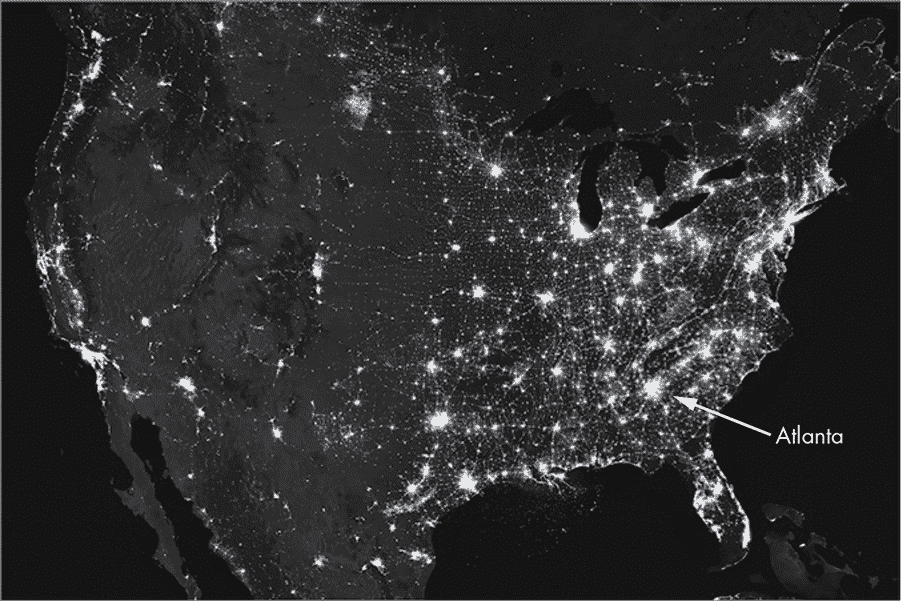
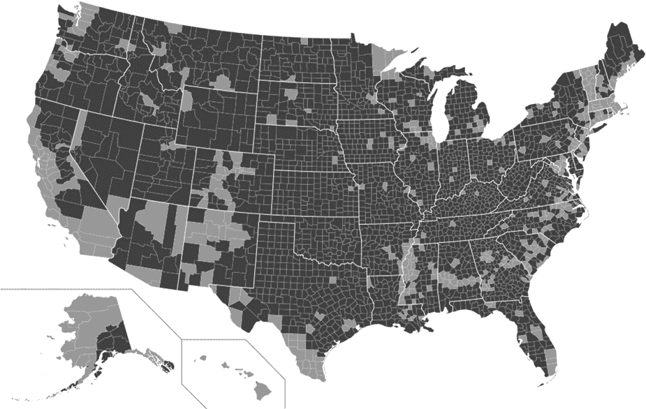
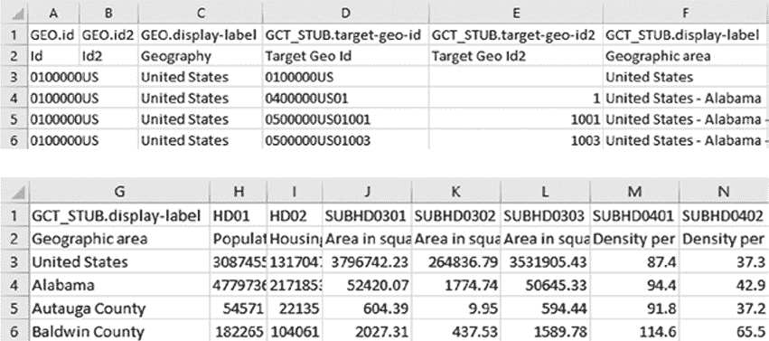
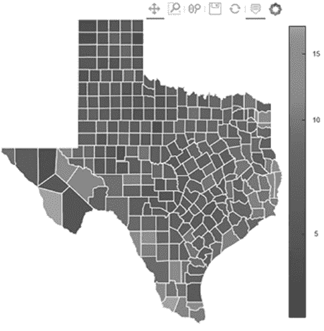
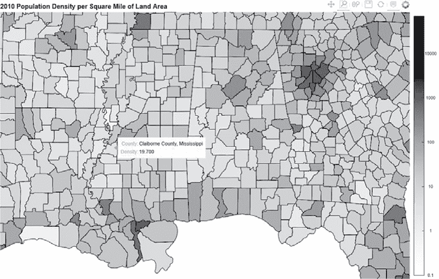
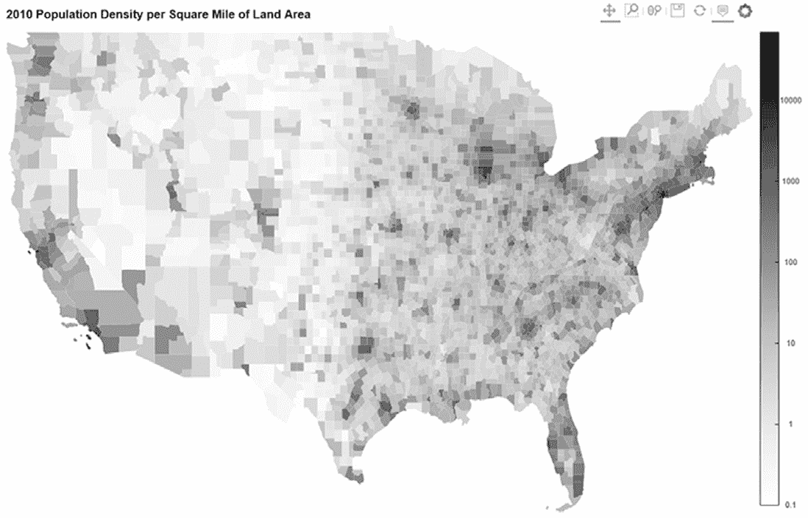
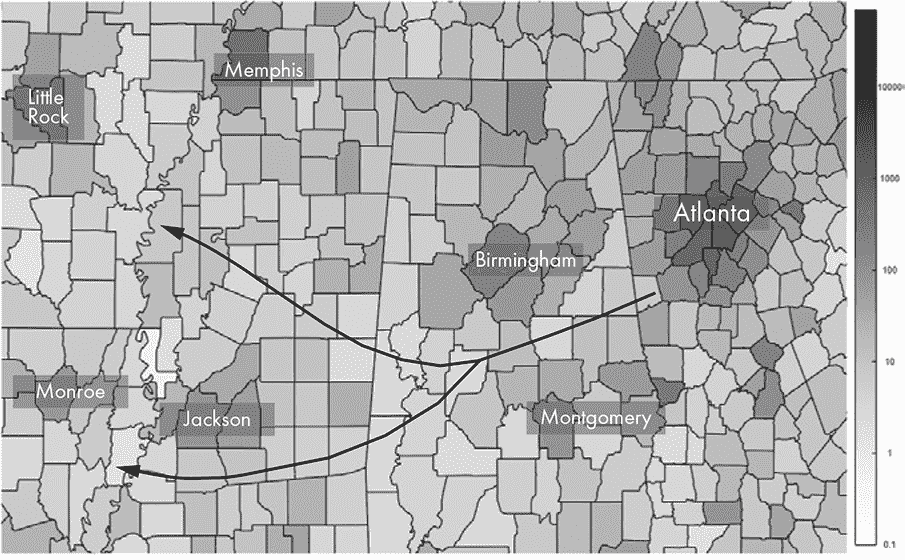
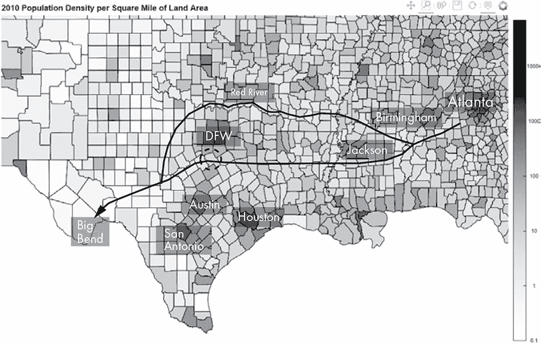
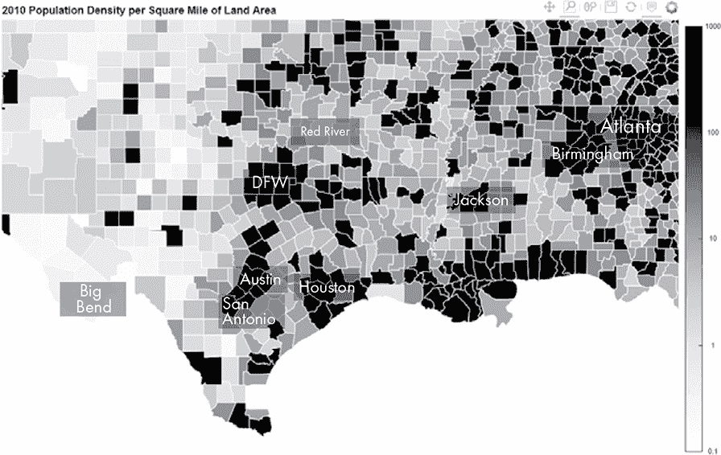
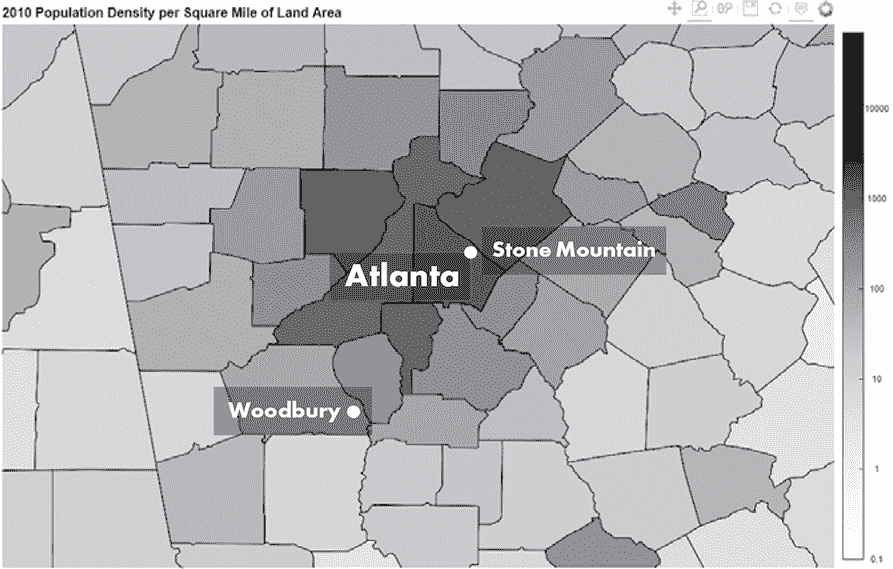

## 创建一个互动丧尸逃生地图


2010 年，*行尸走肉*在 AMC 电视台首播。该剧设定在丧尸末日的初期，讲述了一群幸存者在乔治亚州亚特兰大地区的故事。这部广受好评的剧集迅速成为现象级作品，成为有线电视历史上收视最多的系列剧，衍生出了名为*恐惧行尸走肉*的外传，并开创了一个全新的电视类型——剧集后讨论节目，*行尸走肉后谈*。

在本章中，你将扮演一位机智的数据科学家，预见到文明即将崩溃。你将准备一张地图，帮助*行尸走肉*的幸存者逃离拥挤的亚特兰大大都市区，前往密西西比河以西人口稀少的地区。在这个过程中，你将使用 pandas 库加载、分析和清理数据，并使用 bokeh 和 holoviews 模块绘制地图。

### **项目 #15：使用区域专题地图可视化人口密度**

根据科学家的研究（是的，他们研究过这个问题），生存下来的关键是尽量远离城市。在美国，这意味着要住在图 11-1 中显示的大面积黑色区域里。灯光越亮，人口越多，因此如果你想避免人群，就不要“走向光明”。



图 11-1：2012 年美国城市夜间灯光图

对于我们在亚特兰大的*行尸走肉*幸存者来说，不幸的是，他们距离美国西部相对安全的地区还有很长一段路。他们需要穿越一系列城市和小镇，理想情况下尽量经过人口稀少的区域。服务站地图并没有提供人口信息，但美国人口普查提供了。文明崩溃、互联网失效之前，你可以将人口密度数据下载到你的笔记本电脑上，稍后使用 Python 整理数据。

展示此类数据的最佳方式是使用*区域专题地图*，这是一种利用颜色或图案来表示预定地理区域统计数据的可视化工具。你可能熟悉美国总统选举结果的区域专题地图，地图上县域会被涂上红色代表共和党获胜，蓝色代表民主党获胜（图 11-2）。

如果幸存者们手中有一张显示每个县每平方英里人口数量的*区域专题地图*，他们就能找到离开亚特兰大并穿越美国南部的最短、理论上最安全的路线。尽管你可以从人口普查中获得更高分辨率的数据，但使用其县级数据应该足够了。*行尸走肉*中的丧尸群体会随着饥饿而迁移，这很快就会让详细的统计数据变得过时。



图 11-2：2016 年美国总统选举结果的区域专题地图（浅灰色 = 民主党，深灰色 = 共和党）

为了确定通过各县的最佳路线，幸存者可以使用像加油站和欢迎中心提供的州际公路地图。这些纸质地图包括县和教区的轮廓，便于将它们的城市和道路网络与页尺寸的分层地图打印图对照。

目标

创建一个交互式地图，展示美国 48 个相邻州（即大陆 48 州）的县级人口密度。

#### ***策略***

和所有数据可视化任务一样，本任务包含以下基本步骤：查找并清理数据、选择绘图类型和展示数据的工具、准备数据以进行绘图，以及绘制数据。

在这种情况下，找到数据很容易，因为美国人口普查数据是公开的。但你仍然需要*清理*这些数据，处理虚假的数据点、空值和格式问题。理想情况下，你还应该验证数据的准确性，这是一项困难的工作，数据科学家可能经常忽略。数据至少应该通过一个理智检查，这个工作可能要等到数据绘制出来后才能完成。例如，纽约市的人口密度应该大于蒙大拿州比灵斯市。

接下来，你必须决定如何呈现数据。你将使用地图，但其他选项可能包括条形图或表格。更重要的是选择工具——在这种情况下是 Python 库——来生成图表。工具的选择会对数据准备方式以及最终展示的内容产生重大影响。

多年前，一家快餐公司曾做过一个广告，其中一个顾客声称喜欢“有多样性，但不要太多的多样性。”对于 Python 中的可视化工具，你可以说选择太多，且很难区分它们：matplotlib、seaborn、plotly、bokeh、folium、altair、pygal、ggplot、holoviews、cartopy、geoplotlib，以及 pandas 中的内置函数。

这些不同的可视化库各有优缺点，但由于本项目需要快速完成，你将重点使用易于操作的 holoviews 模块，后端使用 bokeh 绘图。这种组合可以让你仅用几行代码就生成一个交互式的分层地图，而且 bokeh 方便地在其示例数据中包含了美国州和县的多边形。

一旦选择了可视化工具，你就需要将数据转换成工具所期望的格式。你需要弄清楚如何将一个文件中的县级边界形状，和另一个文件中的人口数据结合起来。这将涉及一些逆向工程，借助 holoviews 画廊中的示例代码。完成之后，你将使用 bokeh 绘制地图。

幸运的是，使用 Python 进行数据分析几乎总是依赖于 Python 数据分析库（pandas）。该模块将帮助你加载人口普查数据、分析数据并将其重新格式化，以便与 holoviews 和 bokeh 一起使用。

#### ***Python 数据分析库***

开源的 pandas 库是 Python 中最流行的数据提取、处理和操作库。它包含了针对常见数据源（如 SQL 关系型数据库和 Excel 电子表格）设计的数据结构。如果你打算从事数据科学工作，你一定会在某个时刻遇到 pandas。

pandas 库包含两种主要的数据结构：序列和 DataFrame。*序列* 是一个一维的带标签数组，可以保存任何类型的数据，如整数、浮点数、字符串等。因为 pandas 基于 NumPy，序列对象实际上是两个关联的数组（如果你对数组不熟悉，可以参考第一章中第 12 页的数组介绍）。一个数组包含数据点的值，数据类型可以是任何 NumPy 类型。另一个数组包含每个数据点的标签，称为*索引*（见表 11-1）。

**表 11-1：** 序列对象

| 索引 | 值 |
| --- | --- |
| 0 | 25 |
| 1 | 432 |
| 2 | –112 |
| 3 | 99 |

与 Python 列表项的索引不同，序列中的索引不必是整数。在表 11-2 中，索引是人名，值是他们的年龄。

**表 11-2：** 带有有意义标签的序列对象

| 索引 | 值 |
| --- | --- |
| Javier | 25 |
| Carol | 32 |
| Lora | 19 |
| Sarah | 29 |

与列表或 NumPy 数组一样，你可以通过指定索引来切片序列或选择单个元素。你可以以多种方式操作序列，如对其进行筛选、执行数学运算或与其他序列合并。

*DataFrame* 是一个更复杂的结构，包含两个维度。它具有类似电子表格的表格结构，包括列、行和数据（见表 11-3）。你可以把它看作是一个有序的列集合，配有两个索引数组。

**表 11-3：** DataFrame 对象

|  | 列 |  |  |  |
| --- | --- | --- | --- | --- |
| 索引 | 国家 | 州 | 县 | 人口 |
| --- | --- | --- | --- | --- |
| 0 | 美国 | 阿拉巴马州 | 奥托戈县 | 54,571 |
| 1 | 美国 | 阿拉巴马州 | 鲍德温县 | 182,265 |
| 2 | 美国 | 阿拉巴马州 | 巴伯县 | 27,457 |
| 3 | 美国 | 阿拉巴马州 | 比布县 | 22,915 |

第一个索引用于行，类似于序列中的索引数组。第二个索引跟踪标签序列，每个标签代表一个列标题。DataFrame 也类似于字典；列名作为键，每列中的数据序列作为值。这个结构使你可以轻松地操作 DataFrame。

pandas 的所有功能如果要全部覆盖需要一本书，你可以在网上找到很多资源！我们将在代码部分进一步讨论，届时会通过具体示例来讲解。

#### ***bokeh 和 holoviews 库***

bokeh 模块 (*[`bokeh.org/`](https://bokeh.org/)* )是一个开源的交互式可视化库，适用于现代网页浏览器。你可以使用它在大规模或流式数据集上构建优雅的交互式图形。它使用 HTML 和 JavaScript 渲染图形，这两种是创建交互式网页的主要编程语言。

开源的 holoviews 库 (*[`holoviews.org/`](http://holoviews.org/)* )旨在简化数据分析和可视化。使用 holoviews，你首先创建一个描述数据的对象，而不是直接调用绘图库（如 bokeh 或 matplotlib）来构建图表，然后图表会自动成为该对象的可视化表现。

holoviews 示例画廊包括多个使用 bokeh 可视化的区域图（例如 *[`holoviews.org/gallery/demos/bokeh/texas_choropleth_example.html`](http://holoviews.org/gallery/demos/bokeh/texas_choropleth_example.html)*）。稍后，我们将使用这个画廊中的失业率示例，了解如何以类似的方式呈现我们的人口密度数据。

#### ***安装 pandas、bokeh 和 holoviews***

如果你完成了第一章的项目，你已经安装了 pandas 和 NumPy。如果没有，请参考“安装 Python 库”中的说明，查看第 6 页。

安装 holoviews 的一种方式是使用 Anaconda，它会同时安装推荐的所有包的最新版本，适用于 Linux、Windows 或 macOS。

```py
conda install -c pyviz holoviews bokeh
```

该安装方法包括默认的 matplotlib 绘图库后端、更加互动的 bokeh 绘图库后端以及 Jupyter/IPython Notebook。

你可以使用 pip 安装一套类似的包。

```py
pip install 'holoviews[recommended]'
```

如果你已经安装了 bokeh，通过 pip 可以获得其他最小安装选项。你可以在 *[`holoviews.org/install.html`](http://holoviews.org/install.html)* 和 *[`holoviews.org/user_guide/Installing_and_Configuring.html`](http://holoviews.org/user_guide/Installing_and_Configuring.html)* 上找到这些及其他安装说明。

#### ***访问县、州、失业和人口数据***

bokeh 库附带了州和县的轮廓数据文件以及 2009 年美国各县的失业数据。如前所述，你将使用失业数据来确定如何格式化来自 2010 年人口普查的人口数据。

要下载 bokeh 示例数据，请连接互联网，打开 Python shell，并输入以下命令：

```py
>>> import bokeh
>>> import bokeh.sampledata
>>> bokeh.sampledata.download()
Creating C:\Users\lee_v\.bokeh directory
Creating C:\Users\lee_v\.bokeh\data directory
Using data directory: C:\Users\lee_v\.bokeh\data
```

如你所见，程序会告诉你数据存放的位置，以便 bokeh 可以自动找到它。你的路径会与我的不同。有关下载示例数据的更多信息，请参见 *[`docs.bokeh.org/en/latest/docs/reference/sampledata.html`](https://docs.bokeh.org/en/latest/docs/reference/sampledata.html)*。

在下载的文件夹中查找 *US_Counties.csv* 和 *unemployment09.csv* 文件。这些纯文本文件使用流行的 *逗号分隔值*（CSV）格式，每一行表示一个数据记录，包含多个由逗号分隔的字段。（如果你经常去 CVS 药店购物，试着正确说出“CSV”，祝你好运！）

失业文件展示了数据科学家的困境。如果你打开它，你会发现没有描述数据的列名（图 11-3），虽然大多数字段的含义可以猜测出来。我们稍后会处理这个问题。


图 11-3：unemployment09.csv 文件的前几行

如果你打开美国县文件，你会看到很多列，但至少它们有标题（图 11-4）。你的挑战是将图 11-3 中的失业数据与图 11-4 中的地理数据关联起来，这样你就可以在处理人口普查数据时做同样的事情。


图 11-4：US_Counties.csv 文件的前几行

你可以在 *Chapter_11* 文件夹中找到人口数据 *census_data_popl_2010.csv*，该文件可以从书籍网站下载。这个文件原名为 *DEC_10_SF1_GCTPH1.US05PR_with_ann.csv*，来自美国数据查询网站 American FactFinder。到本书出版时，美国政府将把人口普查数据迁移到一个新的站点 *[`data.census.gov`](https://data.census.gov)*（见 *[`www.census.gov/data/what-is-data-census-gov.html`](https://www.census.gov/data/what-is-data-census-gov.html)*）。

如果你查看人口普查文件的顶部，你会看到很多列和两行标题（图 11-5）。你需要关注的是 M 列，标题为 *每平方英里土地面积密度 - 人口*。



图 11-5：census_data_popl_2010.csv 文件的前几行

到目前为止，你已经具备了生成人口密度专题地图所需的所有 Python 库和数据文件 *理论上*。然而，在你编写代码之前，你需要知道如何将人口数据与地理数据关联起来，以便将正确的县数据放入正确的县形状中。

#### ***黑客入门：Holoviews***

学会根据自己的需求调整现有代码是数据科学家的宝贵技能。这可能需要一些逆向工程的技巧。因为开源软件是免费的，有时文档不全，所以你必须自己弄清楚它是如何工作的。让我们花点时间，将这种技能应用到当前的问题上。

在前几章中，我们利用了像 turtle 和 matplotlib 这样的开源模块提供的图库示例。holoviews 库也有一个图库（* [`holoviews.org/gallery/index.html`](http://holoviews.org/gallery/index.html) *），其中包括德克萨斯州分层图示例，这是一张 2009 年德克萨斯州失业率的分层地图（见图 11-6）。



图 11-6：来自 holoviews 图库的 2009 年德克萨斯州失业率的分层地图

清单 11-1 包含了 holoviews 为该地图提供的代码。你将基于这个示例构建你的项目，但要做到这一点，你需要解决两个主要的差异。首先，你计划绘制人口密度，而不是失业率。其次，你想要一张包括美国本土的地图，而不仅仅是德克萨斯州。

```py
texas_choropleth_example.html
   import holoviews as hv
   from holoviews import opts
   hv.extension('bokeh')
➊ from bokeh.sampledata.us_counties import data as counties
   from bokeh.sampledata.unemployment import data as unemployment

   counties = [dict(county, ➋Unemployment=unemployment[cid])
               for cid, county in counties.items()
            ➌ if county["state"] == "tx"]

   choropleth = hv.Polygons(counties, ['lons', 'lats'],
                            [('detailed name', 'County'), 'Unemployment'])

   choropleth.opts(opts.Polygons(logz=True,
                                 tools=['hover'],
                                 xaxis=None, yaxis=None,
                                 show_grid=False,
                                 show_frame=False,
                                 width=500, height=500,
                                 color_index='Unemployment',
                                 colorbar=True, toolbar='above',
                                 line_color='white'))
```

清单 11-1：生成德克萨斯州分层图的 holoviews 图库代码

这段代码从 bokeh 示例数据 ➊ 中导入数据。你需要知道失业率和县数据这两个变量的格式和内容。失业率稍后将通过失业率变量和 cid 索引或键来访问，cid 可能代表“县 ID” ➋。该程序通过使用州代码来选择德克萨斯州，而不是整个美国 ➌。

让我们在 Python shell 中探讨一下。

```py
   >>> from bokeh.sampledata.unemployment import data as unemployment
➊ >>> type(unemployment)
   <class 'dict'>
➋ >>> first_2 = {k: unemployment[k] for k in list(unemployment)[:2]}
   >>> for k in first_2:
          print(f"{k} : {first_2[k]}")
➌ (1, 1) : 9.7
   (1, 3) : 9.1
   >>>
   >>> for k in first_2:
          for item in k:
             print(f"{item}: {type(item)}")
➍ 1: <class 'int'>
   1: <class 'int'>
   1: <class 'int'>
   3: <class 'int'>
```

首先，使用图库示例中的语法导入 bokeh 示例数据。接着，使用内置函数 type()检查失业率变量 ➊ 的数据类型。你会看到它是一个字典。

现在，使用字典推导式生成一个新的字典，包含失业率中前两行的数据 ➋。打印结果，你会看到键是元组，值是数字，推测是以百分比表示的失业率 ➌。检查键中数字的数据类型。它们是整数，而不是字符串 ➍。

将 ➌ 处的输出与图 11-3 中 CSV 文件的前两行进行对比。键元组中的第一个数字，推测为州代码，来自第 B 列。元组中的第二个数字，推测为县代码，来自第 C 列。失业率显然存储在第 I 列。

现在将失业率的数据与图 11-4 中的县数据进行对比。*STATE num*（第 J 列）和*COUNTY num*（第 K 列）显然包含了键元组的组成部分。

到目前为止都很好，但如果你查看图 11-5 中的人口数据文件，你会发现没有州或县的代码可以直接转换为元组。然而，第 E 列中的数字与县数据的最后一列匹配，那个列被标注为*FIPS 公式*（见图 11-4）。这些 FIPS 号码似乎与州和县的代码有关。

事实证明，*联邦信息处理系列（FIPS）* 代码基本上是县区的邮政编码。FIPS 代码是由国家标准与技术研究院分配给每个县区的五位数字编码。前两位数字代表该县所在的州，后三位数字代表该县（见 表 11-4）。

**表 11-4：** 使用 FIPS 代码识别美国县区

| 美国县区 | 州代码 | 县区代码 | FIPS |
| --- | --- | --- | --- |
| 鲍德温县，AL | 01 | 003 | 1003 |
| 约翰逊县，IA | 19 | 103 | 19103 |

恭喜你，现在你知道如何将美国人口普查数据与 Bokeh 样本数据中的县区形状关联起来了。现在是时候编写最终代码了！

#### ***Choropleth 代码***

*choropleth.py* 程序包括清理数据和绘制 choropleth 地图的代码。你可以在书籍网站的 *[Chapter_11](https://nostarch.com/real-world-python/)* 文件夹中下载该代码以及人口数据的副本。

##### **导入模块和数据并构建数据框**

列表 11-2 导入了模块和包含所有美国县区多边形坐标的 Bokeh 县区样本数据。它还加载并创建了一个数据框对象，用于表示人口数据。然后，它开始清理和准备数据，以便与县区数据一起使用。

```py
choropleth.py, part 1
   from os.path import abspath
   import webbrowser
   import pandas as pd
   import holoviews as hv
   from holoviews import opts
➊ hv.extension('bokeh')
   from bokeh.sampledata.us_counties import data as counties

➋ df = pd.read_csv('census_data_popl_2010.csv', encoding="ISO-8859-1")

   df = pd.DataFrame(df,
                     columns=
                     ['Target Geo Id2',
                     'Geographic area.1',
                     'Density per square mile of land area - Population'])

   df.rename(columns =
             {'Target Geo Id2':'fips',
              'Geographic area.1': 'County',
              'Density per square mile of land area - Population':'Density'},
             inplace = True)

   print(f"\nInitial popl data:\n {df.head()}")
   print(f"Shape of df = {df.shape}\n")
```

列表 11-2：导入模块和数据，创建数据框，并重命名列

首先从操作系统库导入 abspath。你将使用它找到创建后的 choropleth 地图 HTML 文件的绝对路径。然后导入 webbrowser 模块，这样你就可以启动 HTML 文件。你需要这个，因为 holoviews 库是为 Jupyter Notebook 设计的，没有一些帮助，它不会自动显示地图。

接下来，导入 pandas 并重复 列表 11-1 中的 holoviews 导入。注意，你必须指定 bokeh 作为 holoviews 的扩展，或称为 *backend* ➊。这是因为 holoviews 可以与其他绘图库（如 matplotlib）一起使用，因此需要知道使用哪一个。

你通过导入操作获得了地理数据。现在，使用 pandas 加载人口数据。这个模块包括一组输入/输出 API 函数，方便数据的读取和写入。这些 *读取器* 和 *写入器* 处理常见格式，如逗号分隔值（read_csv, to_csv）、Excel（read_excel, to_excel）、结构化查询语言（read_sql, to_sql）、超文本标记语言（read_html, to_html）等。在这个项目中，你将使用 CSV 格式。

在大多数情况下，你可以在不指定字符编码的情况下读取 CSV 文件。

```py
df = pd.read_csv('census_data_popl_2010.csv')
```

然而，在这种情况下，你会遇到以下错误：

```py
UnicodeDecodeError: 'utf-8' codec can't decode byte 0xf1 in position 31: 
invalid continuation byte
```

这是因为文件包含使用 Latin-1 编码（也称为 ISO-8859-1）而非默认的 UTF-8 编码的字符。添加编码参数将解决这个问题 ➋。

现在，通过调用 DataFrame() 构造函数将人口数据文件转化为一个表格数据框。你不需要原始文件中的所有列，因此将你想保留的列名称传递给构造函数。这些列分别代表图 11-5 中的 E 列、G 列和 M 列，即 FIPS 代码、县名（不包含州名）和人口密度。

接下来，使用 rename() 数据框方法将列标签改得更短且更有意义。将它们命名为 *fips*、*County* 和 *Density*。

完成列表后，使用 head() 方法打印数据框的前几行，并使用 shape 属性打印数据框的形状。默认情况下，head() 方法打印前五行。如果你想查看更多行，可以传递行数作为参数，比如 head(20)。你应该会在 shell 中看到以下输出：

```py
Initial popl data:
      fips          County  Density
0     NaN   United States     87.4
1     1.0         Alabama     94.4
2  1001.0  Autauga County     91.8
3  1003.0  Baldwin County    114.6
4  1005.0  Barbour County     31.0
Shape of df = (3274, 3)
```

注意前两行（第 0 行和第 1 行）并不有用。事实上，从输出中可以看出，每个州会有一行用于显示州名，而这些行你需要删除。从 shape 属性中你还可以看到，数据框中一共有 3,274 行。

##### **删除多余的州名行并准备州和县代码**

列表 11-3 删除了所有 FIPS 代码小于或等于 100 的行。这些是指示新州开始的头部行。然后，它为州和县代码创建了新的列，这些列是从现有的 FIPS 代码列派生出来的。你稍后会用这些列从 bokeh 示例数据中选择适当的县轮廓。

```py
   choropleth.py, part 2
   df = df[df['fips'] > 100]
   print(f"Popl data with non-county rows removed:\n {df.head()}")
   print(f"Shape of df = {df.shape}\n")

➊ df['state_id'] = (df['fips'] // 1000).astype('int64')
   df['cid'] = (df['fips'] % 1000).astype('int64') 
   print(f"Popl data with new ID columns:\n {df.head()}")
   print(f"Shape of df = {df.shape}\n")
   print("df info:")
➋ print(df.info())

   print("\nPopl data at row 500:")
➌ print(df.loc[500])
```

列表 11-3：删除多余的行并准备州和县代码

为了在县的多边形中显示人口密度数据，你需要将其转化为一个字典，其中键是由州代码和县代码组成的元组，值是密度数据。但正如你之前所看到的，人口数据中并没有单独的州和县代码列；它只有 FIPS 代码。因此，你需要拆分出州和县的部分。

首先，去除所有不包含县的数据行。如果查看之前的 shell 输出（或图 11-5 中的第 3 和第 4 行），你会发现这些行并没有包含四位或五位的 FIPS 代码。因此，你可以使用 fips 列创建一个新的数据框，仍命名为 df，只保留 FIPS 值大于 100 的行。为了检查这一操作是否有效，可以重复前面列出的打印输出，如下所示：

```py
 Popl data with non-county rows removed:
      fips          County  Density
2  1001.0  Autauga County     91.8
3  1003.0  Baldwin County    114.6
4  1005.0  Barbour County     31.0
5  1007.0     Bibb County     36.8
6  1009.0   Blount County     88.9
Shape of df = (3221, 3)
```

数据框顶部的两行“坏”数据现在已经消失，根据 shape 属性，你已经丢失了总计 53 行。这些行代表了 50 个州、美国、哥伦比亚特区（DC）和波多黎各的表头行。注意，DC 的 FIPS 代码为 11001，波多黎各使用 72 作为州代码，与其 78 个市的三位县代码配合使用。你将保留 DC，但稍后会删除波多黎各。

接下来，为州和县代码数字创建列。将第一列命名为 state_id ➊。使用地板除法（//）除以 1000 返回商，去除小数点后的数字。由于 FIPS 代码的最后三位保留给县代码，因此这将给你留下州代码。

虽然//返回整数，但新的数据框列默认使用浮点数据类型。但我们对 bokeh 示例数据的分析表明，它在关键元组中使用的是整数类型的这些代码。使用 pandas 的 astype()方法将该列转换为整数数据类型，并传递'int64'。

现在，创建一个新的列用于县代码。将其命名为 cid，以便与 holoviews choropleth 示例中使用的术语一致。由于你需要的是 FIPS 代码的最后三位数字，因此使用取余运算符（%）。它返回第一个参数除以第二个参数的余数。像前一行一样，将此列转换为整数数据类型。

再次打印输出，但这次调用数据框的 info()方法 ➋。此方法返回数据框的简洁摘要，包括数据类型和内存使用情况。

```py
Popl data with new ID columns:
      fips          County  Density  state_id  cid
2  1001.0  Autauga County     91.8         1    1
3  1003.0  Baldwin County    114.6         1    3
4  1005.0  Barbour County     31.0         1    5
5  1007.0     Bibb County     36.8         1    7
6  1009.0   Blount County     88.9         1    9
Shape of df = (3221, 5)

df info:
<class 'pandas.core.frame.DataFrame'>
Int64Index: 3221 entries, 2 to 3273
Data columns (total 5 columns):
fips        3221 non-null float64
County      3221 non-null object
Density     3221 non-null float64
state_id    3221 non-null int64
cid         3221 non-null int64
dtypes: float64(2), int64(2), object(1)
memory usage: 151.0+ KB
None
```

如你从列和信息摘要中看到的那样，state_id 和 cid 数字是整数值。

前五行中的州代码都是单一数字，但州代码也可能是两位数。花些时间检查后续行的州代码。你可以通过在数据框上调用 loc()方法并传递一个较大的行号 ➌ 来做到这一点。这将让你检查双位数的州代码。

```py
Popl data at row 500:
fips                13207
County      Monroe County
Density              66.8
state_id               13
cid                   207
Name: 500, dtype: object
```

fips、state_id 和 cid 看起来都很合理。这完成了数据的准备工作。下一步是将这些数据转换成 holoviews 可以用来制作 choropleth 地图的字典。

##### **准备数据以供显示**

列表 11-4 将州和县 ID 以及密度数据转换为单独的列表。然后，它将这些数据重新组合成一个字典，格式与 holoviews 画廊示例中使用的失业字典相同。它还列出了要从地图中排除的州和领土，并列出了绘制 choropleth 地图所需的数据。

```py
choropleth.py, part 3
state_ids = df.state_id.tolist()
cids = df.cid.tolist()
den = df.Density.tolist()

tuple_list = tuple(zip(state_ids, cids))
popl_dens_dict = dict(zip(tuple_list, den))

EXCLUDED = ('ak', 'hi', 'pr', 'gu', 'vi', 'mp', 'as')

counties = [dict(county, Density=popl_dens_dict[cid])
            for cid, county in counties.items()
            if county["state"] not in EXCLUDED]
```

列表 11-4：为绘制准备人口数据

之前，我们查看了 holoviews 画廊示例中的失业变量，并发现它是一个字典。州和县代码的元组作为键，失业率作为值，如下所示：

```py
(1, 1) : 9.7
(1, 3) : 9.1
--snip--
```

为了创建类似的字典来存储人口数据，首先使用 pandas 的 tolist() 方法将数据框的 state_id、cid 和 Density 列分别创建成单独的列表。然后，使用内置的 zip() 函数将州和县代码列表合并成元组对。通过将这个新的元组列表与密度列表打包，创建最终的字典 popl_dens_dict。（tuple_list 这个名字有些误导，严格来说它是一个 tuple_tuple。）数据准备工作就完成了。

*行尸走肉*中的幸存者要是能从亚特兰大活着出去就已经幸运了。我们还是忘了他们能到达阿拉斯加吧。创建一个名为 EXCLUDED 的元组，包含在 bokeh 县数据中但不属于美国本土的州和地区。这些包括阿拉斯加、夏威夷、波多黎各、关岛、维尔京群岛、北马里亚纳群岛和美属萨摩亚。为了减少打字量，你可以使用县数据集中提供的州缩写（参见图 11-4）。

接下来，像 holoviews 示例一样，创建一个字典并将其放入一个名为 counties 的列表中。在这里，你需要添加人口密度数据。使用 cid 县标识符号将其链接到正确的县。使用条件语句来应用 EXCLUDED 元组。

如果你打印出该列表的第一个索引，你将得到以下（被截断的）输出：

```py
[{'name': 'Autauga', 'detailed name': 'Autauga County, Alabama', 'state': 
'al', 'lats': [32.4757, 32.46599, 32.45054, 32.44245, 32.43993, 32.42573, 
32.42417, --snip-- -86.41231, -86.41234, -86.4122, -86.41212, -86.41197, 
-86.41197, -86.41187], 'Density': 91.8}]
```

现在，Density 键值对替换了在 holoviews 示例中使用的失业率键值对。接下来，开始绘制地图！

##### **绘制 choropleth 地图**

列表 11-5 创建 choropleth 地图，将其保存为 *.html* 文件，并通过 webbrowser 打开。

```py
choropleth.py, part 4
   choropleth = hv.Polygons(counties,
                            ['lons', 'lats'],
                            [('detailed name', 'County'), 'Density'])

➊ choropleth.opts(opts.Polygons(logz=True,
                     tools=['hover'],
                     xaxis=None, yaxis=None,
                     show_grid=False, show_frame=False,
                     width=1100, height=700,
                     colorbar=True, toolbar='above',
                     color_index='Density', cmap='Greys', line_color=None,
                     title='2010 Population Density per Square Mile of Land Area'
                     ))

➋ hv.save(choropleth, 'choropleth.html', backend='bokeh')
   url = abspath('choropleth.html')
   webbrowser.open(url)
```

列表 11-5：创建并绘制 choropleth 地图

根据 holoviews 文档，Polygons() 类在 2D 空间中创建一个连通的填充区域，作为多边形几何体的列表。定义一个变量 choropleth 并将 counties 变量和字典键（包括用于绘制县多边形的 lons 和 lats）传递给 Polygons()。同时，传递县名和人口密度键。holoviews 的悬停工具将使用这个元组（'详细名称'，'County'），在你移动鼠标时显示完整的县名，比如 "County: Claiborne County, Mississippi"（见图 11-7）。



图 11-7：启用悬停功能的 choropleth 地图

接下来，设置地图的选项 ➊。首先，通过将 logz 参数设置为 True，允许使用对数色条。

holoviews 窗口将带有一组默认工具，如平移、缩放、保存、刷新等（参见图 11-7 的右上角）。使用 tools 参数将悬停功能添加到此列表中。这允许你查询地图，并获取县名和人口密度的详细信息。

你并不是在创建一个标准的带有注释的 *x* 轴和 *y* 轴的图形，所以将它们设置为 None。同样，不要显示地图周围的网格或框架。

设置地图的宽度和高度（以像素为单位）。你可能需要根据你的显示器调整这些设置。接下来，将 colorbar 设置为 True，并将工具栏放置在显示屏的顶部。

由于你希望根据人口密度为县区着色，因此将 color_index 参数设置为 Density，它代表 popl_dens_dict 中的值。对于填充颜色，使用 Greys 色图。如果你希望使用更亮的颜色，可以在*[`build.holoviews.org/user_guide/Colormaps.html`](http://build.holoviews.org/user_guide/Colormaps.html)*找到可用色图的列表。确保选择一个名称中包含“bokeh”的色图。完成颜色方案后，选择一个线条颜色用于县区轮廓。对于灰色色图，好的选择包括 None、'white'或'black'。

通过添加标题来完成选项。现在，分区地图已经准备好绘制。

要将你的地图保存在当前目录中，使用 holoviews 的 save()方法，并传递给它 choropleth 变量、一个带有*.html*扩展名的文件名以及正在使用的绘图后端名称 ➋。如前所述，holoviews 是为 Jupyter Notebook 设计的。如果你希望地图自动弹出在浏览器中，首先将保存的地图的完整路径赋值给一个 url 变量。然后，使用 webbrowser 模块打开 url 并显示地图（图 11-8）。



图 11-8：2010 年人口密度分区地图。较浅的颜色表示较低的人口密度

你可以使用地图顶部的工具栏来平移、缩放（使用框选或套索）、保存、刷新或悬停。悬停工具，如图 11-7 所示，将帮助你在地图阴影使差异难以视觉区分的地方找到人口最少的县区。

**注意**

*Box Zoom 工具允许快速查看矩形区域，但可能会拉伸或压缩地图坐标轴。为了在缩放时保持地图的纵横比，可以结合使用 Wheel Zoom 和 Pan 工具。*

#### ***逃生计划***

奇索斯山脉（Chisos Mountains）是大弯国家公园（Big Bend National Park）中的一座灭绝超级火山，可能是地球上度过僵尸末日的最佳地点之一。它孤立且外形像堡垒（图 11-9），山脉比周围的沙漠平原高出 4,000 英尺，最高海拔接近 8,000 英尺。山脉的中心是一个天然盆地，里面有公园设施，包括旅馆、小屋、商店和餐厅。该地区鱼类和野生动物丰富，沙漠泉水提供淡水，里奥格兰德河的河岸适合农业种植。


图 11-9：德克萨斯州西部的奇索斯山脉（左）及其 3D 地形图（右）

使用你的地理信息图，你可以迅速规划一条通往远处自然堡垒的路线。但首先，你需要逃离亚特兰大。离开大都市区的最短路线是位于阿拉巴马州伯明翰和蒙哥马利之间的一条狭窄通道（见图 11-10）。你可以选择向北或向南绕过下一个大城市杰克逊，密西西比州。不过，为了选择最佳路线，你需要往前看得更远。



图 11-10：逃离亚特兰大

绕过杰克逊的南方路线较短，但迫使幸存者必须经过高度发达的 I-35 走廊，该走廊以南部的圣安东尼奥和北部的达拉斯–沃斯堡（DFW）为中心（见图 11-11）。这在德克萨斯州希尔县（图 11-11 中圈出的地方）形成了一个潜在的危险瓶颈。



图 11-11：西行路线

或者，通过俄克拉荷马州和德克萨斯州之间的红河谷的北方路线，虽然更长，但更安全，尤其是如果你利用了可通航的河流。一旦穿过沃斯堡以西，幸存者可以过河并向南行进，找到救赎之路。

如果 holoviews 提供一个允许你交互式地改变颜色条的滑动工具，这种类型的规划将变得更加简单。例如，你可以通过简单地上下拖动光标来过滤或改变县的阴影。这将使得找到通过人口最少的县的连接路线变得更加容易。

不幸的是，滑动工具并不是 holoviews 窗口选项之一。然而，由于你了解 pandas，这并不会阻止你。只需在打印位置 500 的信息行之后添加以下代码片段：

```py
df.loc[df.Density >= 65, ['Density']] = 1000
```

这将改变数据框中的人口密度值，将那些大于或等于 65 的值设置为常量 1000。重新运行程序后，你将看到图 11-12 中的图表。通过这些新值，圣安东尼奥–奥斯汀–达拉斯的屏障更加明显，红河谷（它形成了东德克萨斯州的北部边界）的相对安全性也更加明显。

你可能会想知道，电视节目中的幸存者去了哪里？他们什么也没去！他们在亚特兰大附近度过了前四季，最初露营在石山，然后藏身于虚构小镇伍德伯里的监狱附近（见图 11-13）。



图 11-12：每平方英里超过 65 人的县以黑色阴影显示



图 11-13：石山和虚构小镇伍德伯里的位置

斯通山距离亚特兰大市中心不到 20 英里，位于德卡尔布县，每平方英里有 2,586 人。伍德伯里（即实际的塞诺伊镇）距离亚特兰大市中心仅 35 英里，位于科韦塔县和费耶特县的边界，每平方英里有 289 人和 549 人。难怪这些家伙会遇到这么多麻烦。如果当时小组里有一位数据科学家就好了。

### **总结**

在这一章中，你将学习如何使用 Python 数据分析库（pandas）以及 bokeh 和 holoviews 可视化模块。在这个过程中，你进行了实际的数据清洗和整理，将来自不同来源的数据进行连接。

### **进一步阅读**

“如果僵尸 apocalypse 发生，科学家建议你应该跑到山里去”（《商业内幕》，2017 年），作者凯文·洛里亚，描述了将标准疾病模型应用于假设僵尸疫情中的感染率。

“制作分层地图时需要考虑的因素”（*Chartable*，2018 年），作者丽莎·夏洛特·罗斯特，提供了制作分层地图的实用指南。你可以在* [`blog.datawrapper.de/choroplethmaps/`](https://blog.datawrapper.de/choroplethmaps/) *找到它。

“浑浊的美国：选举地图的颜色平衡——信息图表”（STEM Lounge，2019 年），作者拉里·韦鲁，展示了如何增加分层地图中有用细节的方法，并以具有标志性的红蓝美国选举地图为例。

*Python 数据科学手册：数据工作必备工具*（O'Reilly 出版社，2016 年），作者杰克·范德普拉斯，是一本详细的参考书，涵盖了 Python 数据科学工具的相关内容，包括 pandas。

*窗下：大弯国家早期牧场生活*（《铁山出版社》，2003 年），作者帕特里夏·威尔逊·克洛瑟，是一本生动的回忆录，讲述了她在 20 世纪初在德克萨斯州大弯国家的一个广阔牧场上长大，那个地方在成为国家公园之前的样子。它提供了对末日幸存者如何应对严酷环境的见解。

*博弈论：在僵尸末日中生存的真正技巧（7 天生存挑战）*（《游戏理论家》，2016 年）是一部关于*世界上*最佳逃生地的视频。与*行尸走肉*不同，这段视频假设僵尸病毒可以通过蚊子和蜱虫传播，因此选择了考虑到这一点的地点。该视频可以在线观看。

### **挑战项目：美国人口变化地图**

美国政府将在 2021 年发布 2020 年人口普查数据。然而，2019 年的跨普查人口估计数据虽然不那么精确，但已经可以使用。请利用这些数据，结合 2010 年的《项目 15》数据，生成一个新的分层地图，展示该时间段内按县划分的人口变化。

提示：你可以在 pandas 数据框中相减列以生成差异数据，如下面的玩具示例所示。2020 年的人口值代表的是虚拟数据。

```py
>>> import pandas as pd
>>>
>>> # Generate example population data by county:
>>> pop_2010 = {'county': ['Autauga', 'Baldwin', 'Barbour', 'Bibb'],
 'popl': [54571, 182265, 27457, 22915]}
>>> pop_2020 = {'county': ['Autauga', 'Baldwin', 'Barbour', 'Bibb'],
 'popl': [52910, 258321, 29073, 29881]}
>>>
>>> df_2010 = pd.DataFrame(pop_2010)
>>> df_2020 = pd.DataFrame(pop_2020)
>>> df_diff = df_2020.copy()  # Copy the 2020 dataframe to a new df
>>> df_diff['diff'] = df_diff['popl'].sub(df_2010['popl'])  # Subtract popl columns
>>> print(df_diff.loc[:4, ['county', 'diff']])
    county   diff
0  Autauga  -1661
1  Baldwin  76056
2  Barbour   1616
3     Bibb   6966
```
