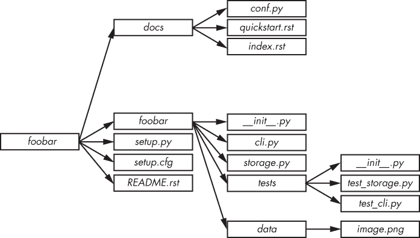

## 第一章：**开始你的项目**


在本章中，我们将讨论开始一个项目时的几个方面，以及在开始之前你应该考虑的内容，例如选择使用哪个 Python 版本、如何构建模块、如何有效地编号软件版本，以及如何通过自动错误检查确保最佳编码实践。

### **Python 的版本**

在开始一个项目之前，你需要决定它将支持哪些版本的 Python。这并不是一个看似简单的决定。

Python 同时支持多个版本这并不是什么秘密。每个小版本的解释器都会提供 18 个月的错误修复支持和 5 年的安全支持。例如，Python 3.7 于 2018 年 6 月 27 日发布，将一直支持到 Python 3.8 发布，预计在 2019 年 10 月发布。大约在 2019 年 12 月，将会发布 Python 3.7 的最后一个错误修复版本，之后大家都需要切换到 Python 3.8。每个新版本的 Python 都会引入新功能，并淘汰旧功能。图 1-1 展示了这一时间表。


*图 1-1：Python 发布时间表*

此外，我们还需要考虑 Python 2 和 Python 3 的问题。使用（非常）旧平台的人可能仍然需要 Python 2 的支持，因为这些平台上没有提供 Python 3，但基本原则是，如果可以的话，就不要考虑 Python 2。

这里有一个快速方法来判断你需要哪个版本：

+   版本 2.6 及更早版本现在已经过时，因此我不建议你为这些版本提供支持。如果你出于某些原因确实打算支持这些旧版本，请注意，确保你的程序也支持 Python 3.x 将会非常困难。话虽如此，你仍然可能会在某些老旧系统上遇到 Python 2.6——如果是这样，那就抱歉了！

+   版本 2.7 是 Python 2.x 的最后一个版本。现在，每个系统基本上都能够运行或者已经运行 Python 3，所以除非你是在做考古学工作，否则不需要担心在新程序中支持 Python 2.7。Python 2.7 将在 2020 年后停止支持，因此最后你想做的事情就是基于它构建新软件。

+   截至目前，Python 3 分支的最新版本是 3.7，这也是你应该目标的版本。然而，如果你的操作系统出厂时自带版本是 3.6（大多数操作系统，除了 Windows，都自带 3.6 或更高版本），请确保你的应用程序也能兼容 3.6。

支持 Python 2.7 和 3.x 的程序编写技巧将在第十三章中讨论。

最后，请注意，本书是针对 Python 3 编写的。

### **项目布局**

开始一个新项目总是有点像拼图。你不能确定项目的具体结构，所以你可能不知道该如何组织文件。然而，一旦你对最佳实践有了正确的理解，你就会知道应该从哪种基本结构开始。在这里，我将提供一些关于如何布局项目的建议，包含一些应该做和不应该做的事项。

#### ***应该做的事情***

首先，考虑你的项目结构，应该保持相对简单。明智地使用包和层级结构：过深的层级结构可能会变得难以导航，而扁平的层级结构则往往会变得臃肿。

然后，避免犯一个常见的错误，即将单元测试存储在包目录之外。这些测试应该被包含在软件的子包中，以确保它们不会被`setuptools`（或其他打包库）误自动安装为*tests*顶级模块。通过将它们放入子包中，你确保它们可以被安装并最终供其他包使用，从而让用户可以构建自己的单元测试。

图 1-2 展示了标准的文件层次结构应该是什么样的。



*图 1-2：标准包目录*

Python 安装脚本的标准名称是*setup.py*。它配套有*setup.cfg*，其中应包含安装脚本的配置细节。运行时，*setup.py*将使用 Python 的分发工具安装你的包。

你还可以在*README.rst*（或*README.txt*，或任何你喜欢的文件名）中提供给用户的重要信息。最后，*docs*目录应包含包的文档，采用*reStructuredText*格式，这些文档将被 Sphinx 使用（见第三章）。

包通常需要提供额外的数据供软件使用，例如图像、shell 脚本等。不幸的是，没有一个被普遍接受的标准来确定这些文件应该存放在哪里，所以你应该根据文件的功能，将它们放在对你的项目最有意义的位置。例如，Web 应用程序的模板可以放在包根目录中的*templates*目录下。

以下顶级目录也经常出现：

+   *etc* 用于示例配置文件

+   *tools* 用于 shell 脚本或相关工具

+   *bin* 用于你编写的二进制脚本，这些脚本将通过*setup.py*进行安装

#### ***不应该做的事情***

我经常在没有充分考虑的项目结构中遇到一个特定的设计问题：一些开发者会根据他们将存储的代码类型创建文件或模块。例如，他们可能会创建*functions.py*或*exceptions.py*文件。这是一种*糟糕*的做法，在开发者浏览代码时没有任何帮助。当阅读代码库时，开发者期望程序的功能区块被限制在特定的文件中。这种代码组织方式并没有带来任何好处，反而迫使读者无缘无故地在多个文件之间跳转。

根据*功能*而非类型来组织你的代码。

创建一个仅包含*__init__.py*文件的模块目录也是一个坏主意，因为这会造成不必要的嵌套。例如，你不应该创建一个名为*hooks*的目录，里面只有一个名为*hooks/__init__.py*的文件，而实际上*hooks.py*就足够了。如果你创建一个目录，它应该包含属于该目录代表的类别的多个其他 Python 文件。不必要地构建深层次的层级结构会让人困惑。

你还应该非常小心你放入*__init__.py*文件中的代码。这个文件将在第一次加载目录中包含的模块时被调用并执行。将错误的内容放入*__init__.py*文件中可能会产生不良的副作用。事实上，除非你知道自己在做什么，否则*__init__.py*文件通常应该是空的。不过，不要试图完全删除*__init__.py*文件，否则你将根本无法导入你的 Python 模块：Python 要求目录中存在*__init__.py*文件才能将其视为子模块。

### **版本编号**

软件版本需要打上印记，以便用户知道哪个是更新的版本。对于每个项目，用户必须能够组织不断发展的代码时间线。

组织版本号的方式有无数种。然而，PEP 440 引入了一种版本格式，每个 Python 包，理想情况下每个应用程序，都应该遵循该格式，以便其他程序和包可以轻松可靠地识别他们需要的包的版本。

PEP 440 定义了以下用于版本编号的正则表达式格式：

```py
N[.N]+[{a|b|c|rc}N][.postN][.devN]
```

这允许使用标准编号，如`1.2`或`1.2.3`。还有一些细节需要注意：

+   版本`1.2`等同于`1.2.0`，`1.3.4`等同于`1.3.4.0`，依此类推。

+   与`N[.N]+`匹配的版本被认为是*最终*版本。

+   基于日期的版本号，如`2013.06.22`，被认为是无效的。旨在检测 PEP 440 格式版本号的自动化工具会（或者应该）在检测到版本号大于或等于`1980`时引发错误。

+   最终组件也可以使用以下格式：

    +   `N[.N]+aN`（例如，`1.2a1`）表示一个 alpha 版本；这个版本可能不稳定并且缺少一些功能。

    +   `N[.N]+bN`（例如，`2.3.1b2`）表示一个 beta 版本，一个可能功能完整但仍然存在 bug 的版本。

    +   `N[.N]+cN` 或 `N[.N]+rcN`（例如，`0.4rc1`）表示一个（发布）候选版本。这是一个可能作为最终产品发布的版本，除非出现重大 bug。`rc`和`c`后缀有相同的含义，但如果两者都使用，`rc`版本被视为比`c`版本更新。

+   还可以使用以下后缀：

    +   后缀*.postN*（例如，`1.4.post2`）表示一个发布后版本。发布后版本通常用于解决发布过程中的小错误，如发布说明中的错误。在发布修复版本时，不应使用*.postN*后缀；应当增加次版本号。

    +   后缀*.devN*（例如，`2.3.4.dev3`）表示开发版本。它表示一个预发布版本，该版本在正式的 alpha、beta、候选版本或最终版本之前发布。例如，*2.3.4.dev3*表示*2.3.4*发布的第三个开发版本。此后缀不建议使用，因为它对人类解析起来较为困难。

该方案应该足以应对大多数常见的使用场景。

**注意**

*你可能听说过语义化版本控制，它为版本编号提供了自己的指南。该规范部分与 PEP 440 重叠，但不完全兼容。例如，语义化版本控制推荐的预发布版本使用类似`1.0.0-alpha+001`的方案，这与 PEP 440 不兼容。*

许多*分布式版本控制系统（DVCS）*平台，如 Git 和 Mercurial，能够使用标识哈希生成版本号（对于 Git，请参见`git describe`）。不幸的是，这种系统与 PEP 440 定义的方案不兼容：其中一个问题是，标识哈希无法排序。

### **编码风格与自动化检查**

编码风格是一个敏感话题，但在我们深入讨论 Python 之前，我们应该先谈谈它。与许多编程语言不同，Python 使用*缩进*来定义代码块。虽然这为“我该把大括号放在哪里？”这个古老问题提供了简单的解决方案，但也带来了一个新问题：“我该如何缩进？”

这是社区提出的第一个问题之一，因此 Python 的开发者们在他们深邃的智慧下，提出了*PEP 8: Python 代码风格指南*（*[`www.python.org/dev/peps/pep-0008/`](https://www.python.org/dev/peps/pep-0008/)*）。

本文档定义了编写 Python 代码的标准风格。指南的核心内容如下：

+   每个缩进级别使用四个空格。

+   限制所有行的最大字符数为 79 个字符。

+   顶级函数和类定义之间应使用两个空行分隔。

+   使用 ASCII 或 UTF-8 编码文件。

+   每个`import`语句和每一行只导入一个模块。将导入语句放在文件顶部，注释和文档字符串之后，先按标准库导入，再按第三方库导入，最后按本地库导入。

+   不要在括号、方括号或大括号之间或逗号前使用多余的空格。

+   类名使用驼峰命名法（例如，`CamelCase`），异常的后缀加上`Error`（如果适用），函数名使用小写字母并用下划线分隔（例如，`separated_by_underscores`）。对`_private`属性或方法使用前导下划线。

这些指南其实并不难遵循，而且非常有道理。大多数 Python 程序员在编写代码时都能轻松遵守这些规范。

然而，*人非圣贤*，仔细检查代码以确保符合 PEP 8 规范仍然是一件麻烦事。幸运的是，有一个`pep8`工具（可以在*[`pypi.org/project/pep8/`](https://pypi.org/project/pep8/)*找到），它可以自动检查你发送的任何 Python 文件。通过`pip`安装`pep8`，然后你可以像下面这样使用它：

```py
$ pep8 hello.py
hello.py:4:1: E302 expected 2 blank lines, found 1 $ echo $?
1
```

在我的文件*hello.py*中，我使用了`pep8`，输出结果显示了不符合 PEP 8 规范的行和列，并报告了每个问题的代码——这里是第 4 行和第 1 列。违反规范中*MUST*语句的部分会被报告为*错误*，其错误代码以*E*开头。较小的问题会被报告为*警告*，其错误代码以*W*开头。紧随其后的三位数字表示错误或警告的具体类型。

百位数字告诉你错误代码的大致类别：例如，以`E2`开头的错误表示空格问题，以`E3`开头的错误表示空行问题，以`W6`开头的警告表示使用了废弃的功能。这些代码都列在`pep8`的 readthedocs 文档中（*[`pep8.readthedocs.io/`](https://pep8.readthedocs.io/)*）。

#### ***捕捉样式错误的工具***

社区仍在争论是否应该验证 PEP 8 代码，虽然它不是标准库的一部分。我的建议是定期运行 PEP 8 验证工具检查你的源代码。你可以通过将其集成到持续集成系统中来轻松实现这一点。虽然这种做法可能看起来有些极端，但它是确保你在长期内始终遵守 PEP 8 指南的好方法。在《在`tox`中使用`virtualenv`》一节中，我们将在第 92 页讨论如何将`pep8`与`tox`集成，以自动执行这些检查。

大多数开源项目通过自动检查来强制执行 PEP 8 合规性。虽然从项目一开始就使用这些自动检查可能会让新人感到沮丧，但它也确保了代码库在项目的每个部分看起来都是一致的。这对于任何有多个开发者的大型项目来说非常重要，因为开发者们可能在空格排序等方面有不同的意见。你懂我的意思。

还可以使用 `--ignore` 选项将某些类型的错误和警告从代码中排除，像这样：

```py
$ pep8 --ignore=E3 hello.py
$ echo $?
0
```

这将忽略我 *hello.py* 文件中的所有 E3 错误。`--ignore` 选项允许你有效地忽略你不想遵循的 PEP 8 规范部分。如果你在现有的代码库上运行 `pep8`，它还允许你忽略某些类型的问题，这样你可以专注于一次修复一个类别的问题。

**注意**

*如果你为 Python 编写 C 代码（例如模块），PEP 7 标准描述了你应该遵循的编码风格。*

#### ***捕获编码错误的工具***

Python 还有一些工具检查实际的编码错误，而不是风格错误。以下是一些 notable（值得注意）的例子：

+   *Pyflakes* (*[`launchpad.net/pyflakes/`](https://launchpad.net/pyflakes/)*): 可以通过插件进行扩展。

+   *Pylint* (*[`pypi.org/project/pylint/`](https://pypi.org/project/pylint/)*): 默认情况下检查 PEP 8 合规性，并执行代码错误检查；可以通过插件进行扩展。

这些工具都利用静态分析——也就是说，它们解析代码并进行分析，而不是直接执行代码。

如果你选择使用 Pyflakes，请注意，它不会自行检查 PEP 8 合规性，因此你需要使用第二个 `pep8` 工具来覆盖两者。

为了简化操作，Python 有一个名为 `flake8` 的项目（* [`pypi.org/project/flake8/`](https://pypi.org/project/flake8/)*），它将 `pyflakes` 和 `pep8` 合并为一个命令。它还添加了一些新特性：例如，它可以跳过包含 `# noqa` 的行的检查，并且可以通过插件进行扩展。

有大量的插件可供 `flake8` 使用，你可以开箱即用。例如，安装 *flake8-import-order*（通过 `pip install flake8-import-order`）将扩展 `flake8`，使其检查源代码中的 `import` 语句是否按字母顺序排序。是的，某些项目需要这样做。

在大多数开源项目中，`flake8` 被广泛用于代码风格验证。一些大型开源项目甚至编写了自己的 `flake8` 插件，增加了如异常处理使用不当、Python 2/3 可移植性问题、导入风格、危险的字符串格式化、可能的本地化问题等错误检查。

如果你正在启动一个新项目，我强烈建议你使用这些工具来自动检查代码质量和风格。如果你已经有了一个没有实现自动代码检查的代码库，一个不错的方法是使用你选择的工具，在大多数警告被禁用的情况下运行，并一次解决一个类别的问题。

虽然这些工具可能并不是与你的项目或偏好 *完美* 贴合，但 `flake8` 是提升代码质量并让其更具持久性的好方法。

**注意**

*许多文本编辑器，包括著名的 GNU Emacs 和 vim，都有可用的插件（例如 Flycheck），可以直接在你的代码缓冲区中运行工具，如 pep8 或 flake8，并互动式地高亮显示任何不符合 PEP 8 的代码部分。这是一种在编写代码时修复大多数风格错误的方便方法。*

我们将在第九章中讨论如何通过我们自己的插件扩展这个工具集，以验证正确的方法声明。

### **Joshua Harlow 论 Python**

Joshua Harlow 是一名 Python 开发者。他曾在 2012 至 2016 年间担任 Yahoo! OpenStack 团队的技术负责人，现在在 GoDaddy 工作。Josh 是多个 Python 库的作者，如 *Taskflow*、*automaton* 和 *Zake*。

**是什么让你开始使用 Python 的？**

我大约在 2004 年的 IBM 实习期间开始使用 Python 2.3 或 2.4，地点在纽约州 Poughkeepsie（我的大部分亲戚和家人都来自纽约州北部，向他们致敬！）。我已经忘记当时具体做了什么，但涉及到了 wxPython 和一些他们用来自动化某些系统的 Python 代码。

在那次实习之后，我回到了学校，去罗切斯特理工学院继续深造，并最终在 Yahoo! 工作。

我最终加入了 CTO 团队，我和其他几个人的任务是决定使用哪个开源云平台。我们选择了 OpenStack，它几乎完全是用 Python 编写的。

**你喜欢和讨厌 Python 语言的哪些方面？**

我喜欢的一些东西（不是全面列举）：

+   它的简洁性——Python 对初学者非常友好，对于有经验的开发者也容易保持兴趣。

+   风格检查——稍后阅读自己写的代码是软件开发的重要部分，通过像 `flake8`、`pep8` 和 Pylint 这样的工具强制执行一致性非常有帮助。

+   挑选和选择编程风格并根据需要进行混合的能力。

我不喜欢的一些东西（不是全面列举）：

+   从 Python 2 到 3 的过渡有些痛苦（不过版本 3.6 已经解决了大部分问题）。

+   Lambda 函数过于简化，应该让它们更强大。

+   缺乏一个好的包管理器——我觉得 `pip` 还需要一些改进，比如开发一个真正的依赖解析器。

+   全局解释器锁（GIL）以及它的必要性。它让我感到难过... 更多关于 GIL 的内容，请参见[第十一章]。

+   缺乏对多线程的原生支持——目前需要额外引入显式的 `asyncio` 模式。

+   Python 社区的分裂；这主要围绕着 CPython 和 PyPy（以及其他变种）之间的分裂。

**你在开发 debtcollector，这是一个管理弃用警告的 Python 模块。启动一个新库的过程是怎样的？**

上面提到的简化使得创建一个新的库并发布它变得非常容易，这样其他人也可以使用它。由于这段代码来自我参与的另一个库（taskflow^(1))，所以在不必担心 API 设计不合理的情况下，移植并扩展这段代码相对容易。我很高兴其他人（无论是 OpenStack 社区内还是外部）都找到了它的需求/用途，并希望这个库能扩展，适应更多其他库（和应用程序？）发现有用的弃用模式。

**你认为 Python 缺少什么？**

Python 在即时编译（JIT）方面的表现可以更好。目前，大多数新兴的编程语言（例如 Rust、使用 Chrome V8 JavaScript 引擎的 Node.js 等）具备了 Python 的许多功能，但它们也是即时编译的。如果默认的 CPython 也能进行 JIT 编译，那就太好了，这样 Python 就能在性能上与这些新语言竞争。

Python 确实非常需要一套强大的并发模式；不仅是底层的 `asyncio` 和线程模式，还包括那些能够帮助在大规模下高效运行应用程序的更高层次概念。Python 库 `goless` 迁移了一些 Go 的概念，Go 提供了内建的并发模型。我认为这些更高层次的模式应该作为一等公民，内建到标准库中并得到维护，这样开发者可以在合适的地方使用它们。如果没有这些，我看不出 Python 如何与提供这些特性的其他语言竞争。

下次再见，继续编码，保持愉快！
