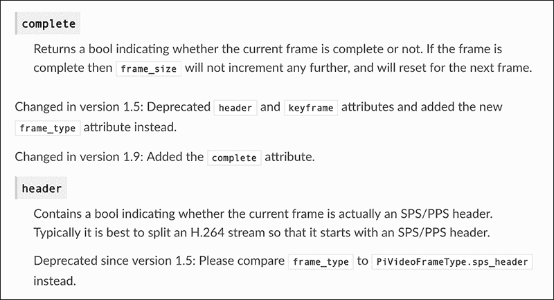

## **3**

**文档编写与良好的 API 实践**


在本章中，我们将讨论文档编写；具体来说，我们将探讨如何通过 *Sphinx* 自动化文档编写中更棘手和更繁琐的部分。虽然你仍然需要自己编写文档，但 Sphinx 将简化你的任务。由于通常使用 Python 库提供功能，我们还将讨论如何管理和记录你的公共 API 变更。因为你的 API 必须随着功能的更改而不断演变，从一开始就完美构建一切是很罕见的，但我将展示一些方法，帮助你确保你的 API 尽可能地对用户友好。

本章的最后，我们将进行一次与 Christophe de Vienne 的采访，他是《Web Services Made Easy》框架的作者，在采访中他将讨论开发和维护 API 的最佳实践。

### **使用 Sphinx 编写文档**

文档编写是软件开发中最重要的部分之一。不幸的是，许多项目没有提供适当的文档。编写文档被认为是复杂且令人生畏的，但其实不必如此：借助 Python 程序员可用的工具，编写文档和编写代码一样简单。

缺乏或没有文档的最大原因之一是许多人认为编写文档的唯一方式是手动编写。即使项目中有多人，这也意味着团队中的一位或多位成员将不得不在贡献代码和维护文档之间权衡——如果你问任何开发人员他们更愿意做哪项工作，可以确定他们会说更愿意编写软件，而不是编写 *关于* 软件的文档。

有时，文档编写过程与开发过程是完全分开的，这意味着文档是由没有编写实际代码的人编写的。此外，以这种方式生成的任何文档都可能是过时的：手动编写的文档几乎不可能跟上开发的步伐，无论由谁负责。

结论是：你的代码和文档之间的隔离程度越高，维护文档的难度就越大。那么，为什么要把它们分开呢？不仅可以直接在代码中编写文档，而且将这些文档转换为易于阅读的 HTML 和 PDF 文件也很简单。

Python 文档编写的最常见格式是 *reStructuredText*，简称 *reST*。它是一种轻量级标记语言（类似 Markdown），既易于人类阅读和编写，也易于计算机处理。Sphinx 是处理这种格式的最常用工具；Sphinx 可以读取 reST 格式的内容，并将文档输出为多种其他格式。

我建议你的项目文档始终包含以下内容：

+   你的项目旨在解决的问题，简明扼要地用一两句话说明。

+   您的项目所采用的许可协议。如果您的软件是开源的，您还应在每个代码文件的头部包含此信息；仅仅因为您已将代码上传到互联网上，并不意味着其他人会知道他们可以对其做什么。

+   一个小示例，展示您的代码是如何工作的。

+   安装说明。

+   指向社区支持、邮件列表、IRC、论坛等的链接。

+   一个指向您的错误跟踪系统的链接。

+   指向您的源代码的链接，方便开发者下载并立即开始研究。

您还应包含一个 *README.rst* 文件，解释您的项目功能。此 README 应显示在您的 GitHub 或 PyPI 项目页面上；这两个网站都知道如何处理 reST 格式。

**注意**

*如果您使用 GitHub，您还可以添加一个 CONTRIBUTING.rst 文件，当有人提交拉取请求时，这个文件将会显示。它应提供一个用户在提交请求前遵循的清单，包括代码是否遵循 PEP 8，以及提醒用户运行单元测试等事项。[Read the Docs](http://readthedocs.org/) 允许您自动在线构建和发布文档。注册和配置项目非常简单。然后 Read the Docs 会搜索您的 Sphinx 配置文件，构建文档并使其可以供用户访问。这是一个非常适合与代码托管网站配合使用的工具。*

#### ***开始使用 Sphinx 和 reST***

您可以从 *[`www.sphinx-doc.org/`](http://www.sphinx-doc.org/)* 获取 Sphinx。网站上有安装说明，但最简单的方法是通过 `pip install sphinx` 安装。

安装 Sphinx 后，在项目的顶层目录中运行 `sphinx-quickstart`。这将创建 Sphinx 所需的目录结构，并在 *doc/source* 文件夹中生成两个文件：*conf.py*，它包含 Sphinx 的配置设置（这是 Sphinx 正常运行所必需的），以及 *index.rst*，它作为文档的首页。一旦运行了快速启动命令，您将依次完成一系列步骤，用以指定命名约定、版本约定以及其他工具和标准的选项。

*conf.py* 文件包含一些文档化的变量，例如项目名称、作者以及用于 HTML 输出的主题。您可以随时编辑此文件。

创建好结构并设置好默认值后，您可以通过调用 `sphinx-build` 命令，传入源目录和输出目录作为参数，将文档构建为 HTML，如示例 3-1 所示。`sphinx-build` 命令会读取源目录中的 *conf.py* 文件，解析该目录中的所有 *.rst* 文件，并将其渲染为 HTML 输出到目标目录。

```py
$ sphinx-build doc/source doc/build
  import pkg_resources
Running Sphinx v1.2b1
loading pickled environment... done
No builder selected, using default: html
building [html]: targets for 1 source files that are out of date
updating environment: 0 added, 0 changed, 0 removed
looking for now-outdated files... none found
preparing documents... done
writing output... [100%] index
writing additional files... genindex search copying static files... done
dumping search index... done
dumping object inventory... done
build succeeded.
```

*示例 3-1：构建一个基本的 Sphinx HTML 文档*

现在你可以在你最喜欢的浏览器中打开 *[doc/build/index.html](http://doc/build/index.html)* 并阅读你的文档。

**注意**

*如果你正在使用 setuptools 或 pbr（参见 第五章）进行打包，Sphinx 扩展了它们以支持命令 setup.py build_sphinx，这将自动运行 sphinx-build。Sphinx 的 pbr 集成具有一些更合理的默认值，例如将文档输出到 /doc 子目录。*

你的文档从 *index.rst* 文件开始，但不一定要以此结束：reST 支持 `include` 指令从其他 reST 文件中包含 reST 文件，因此没有什么能阻止你将文档分成多个文件。刚开始时不要太担心语法和语义；reST 提供了很多格式化选项，但你有足够的时间稍后深入参考文档。完整的参考文档（*[`docutils.sourceforge.net/docs/ref/rst/restructuredtext.html`](http://docutils.sourceforge.net/docs/ref/rst/restructuredtext.html)*) 解释了如何创建标题、项目符号列表、表格等。

#### ***Sphinx 模块***

Sphinx 的扩展性非常强：它的基本功能仅支持手动文档，但它附带了一些有用的模块，可以启用自动文档生成和其他功能。例如，`sphinx.ext.autodoc` 会从你的模块中提取 reST 格式的文档字符串并生成 *.rst* 文件以供包含。这是 `sphinx-quickstart` 会询问你是否想要启用的选项之一。如果你没有选择该选项，你仍然可以编辑你的 *conf.py* 文件，并像这样将其作为扩展添加：

```py
extensions = ['sphinx.ext.autodoc']
```

请注意，`autodoc` *不会* 自动识别并包含你的模块。你需要明确指定你想要文档化的模块，通过在你的 *.rst* 文件中添加类似 清单 3-2 的内容。

```py
   .. automodule:: foobar
➊     :members:
➋     :undoc-members:
➌     :show-inheritance:
```

*清单 3-2：指定自动文档化的模块*

在 清单 3-2 中，我们提出了三个请求，所有这些请求都是可选的：打印所有已记录的成员 ➊，打印所有未记录的成员 ➋，以及显示继承关系 ➌。还需要注意以下几点：

+   如果你没有包含任何指令，Sphinx 将不会生成任何输出。

+   如果你只指定 `:members:`，模块、类或方法树中的未记录节点将被跳过，即使它们的所有成员都有文档。举例来说，如果你文档化了一个类的方法，但没有文档化类本身，`:members:` 会排除该类及其方法。为了防止这种情况发生，你需要为该类写文档字符串，或者也可以指定 `:undoc-members:`。

+   你的模块需要位于 Python 可以导入的地方。将 `.`, `..`, 和/或 `../..` 添加到 `sys.path` 可以帮助解决此问题。

`autodoc` 扩展使你能够将大部分文档内容直接包含在源代码中。你甚至可以选择哪些模块和方法进行文档化——这不是一个“全有或全无”的解决方案。通过将文档与源代码直接维护在一起，你可以轻松确保它始终保持最新。

##### **使用 autosummary 自动生成目录**

如果你正在编写一个 Python 库，通常你会希望用一个包含指向每个模块单独页面链接的目录来格式化你的 API 文档。

`sphinx.ext.autosummary` 模块是专门为处理这种常见用例而创建的。首先，你需要在 *conf.py* 中启用它，通过添加以下行：

```py
extensions = ['sphinx.ext.autosummary']
```

然后，你可以将以下内容添加到 *.rst* 文件中，自动为指定的模块生成目录：

```py
.. autosummary::

   mymodule
   mymodule.submodule
```

这将创建名为 *generated/mymodule.rst* 和 *generated/mymodule.submodule.rst* 的文件，其中包含前面提到的 autodoc 指令。使用相同的格式，你可以指定要包含在文档中的模块 API 部分。

**注意**

*Sphinx-apidoc 命令可以自动为你创建这些文件；查看 Sphinx 文档了解更多信息。*

##### **使用 doctest 自动化测试**

Sphinx 的另一个有用功能是能够在你构建文档时自动运行`doctest`来测试示例。标准的 Python `doctest` 模块会在文档中搜索代码片段，并测试它们是否准确地反映了代码的实际行为。每一个以主提示符 `>>>` 开头的段落都会被视为一个代码片段来进行测试。例如，如果你想文档化 Python 的标准 `print` 函数，你可以编写如下的文档片段，`doctest` 会检查结果：

```py
    To print something to the standard output, use the :py:func:`print`
function:
>>> print("foobar")
    foobar
```

在文档中包含此类示例可以让用户理解你的 API。然而，随着 API 的发展，更新示例可能会被推迟，甚至忘记更新。幸运的是，`doctest` 帮助确保这一点不会发生。如果你的文档包括逐步教程，`doctest` 会通过测试每一行代码，确保它在开发过程中始终保持最新。

你还可以将 `doctest` 用于 *文档驱动开发（DDD）*：先编写文档和示例，然后编写与文档相匹配的代码。利用这个功能非常简单，只需使用特殊的 `doctest` 构建器运行 `sphinx-build`，就像这样：

```py
$ sphinx-build -b doctest doc/source doc/build
Running Sphinx v1.2b1
loading pickled environment... done
building [doctest]: targets for 1 source files that are out of date
updating environment: 0 added, 0 changed, 0 removed
looking for now-outdated files... none found
running tests...

Document: index
---------------
1 items passed all tests:
   1 tests in default
1 tests in 1 items.
1 passed and 0 failed.
Test passed.

Doctest summary
===============
    1 test
    0 failures in tests
    0 failures in setup code
    0 failures in cleanup code
build succeeded.
```

使用 `doctest` 构建器时，Sphinx 会读取常规的 *.rst* 文件，并执行其中包含的代码示例。

Sphinx 还提供了许多其他功能，无论是开箱即用的，还是通过扩展模块提供的，包括以下功能：

+   项目之间的链接

+   HTML 主题

+   图表和公式

+   输出到 Texinfo 和 EPUB 格式

+   链接到外部文档

你可能不会立刻需要所有这些功能，但如果将来需要，提前了解这些是很有帮助的。再次查看完整的 Sphinx 文档，了解更多信息。

#### ***编写 Sphinx 扩展***

有时候现成的解决方案不足以应对，你需要创建自定义工具来处理特定情况。

假设你正在编写一个 HTTP REST API。Sphinx 只会记录你的 API 的 Python 部分，迫使你手动编写 REST API 文档，带来所有相关问题。Web Services Made Easy（WSME）的创建者（在本章末尾采访）提出了一个解决方案：一个名为`sphinxcontrib-pecanwsme`的 Sphinx 扩展，它分析 docstring 和实际的 Python 代码，自动生成 REST API 文档。

**注意**

*对于其他 HTTP 框架，例如 Flask、Bottle 和 Tornado，你可以使用 sphinxcontrib.httpdomain。*

我的观点是，每当你知道可以从代码中提取信息来构建文档时，你应该这么做，并且你也应该自动化这个过程。这比试图维护手动编写的文档要好，尤其是当你可以利用像 Read the Docs 这样的自动发布工具时。

我们将以`sphinxcontrib-pecanwsme`扩展为例，展示如何编写你自己的 Sphinx 扩展。第一步是编写一个模块——最好作为`sphinxcontrib`的子模块，只要你的模块足够通用——并为其选择一个名称。Sphinx 要求这个模块具有一个预定义的函数`setup(app)`，该函数包含你将用来将代码连接到 Sphinx 事件和指令的方法。完整的方法列表可以在 Sphinx 扩展 API 中找到，地址是*[`www.sphinx-doc.org/en/master/extdev/appapi.html`](http://www.sphinx-doc.org/en/master/extdev/appapi.html)*。

例如，`sphinxcontrib-pecanwsme`扩展包含一个名为`rest-controller`的指令，可以通过`setup(app)`函数添加。这个添加的指令需要一个完全限定的控制器类名来生成文档，如清单 3-3 所示。

```py
def setup(app):
    app.add_directive('rest-controller', RESTControllerDirective)
```

*清单 3-3：来自 sphinxcontrib.pecanwsme.rest.setup 的代码，添加了 rest-controller 指令*

清单 3-3 中的`add_directive`方法注册了`rest-controller`指令，并将其处理委托给`RESTControllerDirective`类。这个`RESTControllerDirective`类暴露了某些属性，指示指令如何处理内容，是否有参数等等。该类还实现了一个`run()`方法，实际上从代码中提取文档并将解析后的数据返回给 Sphinx。

在*[`bitbucket.org/birkenfeld/sphinx-contrib/src/`](https://bitbucket.org/birkenfeld/sphinx-contrib/src/)*的代码库中，有许多小模块可以帮助你开发自己的扩展。

**注意**

*尽管 Sphinx 是用 Python 编写并默认针对 Python，但也有扩展可用，允许它支持其他语言。即使你的项目使用多种语言，你也可以使用 Sphinx 对你的项目进行全面文档化。*

作为另一个例子，在我的一个项目 Gnocchi 中——这是一个用于大规模存储和索引时间序列数据的数据库——我使用了一个自定义的 Sphinx 扩展来自动生成文档。Gnocchi 提供了一个 REST API，通常为了文档化这样的 API，项目会手动编写 API 请求及其响应的示例。不幸的是，这种方法容易出错并且与实际情况不同步。

使用可用的单元测试代码来测试 Gnocchi API，我们构建了一个 Sphinx 扩展来运行 Gnocchi，并生成一个包含 HTTP 请求和响应的*.rst*文件，这些请求和响应是在真实的 Gnocchi 服务器上运行的。通过这种方式，我们确保文档是最新的：服务器响应不是手动编写的，如果手动编写的请求失败，那么文档过程也会失败，我们就知道必须修复文档。

将这些代码包括在书中会显得过于冗长，但你可以在线查看 Gnocchi 的源代码，并查看`gnocchi.gendoc`模块，以了解它是如何工作的。

#### ***管理 API 的变化***

良好的文档化代码向其他开发者表明该代码适合被导入并用于构建其他内容。例如，在构建一个库并导出 API 供其他开发者使用时，你需要提供稳固文档的保证。

本节将介绍公共 API 的最佳实践。这些 API 将暴露给你库或应用的用户，虽然你可以随意处理内部 API，但公共 API 应当小心对待。

为了区分公共和私有 API，Python 的约定是将私有 API 的符号前缀加上下划线：`foo`是公共的，而`_bar`是私有的。你应该使用这种约定来判断另一个 API 是公共的还是私有的，并且用来命名你自己的 API。与其他语言（如 Java）不同，Python 并不强制限制访问标记为私有或公共的代码。命名约定仅仅是为了方便程序员之间的理解。

#### ***API 版本编号***

当正确构建时，API 的版本号可以为用户提供大量信息。Python 没有特别的系统或约定来对 API 版本进行编号，但我们可以从 Unix 平台中汲取灵感，后者使用一个复杂的管理系统来处理库并使用细粒度的版本标识符。

通常，你的版本编号应该反映会影响用户的 API 变更。例如，当 API 有重大变化时，主版本号可能会从 1 变为 2；当仅添加了一些新的 API 调用时，次版本号可能会从 2.2 变为 2.3；如果只是修复了 bug，版本号可能会从 2.2.0 变为 2.2.1。一个很好的版本编号使用示例是 Python 的`requests`库（*[`pypi.python.org/pypi/requests/`](https://pypi.python.org/pypi/requests/)*）。该库根据每个新版本中的变更数量和这些变更可能对使用程序的影响来递增 API 编号。

版本号提示开发者应查看两个版本之间的变化，但单独使用版本号不足以完全指导开发者：你必须提供详细的文档来描述这些变化。

#### ***记录你的 API 变更***

每当你对 API 进行更改时，首先也是最重要的事情就是进行详细的文档记录，以便代码的使用者能够快速了解正在发生的变化。你的文档应涵盖以下内容：

+   新接口的元素

+   被弃用的旧接口元素

+   如何迁移到新接口的说明

你还应确保不要立即删除旧接口。我建议在接口变得太麻烦之前保留旧接口。如果你已标记其为弃用，用户就会知道不要再使用它。

列表 3-4 是良好 API 变更文档的示例，展示了一个可以朝任意方向转向的汽车对象代码。由于某种原因，开发者决定撤回`turn_left`方法，取而代之的是提供一个通用的`turn`方法，该方法可以将方向作为参数传递。

```py
class Car(object):

    def turn_left(self):
        """Turn the car left.

        .. deprecated:: 1.1
           Use :func:`turn` instead with the direction argument set to left
        """
        self.turn(direction='left')

    def turn(self, direction):
        """Turn the car in some direction.

        :param direction: The direction to turn to.
        :type direction: str
        """
        # Write actual code for the turn function here instead
        pass
```

*列表 3-4：汽车对象 API 变更文档示例*

这里的三重引号`"""`表示文档字符串的开始和结束，当用户在终端输入`help(Car.turn_left)`或使用外部工具如 Sphinx 提取文档时，这些内容会被提取到文档中。`car.turn_left`方法的弃用通过`.. deprecated 1.1`来标示，其中`1.1`指的是发布此弃用代码的第一个版本。

使用这种弃用方法并通过 Sphinx 显示出来，清晰地告诉用户该函数不应再使用，并为他们提供直接访问新函数的途径，同时解释如何迁移旧代码。

图 3-1 展示了 Sphinx 文档，解释了一些弃用的函数。



*图 3-1：一些弃用函数的解释*

这种方法的缺点是，它依赖于开发者在升级到新版 Python 包时阅读你的变更日志或文档。然而，有一个解决方案：使用`warnings`模块标记你的弃用函数。

#### ***使用 warnings 模块标记弃用函数***

尽管过时的模块应当在文档中标注清楚，以免用户尝试调用它们，Python 还提供了`warnings`模块，允许你的代码在调用已弃用的函数时发出各种警告。这些警告——`DeprecationWarning`和`PendingDeprecationWarning`——可以分别用来告诉开发者他们调用的函数已弃用或将被弃用。

**注意**

*对于那些从事 C 语言工作的人来说，这是`__attribute__((deprecated))`GCC 扩展的一个方便的对照物。*

回到列表 3-4 中的汽车对象示例，我们可以使用这个方法来警告用户当他们试图调用已弃用的函数时，如列表 3-5 所示。

```py
import warnings

class Car(object):
    def turn_left(self):
        """Turn the car left.

     ➊ .. deprecated:: 1.1
           Use :func:`turn` instead with the direction argument set to "left".
        """
     ➋ warnings.warn("turn_left is deprecated; use turn instead",
                      DeprecationWarning)
        self.turn(direction='left')

    def turn(self, direction):
        """Turn the car in some direction.

        :param direction: The direction to turn to.
        :type direction: str
        """
        # Write actual code here instead
        pass
```

*列表 3-5：使用 warnings 模块对汽车对象 API 进行的文档化更改*

这里，`turn_left`函数已经被弃用 ➊。通过添加`warnings.warn`这一行，我们可以编写我们自己的错误信息 ➋。现在，如果任何代码调用`turn_left`函数，都会出现如下警告：

```py
>>> Car().turn_left()
__main__:8: DeprecationWarning: turn_left is deprecated; use turn instead
```

Python 2.7 及以后的版本默认不会打印`warnings`模块发出的任何警告，因为这些警告会被过滤。若要查看这些警告，需要将`-W`选项传递给 Python 可执行文件。选项`-W all`会将所有警告打印到`stderr`。有关`-W`可能值的更多信息，请参见 Python 手册页。

在运行测试套件时，开发者可以使用带有`-W`错误选项的 Python 命令，这样每当调用过时的函数时，就会抛出一个错误。使用你库的开发者可以很容易地找到需要修复的代码位置。列表 3-6 展示了当 Python 使用`-W`错误选项时，如何将警告转换为致命异常。

```py
>>> import warnings
>>> warnings.warn("This is deprecated", DeprecationWarning)
Traceback (most recent call last):
  File "<stdin>", line 1, in <module>
DeprecationWarning: This is deprecated
```

*列表 3-6：使用-W 错误选项运行 Python 并获得弃用错误*

警告通常在运行时被忽略，而在生产系统中运行带有`-W`错误选项的 Python 命令通常不是一个好主意。另一方面，使用`-W`错误选项运行 Python 应用程序的测试套件，则是一个很好的捕获警告并及早修复它们的方法。

然而，手动编写所有这些警告、文档字符串更新等可能会变得乏味，因此创建了`debtcollector`库来帮助自动化其中的一部分。`debtcollector`库提供了一些装饰器，你可以在函数中使用它们，确保正确的警告被触发，并且文档字符串被正确更新。列表 3-7 展示了你可以通过一个简单的装饰器，标明一个函数已经被移动到其他地方。

```py
from debtcollector import moves

class Car(object):
    @moves.moved_method('turn', version='1.1')
    def turn_left(self):
        """Turn the car left."""

        return self.turn(direction='left')
    def turn(self, direction):
        """Turn the car in some direction.

        :param direction: The direction to turn to.
        :type direction: str
        """

        # Write actual code here instead
        pass
```

*清单 3-7：通过 debtcollector 自动化的 API 变更*

在这里，我们使用了来自 `debtcollector` 的 `moves()` 方法，其 `moved_method` 装饰器使得每次调用 `turn_left` 时都会发出一个 `DeprecationWarning`。

### **总结**

Sphinx 是 Python 项目的事实标准文档工具。它支持多种语法，如果你的项目有特定需求，添加新语法或功能也很容易。Sphinx 还可以自动化任务，如生成索引或从代码中提取文档，使得长期维护文档变得更加轻松。

记录 API 的变更至关重要，尤其是在你弃用某些功能时，这样用户就不会感到意外。记录弃用方法的方式包括使用 Sphinx 的 `deprecated` 关键字和 `warnings` 模块，而 `debtcollector` 库可以自动化维护这些文档。

### **Christophe de Vienne 关于开发 API 的看法**

Christophe 是一名 Python 开发者，也是 WSME（Web Services Made Easy）框架的作者，该框架允许开发者以 Pythonic 的方式定义 web 服务，并支持多种 API，使得它可以与许多其他 web 框架兼容。

**开发者在设计 Python API 时倾向于犯哪些错误？**

在设计 Python API 时，我通过遵循这些规则避免了几种常见的错误：

+   **不要让它太复杂。** 保持简单。复杂的 API 很难理解，也难以文档化。虽然实际的库功能不一定需要简单，但将其设计得简单是明智的，这样用户就不会轻易犯错。例如，这个库非常简单直观，但它在背后做了复杂的事情。相比之下，`urllib` 的 API 几乎与其所做的事情一样复杂，使得它很难使用。

+   **让魔法显现出来。** 当你的 API 做了文档中没有解释的事情时，最终用户可能会想要打开代码，看看底层发生了什么。如果你背后有一些“魔法”在发生，这是可以的，但最终用户永远不应看到任何意外发生的情况，否则他们可能会感到困惑，或依赖于可能会改变的行为。

+   **不要忘记使用案例。** 当你全身心投入编写代码时，很容易忘记思考你的库实际上会如何被使用。构思良好的使用案例有助于更容易地设计 API。

+   **编写单元测试。** *TDD（测试驱动开发）* 是编写库的一个非常有效的方法，尤其是在 Python 中，因为它迫使开发者从一开始就以最终用户的身份来设计，这有助于开发者设计出易于使用的 API。它是我所知道的唯一一种允许程序员彻底重写库作为最后手段的方法。

**Python 的哪些方面可能影响设计库 API 的难易程度？**

Python 没有内建的方式来定义哪些 API 部分是公开的，哪些是私有的，这既是一个问题也是一个优势。

这是一个问题，因为它可能导致开发者没有完全考虑哪些 API 部分是公开的，哪些应该保持私有。但只要有一点自律、文档和（如果需要的话）类似 `zope.interface` 的工具，这个问题很快就能解决。

当能够更快速、更轻松地重构 API，同时保持与先前版本的兼容性时，这是一个优势。

**在考虑 API 的演进、弃用和移除时，你会考虑什么？**

在做出任何关于 API 开发的决策时，我会权衡以下几个标准：

+   **用户适应库代码的难度有多大？** 考虑到有些人依赖你的 API，任何修改都必须值得付出适应它的努力。这个规则旨在防止对常用的 API 部分进行不兼容的更改。话虽如此，Python 的一个优点是相对容易重构代码以适应 API 的更改。

+   **如何保证我的 API 易于维护？** 简化实现，清理代码库，让 API 更易于使用，编写更完整的单元测试，使 API 一目了然……这些都会让你作为维护者的工作变得更加轻松。

+   **如何在应用变更时保持 API 的一致性？** 如果你的 API 中所有函数都遵循类似的模式（比如要求第一个参数位置相同），那么确保新函数也遵循该模式。此外，一次做太多事情很容易导致什么都做不好：保持 API 聚焦于它的核心功能。

+   **用户从变更中能获得什么好处？** 最后但同样重要的一点，始终考虑用户的视角。

**关于 Python 中的 API 文档，你有什么建议？**

好的文档使新用户能够轻松采用你的库。忽视文档会把很多潜在用户拒之门外——不仅仅是初学者。问题在于，编写文档是困难的，因此常常被忽视！

+   **尽早编写文档，并将文档构建集成到持续集成中。** 使用 Read the Docs 工具来创建和托管文档，没理由不构建和发布文档（至少对于开源软件而言）。

+   **使用 docstring 来记录 API 中的类和函数。** 如果你遵循 PEP 257（*[`www.python.org/dev/peps/pep-0257/`](https://www.python.org/dev/peps/pep-0257/)*) 的指南，开发者就不必阅读你的源码就能理解你的 API 功能。可以从 docstring 生成 HTML 文档——而且不要仅限于 API 参考文档。

+   **始终提供实际的示例。** 至少提供一个“入门指南”，向新手展示如何构建一个工作示例。文档的第一页应简要概述你 API 的基本和代表性用例。

+   **详细记录你的 API 演变过程，按版本逐一记录。** 版本控制系统（VCS）日志是不够的！

+   **让你的文档易于访问，并尽可能使其舒适易读。** 用户需要能够轻松找到它，并获得他们所需的信息，而不会感觉像在受折磨。通过 PyPI 发布文档是实现这一点的一种方式；在 Read the Docs 上发布也是一个不错的选择，因为用户会期望在那里找到你的文档。

+   **最后，选择一个既高效又吸引人的主题。** 我为 WSME 选择了 “Cloud” Sphinx 主题，但也有许多其他主题可以选择。你不需要是一个网页专家就能制作出漂亮的文档。
